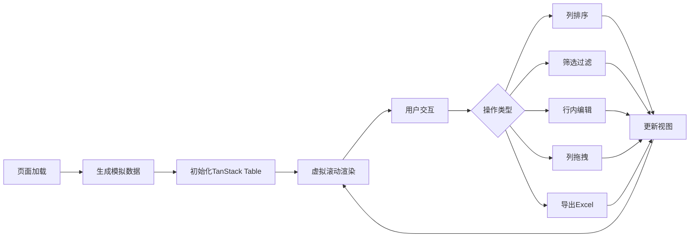

## 1. 产品概述
高性能Web端数据表格组件，支持百万级数据虚拟滚动、列排序、筛选过滤、行内编辑等企业级功能。为数据密集型应用提供流畅的用户体验。
- 主要用途：展示和操作大规模数据，适用于数据分析、企业管理系统
- 目标用户：开发者、数据分析师、企业用户
- 核心价值：高性能、功能丰富、易于集成的数据表格解决方案

## 2. 核心功能

### 2.2 功能模块
1. **数据表格主页**：表格展示、工具栏、控制面板
2. **虚拟滚动引擎**：百万级数据流畅滚动
3. **交互功能区**：排序、筛选、编辑、拖拽

### 2.3 页面详情
| 页面名称 | 模块名称 | 功能描述 |
|-----------|-------------|---------------------|
| 数据表格主页 | 表格容器 | 主体表格展示区域，支持虚拟滚动 |
| 数据表格主页 | 顶部工具栏 | 导出Excel、列设置、数据操作按钮 |
| 数据表格主页 | 列头区域 | 多表头、排序按钮、筛选按钮、拖拽手柄 |
| 数据表格主页 | 表格内容区 | 行内编辑、单元格合并、自定义渲染 |
| 数据表格主页 | 底部状态栏 | 数据统计、分页信息、选中状态 |

## 3. 核心流程
用户打开页面 → 加载百万级模拟数据 → 初始化表格组件 → 数据虚拟渲染 → 用户进行排序/筛选/编辑/拖拽等操作 → 实时更新表格视图 → 可导出Excel文件

## 4. 用户界面设计

### 4.1 设计风格
- 主色调：深蓝色系 (#1e40af)，专业稳重
- 辅助色：青色 (#0891b2)，用于交互元素高亮
- 背景色：深灰/近黑色 (#0f172a)，营造专业数据工具氛围
- 表格行：斑马纹设计，提升可读性
- 字体：现代无衬线字体，清晰易读
- 按钮风格：圆角矩形，微悬浮效果
- 整体风格：暗黑专业风，类似企业级数据分析工具

### 4.2 页面设计概述
| 页面名称 | 模块名称 | UI 元素 |
|-----------|-------------|-------------|
| 数据表格主页 | 表格容器 | 暗黑背景、边框线条、阴影层次 |
| 数据表格主页 | 列头区域 | 固定表头、悬浮高亮、拖拽指示 |
| 数据表格主页 | 工具栏 | 图标按钮、下拉菜单、状态标签 |
| 数据表格主页 | 单元格 | 编辑状态边框、合并样式、自定义渲染 |

### 4.3 响应式
- 桌面端优先设计，全屏展示表格
- 列可横向滚动，适配不同屏幕宽度
- 移动端简化工具栏，优化触摸操作

### 4.4 交互细节
- 行悬浮高亮效果
- 列头拖拽时的视觉反馈
- 编辑状态的边框动画
- 数据加载时的骨架屏效果
- 快捷键操作提示
