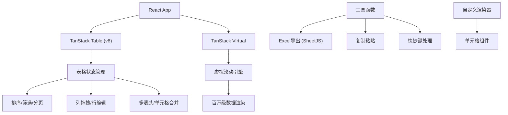

## 1. 架构设计



## 2. 技术描述
- 前端框架: React@18 + TypeScript
- 构建工具: Vite@5
- 样式方案: TailwindCSS@3
- 表格核心: @tanstack/react-table@8
- 虚拟滚动: @tanstack/react-virtual@3
- Excel导出: xlsx (SheetJS)
- 拖拽: @dnd-kit/core
- 状态管理: React Hooks (useState/useReducer)
- 数据: 前端模拟数据生成器

## 3. 目录结构

```
src/
├── components/
│   ├── DataTable/
│   │   ├── DataTable.tsx          # 主表格组件
│   │   ├── TableHeader.tsx        # 表头组件
│   │   ├── TableBody.tsx          # 表体组件(虚拟滚动)
│   │   ├── TableCell.tsx          # 单元格组件(支持编辑)
│   │   ├── TableToolbar.tsx       # 工具栏组件
│   │   ├── FilterPopover.tsx      # 筛选弹窗
│   │   └── ColumnDragHandle.tsx   # 列拖拽手柄
│   └── renderers/                 # 自定义列渲染器
│       ├── TextRenderer.tsx
│       ├── NumberRenderer.tsx
│       ├── DateRenderer.tsx
│       ├── StatusRenderer.tsx
│       └── ProgressRenderer.tsx
├── hooks/
│   ├── useDataTable.ts            # 表格逻辑Hook
│   ├── useKeyboardShortcuts.ts    # 快捷键Hook
│   ├── useClipboard.ts            # 复制粘贴Hook
│   └── useVirtualScroll.ts        # 虚拟滚动Hook
├── utils/
│   ├── excelExport.ts             # Excel导出工具
│   ├── dataGenerator.ts           # 模拟数据生成
│   └── cellMerge.ts               # 单元格合并逻辑
├── types/
│   └── table.ts                   # 类型定义
├── App.tsx
├── main.tsx
└── index.css
```

## 4. 核心功能实现方案

### 4.1 百万级数据虚拟滚动
- 使用 @tanstack/react-virtual 实现行虚拟渲染
- 仅渲染可视区域内的行 (~30-50行)
- 动态计算行高，支持可变行高
- 滚动时预加载上下缓冲区

### 4.2 TanStack Table 配置
- 核心插件: sorting, filtering, columnOrdering, rowSelection
- 自定义状态管理，支持本地存储持久化
- 列定义支持嵌套(多表头)
- 单元格合并通过 columnDef.meta 配置

### 4.3 行内编辑
- 双击单元格进入编辑模式
- 支持 input/select/date 等编辑控件
- Enter 保存，Escape 取消
- 编辑状态通过 row.getIsSelected() 管理

### 4.4 列拖拽排序
- 使用 @dnd-kit 实现列拖拽
- 拖拽时显示占位符和指示线
- 更新 columnOrder 状态触发重排

### 4.5 复制粘贴
- 监听 Ctrl+C / Ctrl+V 事件
- 支持区域选择复制
- 粘贴时自动解析TSV格式
- 批量更新单元格数据

### 4.6 快捷键
| 快捷键 | 功能 |
|--------|------|
| Ctrl+C | 复制选中单元格 |
| Ctrl+V | 粘贴到选中区域 |
| Ctrl+A | 全选 |
| F2 | 编辑当前单元格 |
| Enter | 确认编辑/下移 |
| Tab | 右移单元格 |
| Esc | 取消编辑 |
| Delete | 清除内容 |

## 5. 性能优化策略
- 数据使用 useMemo 缓存
- 组件使用 memo 包裹避免重渲染
- 虚拟滚动减少DOM节点数量
- 防抖处理筛选和搜索
- Web Worker 处理大数据计算
