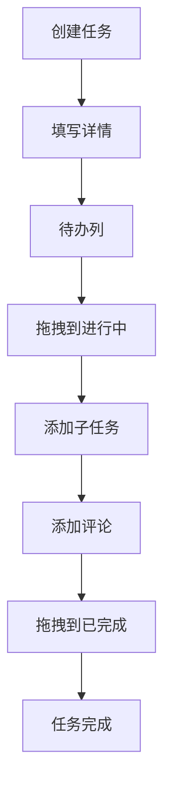

## 1. 产品概述

任务看板管理系统是一个基于敏捷开发理念的项目管理工具，帮助团队高效管理任务流程、追踪项目进度、提升协作效率。

- 核心价值：通过可视化看板和拖拽操作，实现任务的全生命周期管理
- 目标用户：软件开发团队、产品团队、项目管理团队
- 主要解决问题：任务流转不透明、进度追踪困难、团队协作效率低下

## 2. 核心功能

### 2.1 用户角色
| 角色 | 注册方式 | 核心权限 |
|------|---------|---------|
| 团队成员 | 邮箱注册 | 创建看板、管理任务、评论协作 |
| 管理员 | 邮箱注册 + 权限配置 | 团队管理、看板权限配置 |

### 2.2 功能模块
1. **看板管理页面**：看板列表、创建看板、看板设置
2. **看板详情页**：任务列、任务卡片、拖拽排序、筛选功能
3. **任务详情页**：任务信息、子任务、评论区、变更历史
4. **甘特图视图**：时间轴视图、任务依赖、进度展示

### 2.3 页面详情
| 页面名称 | 模块名称 | 功能描述 |
|---------|---------|---------|
| 看板管理页面 | 看板列表 | 展示所有看板卡片，支持搜索和排序 |
| 看板管理页面 | 创建看板 | 表单创建新看板，设置名称和描述 |
| 看板详情页 | 任务列 | 待办/进行中/已完成三列布局 |
| 看板详情页 | 任务卡片 | 展示任务标题、负责人、优先级、截止时间 |
| 看板详情页 | 拖拽功能 | 跨列拖拽移动任务，列内拖拽排序 |
| 看板详情页 | 筛选面板 | 按负责人、标签、优先级筛选任务 |
| 看板详情页 | 视图切换 | 看板视图 / 甘特图视图切换 |
| 任务详情页 | 任务信息 | 编辑标题、描述、负责人、优先级、截止时间、标签 |
| 任务详情页 | 子任务管理 | 添加、编辑、删除、勾选子任务 |
| 任务详情页 | 评论区 | 添加、删除评论，支持@提及 |
| 任务详情页 | 变更历史 | 展示任务所有字段变更记录 |
| 甘特图视图 | 时间轴 | 按时间展示任务，支持缩放和拖拽调整 |

## 3. 核心流程

### 3.1 任务创建与流转流程
用户创建任务 → 填写任务详情（负责人、优先级、截止时间）→ 任务进入待办列 → 拖拽到进行中开始工作 → 完成后拖拽到已完成 → 任务关闭

### 3.2 Mermaid 流程图

## 4. 用户界面设计

### 4.1 设计风格
- **主色调**：深蓝色 (#1e40af) 作为主色，体现专业和信任感
- **辅助色**：青色 (#0891b2) 用于强调和交互元素
- **状态色**：绿色 (#059669) 已完成，黄色 (#d97706) 进行中，灰色 (#6b7280) 待办
- **按钮风格**：圆角 8px，悬停时轻微上浮阴影效果
- **字体**：Inter 作为主要字体，标题加粗，正文常规
- **布局风格**：卡片式布局，清晰的视觉层次，充足的留白
- **图标风格**：线性图标，统一 24px 尺寸

### 4.2 页面设计概述
| 页面名称 | 模块名称 | UI 元素 |
|---------|---------|---------|
| 看板详情页 | 任务卡片 | 阴影卡片、渐变背景、标签徽章、优先级标识 |
| 看板详情页 | 筛选面板 | 侧边滑出、多条件组合、实时生效 |
| 任务详情页 | 模态框 | 居中展示、半透明背景、平滑动画 |
| 甘特图视图 | 时间轴 | 彩色任务条、拖拽手柄、缩放控制 |

### 4.3 响应式
- 桌面端优先设计（1280px+）
- 平板端（768px-1279px）：调整列宽，保持三列布局
- 移动端（<768px）：单列滚动布局，底部导航切换视图

### 4.4 交互动效
- 拖拽时卡片悬浮放大效果
- 任务状态变更时的颜色过渡动画
- 面板展开/收起的平滑滑动
- 页面加载时的元素渐入效果
