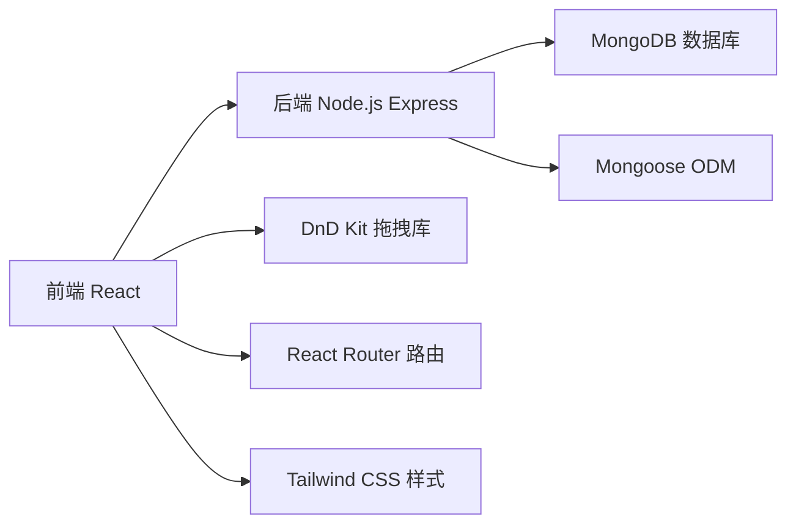
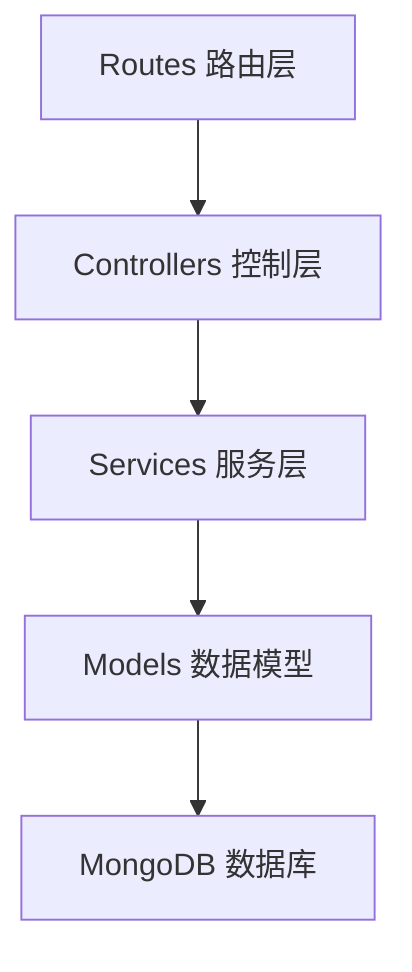
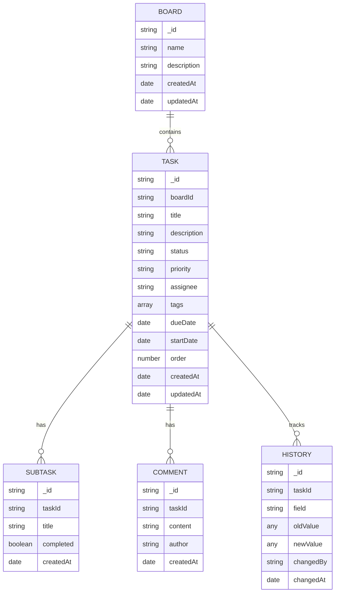

## 1. 架构设计



## 2. 技术描述

- **前端框架**: React@18 + TypeScript
- **构建工具**: Vite
- **样式方案**: Tailwind CSS@3
- **拖拽库**: @dnd-kit/core + @dnd-kit/sortable
- **路由**: React Router@6
- **状态管理**: Zustand
- **日期处理**: date-fns
- **甘特图**: 自定义 Canvas 实现 / gantt-task-react
- **后端**: Node.js + Express@4
- **数据库**: MongoDB + Mongoose@7
- **API 风格**: RESTful API

## 3. 路由定义

| 路由 | 用途 |
|------|------|
| / | 看板列表页 |
| /board/:id | 看板详情页（看板视图） |
| /board/:id/gantt | 看板甘特图视图 |
| /task/:id | 任务详情页 |

## 4. API 定义

### 4.1 TypeScript 类型定义

```typescript
// 看板
interface Board {
  _id: string;
  name: string;
  description: string;
  createdAt: Date;
  updatedAt: Date;
}

// 任务状态
type TaskStatus = 'todo' | 'in-progress' | 'done';

// 优先级
type Priority = 'low' | 'medium' | 'high' | 'urgent';

// 子任务
interface SubTask {
  _id: string;
  title: string;
  completed: boolean;
  createdAt: Date;
}

// 评论
interface Comment {
  _id: string;
  content: string;
  author: string;
  createdAt: Date;
}

// 变更历史
interface HistoryEntry {
  _id: string;
  field: string;
  oldValue: any;
  newValue: any;
  changedBy: string;
  changedAt: Date;
}

// 任务
interface Task {
  _id: string;
  boardId: string;
  title: string;
  description: string;
  status: TaskStatus;
  priority: Priority;
  assignee: string;
  tags: string[];
  dueDate: Date | null;
  startDate: Date | null;
  order: number;
  subTasks: SubTask[];
  comments: Comment[];
  history: HistoryEntry[];
  createdAt: Date;
  updatedAt: Date;
}
```

### 4.2 API 端点

| 方法 | 路径 | 描述 |
|------|------|------|
| GET | /api/boards | 获取看板列表 |
| POST | /api/boards | 创建看板 |
| GET | /api/boards/:id | 获取看板详情 |
| PUT | /api/boards/:id | 更新看板 |
| DELETE | /api/boards/:id | 删除看板 |
| GET | /api/boards/:id/tasks | 获取看板所有任务 |
| POST | /api/tasks | 创建任务 |
| GET | /api/tasks/:id | 获取任务详情 |
| PUT | /api/tasks/:id | 更新任务 |
| DELETE | /api/tasks/:id | 删除任务 |
| PATCH | /api/tasks/:id/status | 更新任务状态 |
| PATCH | /api/tasks/:id/order | 更新任务排序 |
| POST | /api/tasks/:id/subtasks | 添加子任务 |
| PUT | /api/tasks/:id/subtasks/:subId | 更新子任务 |
| DELETE | /api/tasks/:id/subtasks/:subId | 删除子任务 |
| POST | /api/tasks/:id/comments | 添加评论 |
| DELETE | /api/tasks/:id/comments/:commentId | 删除评论 |

## 5. 后端架构



## 6. 数据模型

### 6.1 ER 图



### 6.2 Mongoose Schema 定义

```javascript
// Board Schema
const boardSchema = new Schema({
  name: { type: String, required: true },
  description: { type: String, default: '' }
}, { timestamps: true });

// Task Schema
const taskSchema = new Schema({
  boardId: { type: Schema.Types.ObjectId, ref: 'Board', required: true },
  title: { type: String, required: true },
  description: { type: String, default: '' },
  status: { type: String, enum: ['todo', 'in-progress', 'done'], default: 'todo' },
  priority: { type: String, enum: ['low', 'medium', 'high', 'urgent'], default: 'medium' },
  assignee: { type: String, default: '' },
  tags: [{ type: String }],
  dueDate: { type: Date },
  startDate: { type: Date },
  order: { type: Number, default: 0 },
  subTasks: [{
    title: String,
    completed: { type: Boolean, default: false },
    createdAt: { type: Date, default: Date.now }
  }],
  comments: [{
    content: String,
    author: String,
    createdAt: { type: Date, default: Date.now }
  }],
  history: [{
    field: String,
    oldValue: Schema.Types.Mixed,
    newValue: Schema.Types.Mixed,
    changedBy: String,
    changedAt: { type: Date, default: Date.now }
  }]
}, { timestamps: true });
```
