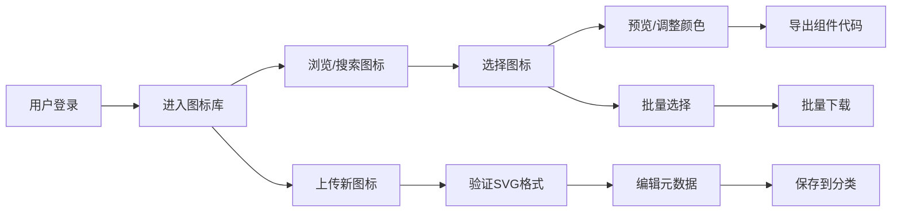

## 1. 产品概述

IconHub - 现代化Web端图标库管理工具，为设计和开发团队提供高效的SVG图标管理解决方案。支持图标上传、搜索、分类、颜色替换及组件代码导出。

- 核心价值：统一管理团队图标资产，提升设计开发协作效率，实现图标资产的可复用性和一致性。

## 2. 核心功能

### 2.1 用户角色

| 角色 | 注册方式 | 核心权限 |
|------|----------|----------|
| 管理员 | 邮箱注册 | 完整权限：图标管理、用户管理、权限配置 |
| 编辑者 | 邀请加入 | 图标上传、编辑、分类、导出 |
| 查看者 | 邀请加入 | 图标浏览、搜索、下载 |

### 2.2 功能模块

1. **仪表板**：图标统计、最近上传、快捷操作
2. **图标库**：图标列表、搜索筛选、分类浏览
3. **图标详情**：预览缩放、颜色替换、代码导出
4. **分类管理**：创建/编辑/删除分类、分类排序
5. **团队管理**：成员邀请、角色配置、权限管理
6. **上传中心**：批量上传、SVG验证、元数据编辑

### 2.3 页面详情

| 页面名称 | 模块名称 | 功能描述 |
|----------|----------|----------|
| 仪表板 | 统计概览 | 图标总数、分类数量、上传趋势图表 |
| 图标库 | 图标网格 | 瀑布流布局、悬停预览、多选操作 |
| 图标库 | 搜索筛选 | 名称搜索、标签筛选、分类过滤 |
| 图标详情 | 预览面板 | SVG渲染、缩放控制、颜色拾取器 |
| 图标详情 | 代码导出 | React/Vue组件预览、一键复制 |
| 分类管理 | 分类列表 | 树形结构、拖拽排序、统计数量 |
| 团队管理 | 成员列表 | 角色标签、邀请弹窗、权限切换 |
| 上传中心 | 上传区域 | 拖拽上传、格式验证、进度显示 |

## 3. 核心流程

## 4. 用户界面设计

### 4.1 设计风格

- **主色调**：深邃靛蓝 (#3B82F6) 作为品牌色，搭配深灰 (#1F2937) 作为背景
- **辅助色**：翠绿 (#10B981) 成功状态，琥珀 (#F59E0B) 警告状态
- **按钮风格**：圆角 圆角8px，悬浮阴影，微动画过渡
- **字体**：Space Grotesk 标题，Inter 正文
- **布局风格**：卡片式布局，左侧导航，内容区网格
- **图标风格**：线性图标，24px标准尺寸

### 4.2 页面设计概述

| 页面名称 | 模块名称 | UI元素 |
|----------|----------|--------|
| 图标库 | 工具栏 | 搜索框、筛选下拉、视图切换、上传按钮 |
| 图标库 | 图标卡片 | 悬停放大效果、勾选框、快捷操作 |
| 图标详情 | 预览区 | 大尺寸SVG、缩放滑块、颜色拾取器 |
| 图标详情 | 导出区 | Tab切换、代码高亮、复制按钮 |
| 上传中心 | 上传区 | 虚线边框、拖拽高亮、文件列表 |

### 4.3 响应式

- 桌面端优先设计
- 平板端：侧边栏折叠，内容区自适应
- 移动端：底部导航，单列布局
- 触摸优化：增大点击区域，支持捏合缩放

### 4.4 动画效果

- 页面加载：渐入动画
- 图标悬停：缩放+阴影增强
- 模态框：滑入+淡入
- 按钮点击：微缩反馈
- 颜色变更：平滑过渡
