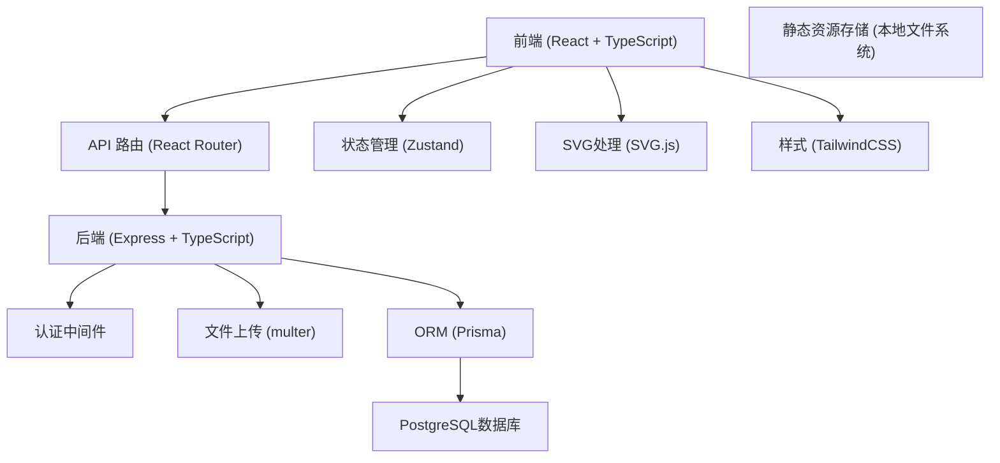
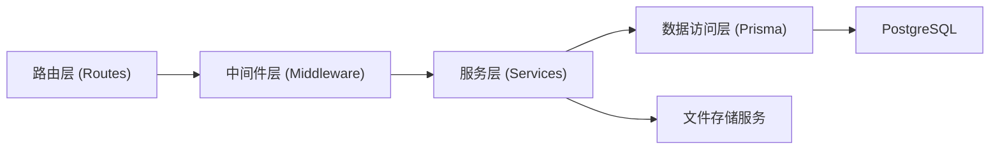
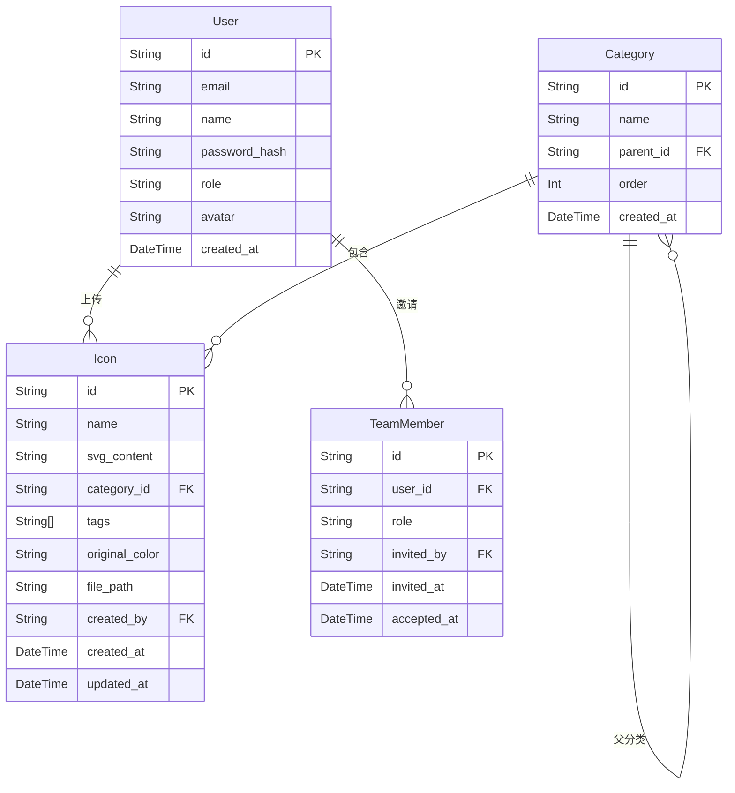

## 1. 架构设计



## 2. 技术栈说明

- **前端**: React@18 + TypeScript + Vite + TailwindCSS@3
- **状态管理**: Zustand
- **路由**: React Router DOM
- **SVG处理**: @svgdotjs/svg.js
- **后端**: Express@4 + TypeScript
- **数据库**: PostgreSQL + Prisma ORM
- **文件上传**: multer
- **认证**: JWT (jsonwebtoken)
- **代码高亮**: prismjs
- **图标**: lucide-react

## 3. 路由定义

### 前端路由
| 路由 | 页面 | 权限要求 |
|------|------|----------|
| / | 仪表板 | 已登录 |
| /icons | 图标库 | 已登录 |
| /icons/:id | 图标详情 | 已登录 |
| /categories | 分类管理 | 编辑者+ |
| /upload | 上传中心 | 编辑者+ |
| /team | 团队管理 | 管理员 |
| /login | 登录页 | 公开 |

### 后端API路由
| 方法 | 路由 | 功能 | 权限 |
|------|------|------|------|
| POST | /api/auth/login | 用户登录 | 公开 |
| GET | /api/icons | 获取图标列表 | 已登录 |
| POST | /api/icons | 上传图标 | 编辑者+ |
| GET | /api/icons/:id | 获取图标详情 | 已登录 |
| PUT | /api/icons/:id | 更新图标 | 编辑者+ |
| DELETE | /api/icons/:id | 删除图标 | 编辑者+ |
| GET | /api/icons/:id/export | 导出组件代码 | 已登录 |
| GET | /api/categories | 获取分类列表 | 已登录 |
| POST | /api/categories | 创建分类 | 编辑者+ |
| PUT | /api/categories/:id | 更新分类 | 编辑者+ |
| DELETE | /api/categories/:id | 删除分类 | 编辑者+ |
| GET | /api/team/members | 获取团队成员 | 管理员 |
| POST | /api/team/invite | 邀请成员 | 管理员 |
| PUT | /api/team/members/:id | 更新成员角色 | 管理员 |
| DELETE | /api/team/members/:id | 移除成员 | 管理员 |

## 4. API类型定义

```typescript
// 图标类型
interface Icon {
  id: string;
  name: string;
  svgContent: string;
  categoryId: string | null;
  tags: string[];
  color: string;
  originalColor: string;
  createdAt: Date;
  updatedAt: Date;
  createdBy: string;
}

// 分类类型
interface Category {
  id: string;
  name: string;
  icon: string;
  parentId: string | null;
  order: number;
  iconCount: number;
}

// 用户类型
interface User {
  id: string;
  email: string;
  name: string;
  role: 'admin' | 'editor' | 'viewer';
  avatar?: string;
}

// 响应类型
interface ApiResponse<T> {
  success: boolean;
  data?: T;
  error?: string;
}
```

## 5. 服务端架构图



## 6. 数据模型

### 6.1 ER图



### 6.2 Prisma Schema

```prisma
model User {
  id            String   @id @default(cuid())
  email         String   @unique
  name          String
  passwordHash String
  role          String   @default("viewer")
  avatar        String?
  createdAt     DateTime @default(now())
  icons         Icon[]
  invitedMembers TeamMember[]
}

model Category {
  id        String   @id @default(cuid())
  name      String
  parentId  String?
  parent    Category? @relation("CategoryHierarchy", fields: [parentId], references: [id])
  children  Category[] @relation("CategoryHierarchy")
  order     Int      @default(0)
  icons     Icon[]
  createdAt DateTime @default(now())
}

model Icon {
  id            String   @id @default(cuid())
  name          String
  svgContent    String
  categoryId    String?
  category      Category? @relation(fields: [categoryId], references: [id])
  tags          String[]
  originalColor String
  filePath      String
  createdBy     User   @relation(fields: [createdById], references: [id])
  createdById   String
  createdAt     DateTime @default(now())
  updatedAt     DateTime @default(now())
}

model TeamMember {
  id         String   @id @default(cuid())
  userId     String
  user       User     @relation(fields: [userId], references: [id])
  role       String   @default("viewer")
  invitedBy  String
  invitedAt DateTime @default(now())
  acceptedAt DateTime?
}
```
