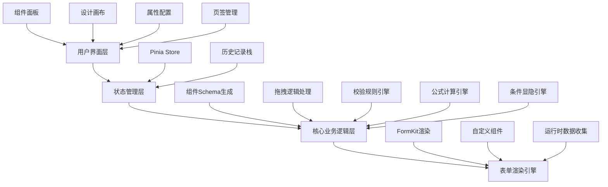

## 1. 架构设计



## 2. 技术描述

- **前端框架**: Vue@3.4 + TypeScript + Vite@5
- **UI框架**: TailwindCSS@3
- **状态管理**: Pinia
- **拖拽库**: vuedraggable@next (基于Sortable.js)
- **表单引擎**: @formkit/vue@1 + 自研渲染引擎
- **代码高亮**: prismjs
- **图标库**: lucide-vue-next
- **初始化工具**: vite-init

## 3. 路由定义

| 路由 | 页面名称 | 用途 |
|-------|---------|------|
| / | 表单设计器 | 拖拽设计表单、配置属性、多页签管理 |
| /preview | 表单预览 | 运行时渲染表单、验证提交、数据收集 |
| /schema | Schema预览 | 查看和导出JSON Schema |

## 4. 数据模型

### 4.1 表单Schema结构

```typescript
interface FormSchema {
  id: string
  name: string
  description: string
  tabs: FormTab[]
  version: string
  createdAt: string
  updatedAt: string
}

interface FormTab {
  id: string
  name: string
  icon?: string
  fields: FormField[]
}

interface FormField {
  id: string
  type: FieldType
  name: string
  label: string
  placeholder?: string
  defaultValue?: any
  required?: boolean
  validation?: ValidationRule[]
  formula?: FormulaConfig
  conditional?: ConditionalConfig
  props?: Record<string, any>
}

type FieldType = 
  | 'input' | 'textarea' | 'number' | 'select' 
  | 'radio' | 'checkbox' | 'switch' | 'date' 
  | 'time' | 'upload' | 'rate' | 'slider'
  | 'grid' | 'divider' | 'text'

interface ValidationRule {
  type: 'required' | 'min' | 'max' | 'pattern' | 'email' | 'custom'
  value?: any
  message: string
}

interface FormulaConfig {
  expression: string
  dependencies: string[]
}

interface ConditionalConfig {
  show?: ConditionalExpression
  disable?: ConditionalExpression
}

interface ConditionalExpression {
  field: string
  operator: '==' | '!=' | '>' | '<' | '>=' | '<=' | 'contains'
  value: any
}
```

### 4.2 设计器状态

```typescript
interface DesignerState {
  formSchema: FormSchema
  selectedFieldId: string | null
  selectedTabId: string
  history: HistoryRecord[]
  historyIndex: number
  clipboard: FormField | null
}

interface HistoryRecord {
  type: 'add' | 'update' | 'delete' | 'move' | 'tab'
  snapshot: FormSchema
  timestamp: number
}
```

## 5. 核心模块结构

```
src/
├── components/
│   ├── designer/
│   │   ├── ComponentPanel.vue      # 组件面板
│   │   ├── DesignCanvas.vue        # 设计画布
│   │   ├── PropertyPanel.vue       # 属性配置
│   │   ├── TabBar.vue              # 页签栏
│   │   └── ToolBar.vue             # 工具栏
│   ├── fields/
│   │   ├── InputField.vue          # 输入框
│   │   ├── SelectField.vue         # 下拉选择
│   │   ├── NumberField.vue         # 数字输入
│   │   └── ...                     # 其他组件
│   ├── properties/
│   │   ├── BasicProps.vue          # 基础属性
│   │   ├── ValidationProps.vue     # 校验配置
│   │   ├── FormulaProps.vue        # 公式配置
│   │   └── ConditionalProps.vue    # 条件配置
│   └── renderer/
│       ├── FormRenderer.vue        # 表单渲染器
│       └── FieldRenderer.vue       # 字段渲染器
├── composables/
│   ├── useDragDrop.ts              # 拖拽逻辑
│   ├── useHistory.ts               # 历史记录
│   ├── useValidation.ts            # 校验引擎
│   ├── useFormula.ts               # 公式引擎
│   └── useConditional.ts           # 条件引擎
├── stores/
│   └── designer.ts                 # 设计器状态
├── types/
│   └── form.ts                     # 类型定义
├── utils/
│   ├── schema.ts                   # Schema工具
│   └── validator.ts                # 校验工具
└── pages/
    ├── Index.vue                   # 设计器页面
    ├── Preview.vue                 # 预览页面
    └── SchemaView.vue              # Schema页面
```

## 6. 核心引擎设计

### 6.1 拖拽引擎
- 使用vuedraggable实现组件拖拽排序
- 自定义拖拽预览和占位符效果
- 支持跨页签拖拽组件

### 6.2 校验引擎
- 基于FormKit原生校验
- 支持自定义校验规则
- 实时验证反馈

### 6.3 公式计算引擎
- 解析简单数学表达式（加减乘除）
- 支持字段引用和依赖追踪
- 实时计算更新

### 6.4 条件显隐引擎
- 解析条件表达式
- 监听依赖字段变化
- 动态控制字段显示/禁用

## 7. 核心功能实现说明

### 7.1 JSON Schema生成
- 实时根据画布内容生成标准JSON Schema
- 支持导出和导入Schema
- Schema版本管理

### 7.2 运行时渲染
- 基于FormKit的动态表单渲染
- 支持自定义组件扩展
- 响应式表单布局

### 7.3 数据收集
- 表单数据统一管理
- 数据验证和格式化
- 提交数据结构标准化
