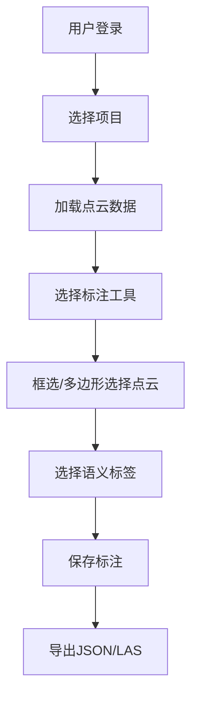

## 1. 产品概述
Web端3D点云标注工具，支持在浏览器中可视化大规模点云数据，提供框选、多边形选择等标注方式，支持语义标签分类，实现多用户实时协作标注和结果导出。
- 主要目的：提供高效的点云数据标注解决方案，支持自动驾驶、三维重建等领域的数据标注工作
- 目标用户：数据标注人员、自动驾驶研发团队、三维视觉研究者

## 2. 核心功能

### 2.1 用户角色
| 角色 | 登录方式 | 核心权限 |
|------|----------|----------|
| 标注员 | 用户名/密码登录 | 点云可视化、标注操作、导出个人标注结果 |
| 管理员 | 用户名/密码登录 | 全部功能、用户管理、项目管理、进度查看 |

### 2.2 功能模块
1. **主标注页面**: 3D点云视口、工具栏、标签面板、协作面板
2. **项目管理页面**: 项目列表、数据上传、任务分配
3. **进度统计页面**: 标注进度、用户贡献、质量统计

### 2.3 页面详情
| 页面名称 | 模块名称 | 功能描述 |
|---------|----------|----------|
| 主标注页面 | 3D视口 | Potree点云渲染、视角控制、缩放平移旋转 |
| 主标注页面 | 工具栏 | 框选工具、多边形选择工具、删除标注、撤销操作 |
| 主标注页面 | 标签面板 | 语义标签选择（地面、车辆、行人）、颜色标识 |
| 主标注页面 | 协作面板 | 在线用户列表、实时光标同步、标注冲突提示 |
| 主标注页面 | 导出功能 | JSON格式导出、LAS格式导出 |
| 项目管理页面 | 项目列表 | 项目创建、编辑、删除、点云文件上传 |
| 进度统计页面 | 统计面板 | 标注完成率、用户工作量、标签分布统计 |

## 3. 核心流程

### 3.1 标注工作流程
用户登录 → 选择项目 → 加载点云数据 → 选择标注工具 → 框选/多边形选择点云 → 选择语义标签 → 保存标注 → 导出结果

### 3.2 多用户协作流程
用户A连接WebSocket → 加入协作房间 → 实时同步标注操作 → 用户B加入 → 双向同步标注和光标位置

## 4. 用户界面设计

### 4.1 设计风格
- 主色调：深蓝科技感 (#165DFF)，辅助色：翠绿 (#00B42A)、橙红 (#F53F3F)、金黄 (#FF7D00)
- 按钮风格：圆角矩形、悬浮效果、图标+文字
- 字体：Inter 现代无衬线字体，标题 18px，正文 14px
- 布局风格：左侧工具栏 + 中央3D视口 + 右侧属性面板，暗色主题
- 图标风格：简洁线性图标，科技感设计

### 4.2 页面设计概述
| 页面名称 | 模块名称 | UI元素 |
|---------|----------|--------|
| 主标注页面 | 3D视口 | 全屏暗色背景、点云渲染、网格辅助线、坐标轴指示器 |
| 主标注页面 | 工具栏 | 垂直排列工具按钮、选中状态高亮、快捷键提示 |
| 主标注页面 | 标签面板 | 彩色标签卡片、选中计数、颜色预览方块 |
| 主标注页面 | 状态栏 | 底部信息栏、显示坐标、点数、标注数量 |
| 进度统计页面 | 统计面板 | 数据卡片、进度条、饼图/柱状图可视化 |

### 4.3 响应式
- Desktop-first 设计，优先保证桌面端大屏标注体验
- 自适应窗口大小，3D视口随窗口缩放
- 工具栏在小屏幕可折叠

### 4.4 3D场景指引
- 环境：暗色深空背景，HDR环境光
- 光照：三点光源系统，主光+补光+轮廓光
- 相机：透视相机，默认俯视角45度
- 交互：鼠标左键旋转、中键平移、滚轮缩放
- 标注高亮：选中点云高亮显示，半透明叠加颜色
- 后处理：FXAA抗锯齿，轻微泛光效果
