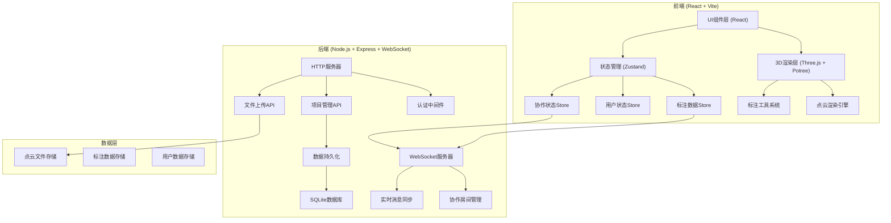
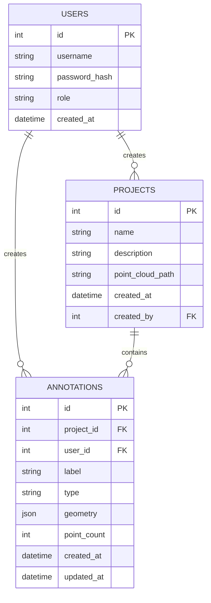

## 1. 架构设计



## 2. 技术描述

### 2.1 前端技术栈
- **框架**: React@18 + TypeScript
- **构建工具**: Vite@5
- **样式**: TailwindCSS@3
- **3D渲染**: Three.js@0.160, @react-three/fiber, @react-three/drei
- **点云渲染**: Potree (集成到React环境)
- **状态管理**: Zustand
- **路由**: React Router@6
- **WebSocket**: Socket.IO Client

### 2.2 后端技术栈
- **运行时**: Node.js@18
- **Web框架**: Express@4
- **WebSocket**: Socket.IO@4
- **数据库**: SQLite + better-sqlite3
- **认证**: JWT
- **文件处理**: Multer (文件上传)

### 2.3 初始化工具
- 前端: `npm create vite@latest`
- 后端: Express 手动初始化

## 3. 路由定义

### 3.1 前端路由
| 路由 | 页面 | 说明 |
|------|------|------|
| /login | 登录页 | 用户登录 |
| /projects | 项目列表页 | 项目管理和选择 |
| /annotate/:projectId | 主标注页 | 3D点云标注核心页面 |
| /statistics/:projectId | 进度统计页 | 标注进度和统计 |

### 3.2 后端API路由
| 路由 | 方法 | 说明 |
|------|------|------|
| /api/auth/login | POST | 用户登录 |
| /api/projects | GET | 获取项目列表 |
| /api/projects | POST | 创建新项目 |
| /api/projects/:id | GET | 获取项目详情 |
| /api/projects/:id/upload | POST | 上传点云文件 |
| /api/annotations/:projectId | GET | 获取标注数据 |
| /api/annotations/:projectId | POST | 保存标注数据 |
| /api/annotations/:projectId/export | GET | 导出标注结果 |
| /api/statistics/:projectId | GET | 获取统计数据 |

## 4. WebSocket事件定义

| 事件名 | 方向 | 数据结构 | 说明 |
|--------|------|----------|------|
| join-project | Client→Server | { projectId, userId } | 加入协作项目 |
| leave-project | Client→Server | { projectId } | 离开协作项目 |
| user-joined | Server→Client | { userId, userName, color } | 用户加入通知 |
| user-left | Server→Client | { userId } | 用户离开通知 |
| annotation-created | Client→Server | { annotation } | 创建标注 |
| annotation-updated | Client→Server | { annotation } | 更新标注 |
| annotation-deleted | Client→Server | { annotationId } | 删除标注 |
| cursor-position | Client→Server | { position, rotation } | 同步视角位置 |
| cursor-update | Server→Client | { userId, position, rotation } | 广播用户视角 |
| online-users | Server→Client | { users[] } | 在线用户列表 |

## 5. 数据模型

### 5.1 数据模型定义



### 5.2 数据定义语言 (SQL)

```sql
CREATE TABLE users (
    id INTEGER PRIMARY KEY AUTOINCREMENT,
    username TEXT UNIQUE NOT NULL,
    password_hash TEXT NOT NULL,
    role TEXT DEFAULT 'annotator',
    created_at DATETIME DEFAULT CURRENT_TIMESTAMP
);

CREATE TABLE projects (
    id INTEGER PRIMARY KEY AUTOINCREMENT,
    name TEXT NOT NULL,
    description TEXT,
    point_cloud_path TEXT,
    created_at DATETIME DEFAULT CURRENT_TIMESTAMP,
    created_by INTEGER REFERENCES users(id)
);

CREATE TABLE annotations (
    id INTEGER PRIMARY KEY AUTOINCREMENT,
    project_id INTEGER REFERENCES projects(id),
    user_id INTEGER REFERENCES users(id),
    label TEXT NOT NULL,
    type TEXT NOT NULL,
    geometry JSON NOT NULL,
    point_count INTEGER DEFAULT 0,
    created_at DATETIME DEFAULT CURRENT_TIMESTAMP,
    updated_at DATETIME DEFAULT CURRENT_TIMESTAMP
);

CREATE INDEX idx_annotations_project ON annotations(project_id);
CREATE INDEX idx_annotations_user ON annotations(user_id);
CREATE INDEX idx_annotations_label ON annotations(label);
```

## 6. 标注数据格式

### 6.1 单个标注对象结构
```typescript
interface Annotation {
    id: string;
    projectId: string;
    label: 'ground' | 'vehicle' | 'pedestrian';
    type: 'box' | 'polygon';
    geometry: BoxGeometry | PolygonGeometry;
    pointIndices: number[];
    userId: string;
    createdAt: string;
    updatedAt: string;
}

interface BoxGeometry {
    center: { x: number; y: number; z: number };
    size: { x: number; y: number; z: number };
    rotation: { x: number; y: number; z: number };
}

interface PolygonGeometry {
    points: { x: number; y: number; z: number }[];
    height: number;
}
```

### 6.2 导出格式

**JSON导出:**
```json
{
    "projectId": "proj_001",
    "exportedAt": "2024-01-01T12:00:00Z",
    "annotations": [
        {
            "id": "ann_001",
            "label": "vehicle",
            "type": "box",
            "geometry": { ... }
        }
    ],
    "statistics": {
        "totalAnnotations": 100,
        "labelDistribution": {
            "ground": 40,
            "vehicle": 35,
            "pedestrian": 25
        }
    }
}
```

**LAS导出:**
- 标准LAS 1.4格式
- 扩展字段存储标注标签信息
- 每个点的classification字段对应语义标签
