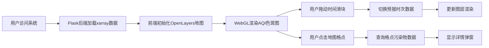

## 1. 产品概述

空气质量数值预报可视化系统，基于格点预报数据实现AQI时空分布的交互式展示。系统面向环境监测人员、科研工作者及公众，提供未来72小时小时级别的空气质量预报可视化服务，通过地图直观展示污染物扩散趋势，支持格点详情查询，助力空气质量分析与预警决策。

## 2. 核心功能

### 2.1 用户角色

| 角色 | 注册方式 | 核心权限 |
|------|----------|----------|
| 普通用户 | 无需注册 | 浏览预报地图、查询格点数据、切换时间节点 |
| 管理员 | 账号登录 | 数据管理、系统配置（预留接口） |

### 2.2 功能模块

1. **地图主界面**：OpenLayers地图容器、AQI色斑图层、等值线图层、风矢量场图层
2. **时间控制模块**：时间滑动条、播放/暂停控制、时间标签显示
3. **格点详情面板**：点击格点弹出污染物浓度详情、6项污染物浓度展示
4. **图层控制面板**：图层显隐切换、图例说明
5. **数据加载模块**：NetCDF数据解析、WebGL渲染优化

### 2.3 页面详情

| 页面名称 | 模块名称 | 功能描述 |
|----------|----------|----------|
| 主页面 | 地图容器 | OpenLayers初始化、底图加载、WebGL渲染层叠加 |
| 主页面 | 时间控制条 | 横向滑动条、72小时逐时切换、动画播放控制 |
| 主页面 | 图层控制面板 | 色斑图/等值线/风矢量开关切换、透明度调节 |
| 主页面 | 格点详情弹窗 | 显示PM2.5/PM10/O3/NO2/SO2/CO浓度、AQI等级、首要污染物 |
| 主页面 | 图例 | AQI等级色标、风矢图例说明 |

## 3. 核心流程

## 4. 用户界面设计

### 4.1 设计风格

- **主色调**：科技蓝 #165DFF 作为主色，配合青绿色渐变表示空气质量优良等级
- **辅助色**：橙色#FF7D00、红色#F53F3F、紫色#722ED1 表示中度至严重污染
- **按钮样式**：圆角矩形，悬停有阴影效果，按下有按压反馈
- **字体**：标题使用思源黑体 Bold，正文使用思源黑体 Regular，数字使用等宽字体
- **布局风格**：顶部导航栏+全屏地图+侧边浮动面板，半透明毛玻璃效果
- **图标风格**：线性图标，统一2px描边，科技感简洁风格

### 4.2 页面设计概览

| 页面名称 | 模块名称 | UI元素 |
|----------|----------|--------|
| 主页面 | 顶部导航 | 系统标题、时间显示、帮助按钮、深色/浅色模式切换 |
| 主页面 | 地图区域 | 全屏OpenLayers地图、WebGL色斑图覆盖、风矢量动画 |
| 主页面 | 时间控制条 | 底部固定、渐变滑块、播放按钮、时间轴刻度、当前时间高亮 |
| 主页面 | 右侧面板 | 图层开关列表、色阶图例、透明度滑块 |
| 主页面 | 详情弹窗 | 卡片式设计、渐变背景、污染物环形进度条展示 |

### 4.3 响应式

- 桌面端优先设计，侧边面板浮动布局
- 平板端：侧边面板转为底部抽屉
- 移动端：简化控制面板，优化触摸交互区域

### 4.4 WebGL渲染优化

- 着色器实现色阶插值，避免色块断层
- 风矢量场采用粒子动画效果，流畅展示风向风速
- 等值线采用Marching Squares算法预计算，GPU加速渲染
- 数据分层LOD，不同缩放级别调整渲染精度
