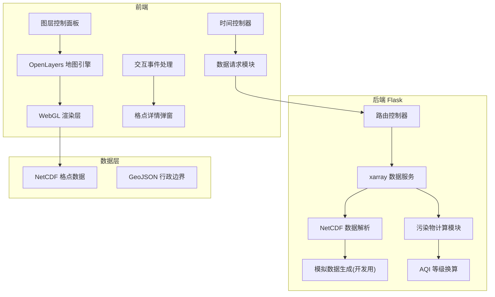

## 1. 架构设计



## 2. 技术描述

- **前端技术栈**:
  - OpenLayers v7+: 地图渲染、图层管理、交互控制
  - WebGL着色器: AQI色斑图渲染、风矢粒子动画
  - 原生JavaScript + CSS3: 界面交互、动画效果
  - 无框架依赖，轻量高效

- **后端技术栈**:
  - Python 3.9+
  - Flask 2.x: Web服务、API路由
  - xarray + netCDF4: 多维格点数据处理
  - numpy: 数值计算、AQI换算
  - matplotlib + cartopy: 等值线计算(可选)

- **数据格式**:
  - 输入: NetCDF格式格点预报数据 (time, lat, lon, variables)
  - 输出: JSON格点数据、WebGL纹理数组
  - 空间范围: 中国区域或自定义区域

## 3. 路由定义

| 路由 | 方法 | 用途 |
|------|------|------|
| / | GET | 主页面 |
| /api/metadata | GET | 获取数据元信息(时间范围、格点范围、变量列表) |
| /api/aqi/&lt;time_idx&gt; | GET | 获取指定时次的AQI格点数据 |
| /api/pollutants/&lt;time_idx&gt;/&lt;lat&gt;/&lt;lon&gt; | GET | 获取指定格点的污染物浓度 |
| /api/wind/&lt;time_idx&gt; | GET | 获取风场U/V分量数据 |
| /api/contour/&lt;time_idx&gt; | GET | 获取等值线GeoJSON数据 |

## 4. API 数据结构定义

### 4.1 元信息接口响应
```typescript
interface Metadata {
  time_steps: number;           // 总时步数(72)
  start_time: string;           // 预报起始时间 ISO格式
  grid_info: {
    lon_min: number;
    lon_max: number;
    lat_min: number;
    lat_max: number;
    nx: number;                 // 经度格点数
    ny: number;                 // 纬度格点数
  };
  variables: string[];          // ['PM25', 'PM10', 'O3', 'NO2', 'SO2', 'CO']
}
```

### 4.2 AQI格点数据响应
```typescript
interface AqiGridData {
  time_index: number;
  time_label: string;
  aqi_data: number[][];         // [lat][lon] 二维数组
  bounds: [number, number, number, number]; // [minLon, minLat, maxLon, maxLat]
}
```

### 4.3 格点污染物详情响应
```typescript
interface PollutantDetail {
  lon: number;
  lat: number;
  aqi: number;
  aqi_level: string;
  primary_pollutant: string;
  pollutants: {
    PM25: { value: number; unit: string };
    PM10: { value: number; unit: string };
    O3: { value: number; unit: string };
    NO2: { value: number; unit: string };
    SO2: { value: number; unit: string };
    CO: { value: number; unit: string };
  };
}
```

## 5. 核心模块说明

### 5.1 后端数据处理模块

**文件**: `backend/data_service.py`
- 使用xarray.open_dataset加载NetCDF数据
- 实现按时间索引切片功能
- AQI计算: 根据6项污染物浓度计算IAQI，取最大值
- 数据缓存: LRU缓存最近5个时次的数据

**文件**: `backend/aqi_calculator.py`
- AQI分级标准实现(GB3095-2012)
- 各污染物分指数换算函数
- 首要污染物判定逻辑

### 5.2 前端WebGL渲染模块

**文件**: `static/js/webgl_renderer.js`
- 自定义OpenLayers WebGL图层
- 片元着色器实现色阶插值
- 支持透明度调整
- 风场粒子动画系统

**文件**: `static/js/contour_layer.js`
- Marching Squares算法实现等值线提取
- Canvas或WebGL渲染等值线
- 支持等值线标注

### 5.3 时间控制模块

**文件**: `static/js/time_controller.js`
- 滑动条组件封装
- 播放/暂停/步进控制
- 播放速度调节(0.5x, 1x, 2x)
- 时间格式化显示

## 6. 项目目录结构

```
aqi-forecast-viz/
├── backend/
│   ├── app.py              # Flask主应用
│   ├── config.py           # 配置文件
│   ├── data_service.py     # 数据服务
│   ├── aqi_calculator.py   # AQI计算
│   └── requirements.txt    # Python依赖
├── data/
│   └── mock/               # 模拟数据目录
│       └── generate_mock.py # 模拟数据生成脚本
├── static/
│   ├── css/
│   │   └── main.css        # 主样式
│   ├── js/
│   │   ├── main.js         # 入口脚本
│   │   ├── map.js          # 地图初始化
│   │   ├── webgl_renderer.js # WebGL渲染
│   │   ├── time_controller.js # 时间控制
│   │   ├── contour_layer.js # 等值线图层
│   │   └── popup.js        # 弹窗组件
│   └── shaders/
│       ├── aqi.frag        # AQI着色器
│       └── wind.frag       # 风场着色器
├── templates/
│   └── index.html          # 主页面模板
└── README.md
```

## 7. AQI色阶配置

### 7.1 对数色标映射算法

为均衡各等级视觉差异，采用对数色标映射替代线性映射：

**映射公式**：
```
normalized_value = log(aqi + 1) / log(max_aqi + 1)
```

其中 max_aqi = 500

| AQI范围 | 等级 | 颜色 | 对数归一化值 |
|---------|------|------|-------------|
| 0-50 | 优 | #00E400 | 0.000 - 0.468 |
| 51-100 | 良 | #FFFF00 | 0.468 - 0.617 |
| 101-150 | 轻度污染 | #FF7E00 | 0.617 - 0.708 |
| 151-200 | 中度污染 | #FF0000 | 0.708 - 0.776 |
| 201-300 | 重度污染 | #99004C | 0.776 - 0.876 |
| 301-500 | 严重污染 | #7E0023 | 0.876 - 1.000 |

### 7.2 风矢量自适应采样

采用梯度敏感的自适应采样策略：
- **梯度计算**：计算风场幅值的空间梯度 ∇|V|
- **采样密度**：梯度大的区域采样密度提高2-4倍
- **八叉树细分**：递归细分高梯度区域，控制总粒子数在500-2000范围内
- **边缘保留**：锋面、切变线等特征区域自动加密

### 7.3 瓦片缓存系统

实现XYZ标准瓦片预生成与缓存：

**瓦片规格**：
- 缩放级别：Zoom 4-10
- 瓦片尺寸：256x256 PNG
- 缓存格式：WebP + PNG 双格式
- 存储路径：`data/cache/tiles/{z}/{x}/{y}_{t}.webp`

**缓存策略**：
- 预生成：系统启动时预生成前24小时预报瓦片
- 按需生成：后续时次首次访问时生成并缓存
- LRU淘汰：超过7天未访问的瓦片自动清理
- 内存缓存：热点瓦片使用Redis/内存缓存加速访问

**新增路由**：
| 路由 | 方法 | 用途 |
|------|------|------|
| `/tiles/{z}/{x}/{y}/{t}.png` | GET | 获取指定时次瓦片 |
| `/api/cache/status` | GET | 查看缓存统计 |
| `/api/cache/clear` | POST | 清理瓦片缓存 |

## 8. 扩散模拟动画

### 8.1 动画原理

基于粒子系统实现污染物扩散过程可视化：

**粒子类型**：
- **源点粒子**：从排放源持续发射
- **平流粒子**：受风场驱动进行大尺度运动
- **扩散粒子**：随机布朗运动模拟湍流扩散
- **沉降粒子**：模拟重力沉降和干/湿沉降

**运动方程**：
```
dx/dt = u(x,y,t) + u'_turb
dy/dt = v(x,y,t) + v'_turb
dc/dt = K * ∇²c
```

### 8.2 性能优化

- **GPU粒子系统**：WebGL Transform Feedback 更新粒子位置
- **LOD策略**：视口内高密度，外围低密度
- **粒子池**：复用死亡粒子，避免频繁GC
- **轨迹尾迹**：使用Framebuffer Object 绘制粒子历史轨迹

### 8.3 交互控制

| 控制项 | 功能 |
|--------|------|
| 播放/暂停 | 控制动画播放状态 |
| 速度调节 | 0.25x - 8x 倍速 |
| 粒子密度 | 500 - 5000 粒子数 |
| 尾迹长度 | 0 - 100 帧 |
| 源点选择 | 单个/多个排放源开关 |

## 9. 数据对比模式

### 9.1 对比模式类型

1. **左右分屏对比** (Swipe)
   - 左侧显示数据集A，右侧显示数据集B
   - 可拖动分割线调整比例
   - 视口同步缩放平移

2. **差值模式** (Difference)
   - 色彩编码显示 A - B 的差值
   - 蓝-白-红 双向色标
   - 可设置差值阈值

3. **闪烁对比** (Flicker)
   - A/B 数据集交替显示
   - 频率可调：0.5Hz - 4Hz
   - 适合检测细微差异

### 9.2 数据加载机制

- **双数据源**：支持同时加载两套 NetCDF 数据
- **时间对齐**：自动匹配预报起报时间
- **空间重采样**：不同分辨率数据自动插值对齐
- **内存管理**：LRU缓存，单数据集最大占用 500MB

### 9.3 统计指标

自动计算对比统计量：
- 空间相关系数 (R)
- 均方根误差 (RMSE)
- 平均偏差 (MB)
- 平均绝对误差 (MAE)
- 威胁评分 (TS) 分级计算

## 10. PDF报告导出

### 10.1 报告内容结构

```
空气质量预报评估报告
├── 封面信息
│   ├── 预报起报时间
│   ├── 预报时效范围
│   ├── 生成时间
│   └── 预报员签名
├── 空间分布图谱
│   ├── 关键时次色斑图 (0h, 24h, 48h, 72h)
│   ├── 极值标注
│   └── 行政边界叠加
├── 时间序列曲线
│   ├── 区域平均AQI变化
│   ├── 主要城市逐时曲线
│   └── 峰值出现时间
├── 统计评估表格
│   ├── 分级准确率
│   ├── 预报偏差统计
│   └── TS评分
└── 结论与建议
```

### 10.2 技术实现

**后端生成**：
- 使用 `reportlab` + `matplotlib` 生成高质量PDF
- 地图截图使用 `selenium` 或后端渲染
- 支持自定义页眉页脚、水印

**前端生成**（备选）：
- 使用 `jsPDF` + `html2canvas` 浏览器端生成
- 无需后端依赖，适合简单报告

### 10.3 新增路由

| 路由 | 方法 | 用途 |
|------|------|------|
| `/api/report/generate` | POST | 生成PDF报告 |
| `/api/report/download/<id>` | GET | 下载报告 |
| `/api/compare/datasets` | GET | 获取可用数据集列表 |
| `/api/compare/load/<id>` | POST | 加载对比数据集 |
| `/api/diff/<time_idx>` | GET | 获取差值场数据 |
