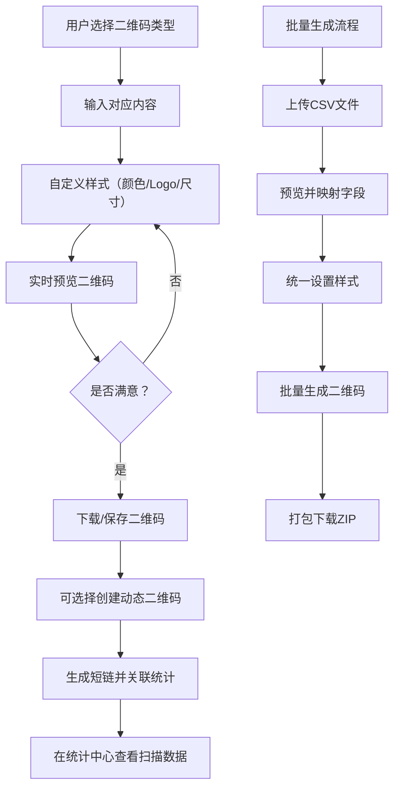

## 1. 产品概述

本产品是一个功能丰富的Web端二维码生成器，支持多种类型二维码的创建与管理。用户可以生成文本、网址、名片、WiFi、邮件等类型的二维码，支持自定义样式、颜色、Logo嵌入，并提供批量生成、动态二维码和扫描统计功能。

- **主要用途**：为个人和企业用户提供便捷的二维码生成与管理解决方案
- **解决问题**：传统二维码生成器功能单一，缺乏样式定制、批量处理和数据统计能力
- **目标用户**：市场营销人员、企业管理员、开发者、个人用户
- **市场价值**：一站式二维码解决方案，覆盖从生成到数据追踪的全流程

## 2. 核心功能

### 2.1 用户角色

| 角色 | 注册方式 | 核心权限 |
|------|----------|----------|
| 普通用户 | 无需注册 | 生成静态二维码、使用基础样式、批量生成 |
| 注册用户 | 邮箱注册 | 所有普通用户权限 + 动态二维码管理 + 扫描统计查看 |

### 2.2 功能模块

1. **二维码生成器**：支持5种类型（文本/网址/名片/WiFi/邮件），实时预览
2. **样式定制面板**：颜色自定义、码点样式、Logo嵌入、尺寸调整
3. **批量生成**：CSV文件导入、批量设置样式、打包下载
4. **动态二维码**：创建可编辑内容的二维码、内容修改不改变图案
5. **数据统计**：扫描次数统计、地域分布、时间趋势图表
6. **二维码管理**：历史记录、分类管理、一键复用

### 2.3 页面详情

| 页面名称 | 模块名称 | 功能描述 |
|---------|----------|---------|
| 首页 | 生成器主界面 | 类型选择、内容输入、实时预览、样式调整、下载导出 |
| 批量生成 | CSV导入模块 | 文件上传、数据预览、字段映射、批量样式设置、ZIP打包下载 |
| 动态二维码 | 动态码管理 | 创建动态码、内容编辑、短链跳转、查看统计数据 |
| 统计中心 | 数据看板 | 扫描次数趋势图、地域分布图、设备类型统计、导出报表 |
| 我的二维码 | 管理中心 | 历史记录列表、分类筛选、编辑复用、删除管理 |

## 3. 核心流程

## 4. 用户界面设计

### 4.1 设计风格

- **设计理念**：现代简约科技风，突出工具的专业性和易用性
- **主色调**：深邃蓝 (#1e3a8a) 作为主色，搭配科技青 (#06b6d4) 作为强调色
- **辅助色**：渐变蓝紫色系用于按钮和关键交互元素
- **背景**：深色模式为主 (#0f172a)，搭配微妙的网格纹理和发光效果
- **按钮样式**：圆角胶囊型，带有微渐变和hover发光效果
- **字体**：展示字体使用 Space Grotesk，正文字体使用 JetBrains Mono，营造科技感
- **布局风格**：左右分栏布局，左侧配置面板，右侧实时预览
- **图标风格**：线性轮廓图标，统一2px描边，科技感十足

### 4.2 页面设计概述

| 页面名称 | 模块名称 | UI元素 |
|---------|----------|--------|
| 首页 | 生成器主界面 | 左侧：类型切换标签页、表单输入区、样式折叠面板；右侧：大尺寸实时预览区、操作按钮组；背景：动态渐变光斑 |
| 批量生成 | CSV导入模块 | 拖拽上传区、数据表格预览、字段映射下拉框、进度条动画、成功状态动效 |
| 动态二维码 | 动态码管理 | 卡片式列表、悬浮编辑按钮、状态切换开关、扫描次数微图表 |
| 统计中心 | 数据看板 | 顶部关键指标卡片、趋势折线图、地域分布图、设备类型饼图、时间筛选器 |
| 我的二维码 | 管理中心 | 网格布局卡片、悬停显示操作按钮、搜索过滤栏、分页组件 |

### 4.3 响应式设计

- **桌面优先**：1280px以上为最佳体验，左右分栏布局
- **平板适配**：768px-1279px，上下布局，预览区在上，控制面板在下
- **移动端**：768px以下，单列流式布局，折叠面板收纳次要功能
- **触控优化**：按钮最小尺寸48x48px，重要操作增加触觉反馈动效

### 4.4 交互动效

- 页面加载：元素错峰淡入，预览区域有微妙的扫描线动画
- 类型切换：标签页切换带滑动指示条，内容区淡入淡出
- 实时预览：参数修改时有平滑过渡动画，非生硬刷新
- 下载按钮：点击后出现进度环，完成后有对勾动画
- 数据图表：首次加载时从下往上生长动画
- Logo上传：拖拽上传时有边框高亮和文件预览动效
