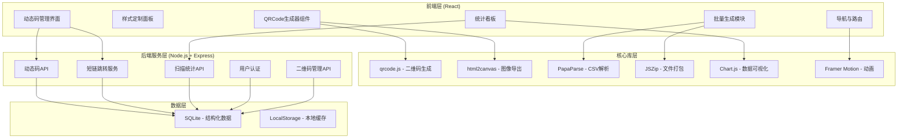
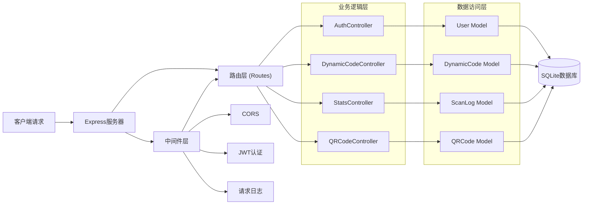
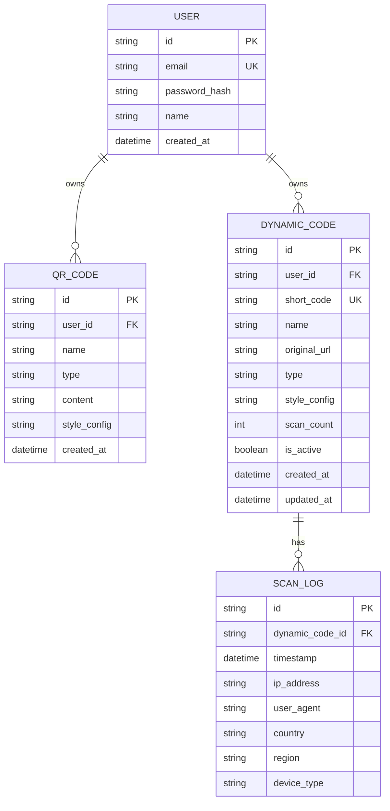

## 1. 架构设计



## 2. 技术描述

### 2.1 前端技术栈
- **框架**: React 18 + TypeScript
- **构建工具**: Vite 5
- **样式方案**: TailwindCSS 3 + CSS Variables
- **路由**: React Router v6
- **状态管理**: Zustand
- **二维码生成**: qrcode (1.5.3)
- **图像导出**: html2canvas (1.4.1)
- **CSV解析**: papaparse (5.4.1)
- **文件打包**: jszip (3.10.1)
- **图表库**: chart.js + react-chartjs-2
- **动画**: framer-motion
- **图标**: lucide-react

### 2.2 后端技术栈
- **运行时**: Node.js 18+
- **框架**: Express 4
- **语言**: TypeScript
- **数据库**: SQLite + better-sqlite3
- **认证**: JWT + bcrypt
- **CORS**: cors 中间件
- **日志**: morgan + winston

### 2.3 项目结构
```
qr-code-generator/
├── client/                          # 前端React应用
│   ├── src/
│   │   ├── components/              # 公共组件
│   │   │   ├── QRCodePreview.tsx    # 二维码预览组件
│   │   │   ├── StylePanel.tsx       # 样式定制面板
│   │   │   ├── TypeSelector.tsx     # 类型选择器
│   │   │   ├── LogoUploader.tsx     # Logo上传组件
│   │   │   └── ColorPicker.tsx      # 颜色选择器
│   │   ├── pages/                   # 页面组件
│   │   │   ├── Generator.tsx        # 首页生成器
│   │   │   ├── BatchGenerate.tsx    # 批量生成
│   │   │   ├── DynamicCode.tsx      # 动态码管理
│   │   │   ├── Statistics.tsx       # 统计中心
│   │   │   └── MyQRCodes.tsx        # 我的二维码
│   │   ├── types/                   # TypeScript类型定义
│   │   ├── utils/                   # 工具函数
│   │   │   ├── qrGenerator.ts       # 二维码生成工具
│   │   │   ├── vCard.ts             # vCard格式化
│   │   │   ├── wifiFormat.ts        # WiFi格式化
│   │   │   └── exportUtils.ts       # 导出工具
│   │   ├── store/                   # Zustand状态管理
│   │   ├── hooks/                   # 自定义Hooks
│   │   ├── App.tsx
│   │   └── main.tsx
│   ├── index.html
│   ├── package.json
│   ├── vite.config.ts
│   └── tailwind.config.js
│
├── server/                          # 后端Node.js服务
│   ├── src/
│   │   ├── controllers/             # 控制器
│   │   │   ├── qrCodeController.ts  # 二维码管理
│   │   │   ├── dynamicController.ts # 动态码控制
│   │   │   ├── statsController.ts   # 统计控制
│   │   │   └── authController.ts    # 认证控制
│   │   ├── models/                  # 数据模型
│   │   │   ├── QRCode.ts            # 二维码模型
│   │   │   ├── DynamicCode.ts       # 动态码模型
│   │   │   ├── ScanLog.ts           # 扫描日志模型
│   │   │   └── User.ts              # 用户模型
│   │   ├── routes/                  # 路由定义
│   │   │   ├── qrRoutes.ts
│   │   │   ├── dynamicRoutes.ts
│   │   │   ├── statsRoutes.ts
│   │   │   └── authRoutes.ts
│   │   ├── middleware/              # 中间件
│   │   ├── db/                      # 数据库初始化
│   │   ├── utils/                   # 工具函数
│   │   └── index.ts                 # 入口文件
│   ├── package.json
│   └── tsconfig.json
│
└── package.json                     # 根目录monorepo配置
```

## 3. 路由定义

### 前端路由
| 路由路径 | 页面名称 | 说明 |
|---------|---------|------|
| / | 二维码生成器 | 首页，核心生成功能 |
| /batch | 批量生成 | CSV导入批量生成 |
| /dynamic | 动态二维码 | 动态码管理列表 |
| /dynamic/:id | 动态码详情 | 编辑动态码内容 |
| /statistics | 统计中心 | 扫描数据看板 |
| /my-codes | 我的二维码 | 历史记录管理 |

### 后端API路由
| 路由路径 | 方法 | 用途 |
|---------|------|------|
| /api/auth/register | POST | 用户注册 |
| /api/auth/login | POST | 用户登录 |
| /api/dynamic | POST | 创建动态二维码 |
| /api/dynamic | GET | 获取动态码列表 |
| /api/dynamic/:id | PUT | 更新动态码内容 |
| /api/dynamic/:id | DELETE | 删除动态码 |
| /r/:shortCode | GET | 短链跳转（记录扫描） |
| /api/stats/overview | GET | 获取统计概览 |
| /api/stats/:codeId | GET | 获取单个二维码统计 |
| /api/stats/export | GET | 导出统计报表 |
| /api/qrcodes | POST | 保存二维码到账户 |
| /api/qrcodes | GET | 获取用户二维码列表 |
| /api/qrcodes/:id | DELETE | 删除二维码 |

## 4. API定义

### 4.1 TypeScript类型定义

```typescript
// 二维码类型枚举
type QRCodeType = 'text' | 'url' | 'vcard' | 'wifi' | 'email';

// 二维码样式配置
interface QRStyle {
  foregroundColor: string;      // 前景色
  backgroundColor: string;      // 背景色
  size: number;                 // 尺寸 (px)
  errorCorrectionLevel: 'L' | 'M' | 'Q' | 'H';  // 容错等级
  dotStyle: 'square' | 'round' | 'dots';         // 码点样式
  cornerRadius: number;         // 圆角半径
  logo?: string;                // Logo图片(base64)
  logoSize?: number;            // Logo大小比例
  logoBackgroundColor?: string; // Logo背景色
}

// vCard数据
interface VCardData {
  firstName: string;
  lastName: string;
  organization: string;
  title: string;
  phone: string;
  email: string;
  website: string;
  address: string;
}

// WiFi数据
interface WiFiData {
  ssid: string;
  password: string;
  encryption: 'WPA' | 'WEP' | 'nopass';
  hidden: boolean;
}

// 邮件数据
interface EmailData {
  to: string;
  subject: string;
  body: string;
}

// 动态二维码
interface DynamicCode {
  id: string;
  shortCode: string;
  originalUrl: string;
  name: string;
  type: QRCodeType;
  style: QRStyle;
  scanCount: number;
  createdAt: string;
  updatedAt: string;
  isActive: boolean;
}

// 扫描日志
interface ScanLog {
  id: string;
  dynamicCodeId: string;
  timestamp: string;
  ip: string;
  userAgent: string;
  country?: string;
  region?: string;
  deviceType: 'mobile' | 'desktop' | 'tablet';
}

// 统计数据
interface StatisticsOverview {
  totalScans: number;
  totalCodes: number;
  scansThisWeek: number;
  topPerformingCodes: Array<{
    id: string;
    name: string;
    scans: number;
  }>;
  scanTrend: Array<{
    date: string;
    count: number;
  }>;
  deviceDistribution: Array<{
    type: string;
    count: number;
    percentage: number;
  }>;
}

// CSV批量数据
interface BatchCSVRow {
  type: QRCodeType;
  content: string;
  name?: string;
  [key: string]: string | undefined;
}
```

### 4.2 请求响应示例

**创建动态二维码**
```typescript
// 请求
POST /api/dynamic
{
  "name": "产品宣传页",
  "originalUrl": "https://example.com/product",
  "type": "url",
  "style": {
    "foregroundColor": "#1e3a8a",
    "backgroundColor": "#ffffff",
    "size": 300,
    "errorCorrectionLevel": "H",
    "dotStyle": "round",
    "cornerRadius": 4
  }
}

// 响应
{
  "success": true,
  "data": {
    "id": "qr_abc123",
    "shortCode": "xKf9P2",
    "shortUrl": "https://qr.example.com/r/xKf9P2",
    "name": "产品宣传页",
    "scanCount": 0,
    "createdAt": "2024-01-15T10:30:00Z"
  }
}
```

**获取统计数据**
```typescript
// 请求
GET /api/stats/overview?timeRange=7d

// 响应
{
  "success": true,
  "data": {
    "totalScans": 15420,
    "totalCodes": 28,
    "scansThisWeek": 3240,
    "scanTrend": [
      {"date": "2024-01-09", "count": 420},
      {"date": "2024-01-10", "count": 380},
      {"date": "2024-01-11", "count": 450}
    ],
    "deviceDistribution": [
      {"type": "mobile", "count": 10240, "percentage": 66.4},
      {"type": "desktop", "count": 4120, "percentage": 26.7},
      {"type": "tablet", "count": 1060, "percentage": 6.9}
    ]
  }
}
```

## 5. 服务器架构图



## 6. 数据模型

### 6.1 ER图



### 6.2 DDL语句

```sql
-- 用户表
CREATE TABLE users (
  id TEXT PRIMARY KEY,
  email TEXT UNIQUE NOT NULL,
  password_hash TEXT NOT NULL,
  name TEXT,
  created_at DATETIME DEFAULT CURRENT_TIMESTAMP
);

-- 二维码保存表
CREATE TABLE qr_codes (
  id TEXT PRIMARY KEY,
  user_id TEXT NOT NULL,
  name TEXT,
  type TEXT NOT NULL,
  content TEXT NOT NULL,
  style_config TEXT,
  created_at DATETIME DEFAULT CURRENT_TIMESTAMP,
  FOREIGN KEY (user_id) REFERENCES users(id) ON DELETE CASCADE
);

-- 动态二维码表
CREATE TABLE dynamic_codes (
  id TEXT PRIMARY KEY,
  user_id TEXT NOT NULL,
  short_code TEXT UNIQUE NOT NULL,
  name TEXT NOT NULL,
  original_url TEXT NOT NULL,
  type TEXT NOT NULL,
  style_config TEXT,
  scan_count INTEGER DEFAULT 0,
  is_active BOOLEAN DEFAULT 1,
  created_at DATETIME DEFAULT CURRENT_TIMESTAMP,
  updated_at DATETIME DEFAULT CURRENT_TIMESTAMP,
  FOREIGN KEY (user_id) REFERENCES users(id) ON DELETE CASCADE
);

-- 扫描日志表
CREATE TABLE scan_logs (
  id TEXT PRIMARY KEY,
  dynamic_code_id TEXT NOT NULL,
  timestamp DATETIME DEFAULT CURRENT_TIMESTAMP,
  ip_address TEXT,
  user_agent TEXT,
  country TEXT,
  region TEXT,
  device_type TEXT,
  FOREIGN KEY (dynamic_code_id) REFERENCES dynamic_codes(id) ON DELETE CASCADE
);

-- 索引
CREATE INDEX idx_dynamic_short_code ON dynamic_codes(short_code);
CREATE INDEX idx_scan_log_code_id ON scan_logs(dynamic_code_id);
CREATE INDEX idx_scan_log_timestamp ON scan_logs(timestamp);
CREATE INDEX idx_qr_codes_user_id ON qr_codes(user_id);
```
