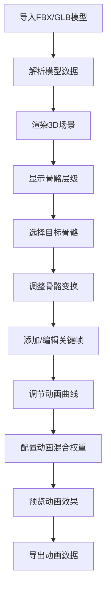

## 1. 产品概述

Web端3D骨骼动画编辑器，用于游戏开发、影视动画领域的专业动画创作工具。支持导入主流3D模型格式，可视化编辑骨骼动画，实现流畅的动画混合效果。

- **主要用途**：为3D艺术家和游戏开发者提供基于浏览器的轻量级骨骼动画编辑解决方案
- **目标用户**：游戏开发者、3D动画师、虚拟现实内容创作者
- **市场价值**：无需安装重型桌面软件，通过浏览器即可完成专业级骨骼动画编辑工作

## 2. 核心功能

### 2.1 用户角色
| 角色 | 注册方式 | 核心权限 |
|------|----------|----------|
| 创作者 | 无需注册，本地使用 | 完整的模型导入、动画编辑、导出功能 |

### 2.2 功能模块
1. **主编辑器页面**：3D视口、骨骼层级面板、属性编辑面板、时间轴、曲线编辑器
2. **模型导入模块**：FBX/GLB格式解析、蒙皮网格渲染、骨骼绑定显示
3. **骨骼变换模块**：位置/旋转/缩放Gizmo控制器、数值精确输入
4. **关键帧编辑模块**：时间轴标记、关键帧增删改、曲线插值调节
5. **动画混合模块**：多动画片段管理、走跑切换权重调节、过渡平滑处理
6. **2D骨骼示意模块**：Zdog实现的简化骨骼结构预览

### 2.3 页面详情
| 页面名称 | 模块名称 | 功能描述 |
|-----------|-------------|---------------------|
| 主编辑器 | 3D视口 | Three.js渲染场景，支持轨道控制、模型选择、骨骼高亮 |
| 主编辑器 | 骨骼层级面板 | 树形结构展示骨骼父子关系，支持展开折叠和选择 |
| 主编辑器 | 属性面板 | 显示选中骨骼的变换数值，支持手动输入修改 |
| 主编辑器 | 时间轴 | 动画播放控制、关键帧可视化标记、当前时间指示 |
| 主编辑器 | 曲线编辑器 | 动画曲线可视化编辑，支持贝塞尔手柄调节 |
| 主编辑器 | 动画混合面板 | 多动画片段权重调节，走跑切换滑块控制 |
| 主编辑器 | 2D骨骼示意 | Zdog渲染的简化骨骼结构，实时同步3D骨骼姿态 |

## 3. 核心流程

用户导入FBX/GLB模型文件后，系统解析模型数据并在3D视口中渲染显示蒙皮网格和骨骼结构。用户可在骨骼层级面板选择骨骼，通过Gizmo或数值输入修改骨骼变换，在时间轴上添加关键帧。通过曲线编辑器调整动画曲线，在动画混合面板调节不同动画片段的权重，实现走跑等状态的平滑过渡。最终可导出编辑后的动画数据。

## 4. 用户界面设计

### 4.1 设计风格
- **主色调**：深空蓝 (#0f172a) 作为背景，搭配赛博朋克青 (#06b6d4) 作为强调色
- **辅助色**：霓虹粉 (#ec4899) 用于选中状态，琥珀色 (#f59e0b) 用于关键帧标记
- **按钮风格**：扁平化设计，微小圆角(4px)，悬停时显示霓虹发光效果
- **字体**：使用 JetBrains Mono 作为代码和数值显示字体，Space Grotesk 作为标题字体
- **布局风格**：专业Dock布局，可拖拽调整面板大小，深色主题为主
- **图标风格**：Lucide线性图标，配合霓虹色彩描边

### 4.2 页面设计概述
| 页面名称 | 模块名称 | UI元素 |
|-----------|-------------|-------------|
| 主编辑器 | 3D视口 | 居中占比最大区域，带网格地面、坐标轴指示器、阴影效果 |
| 主编辑器 | 骨骼层级面板 | 左侧停靠，树形列表，展开动画，选中高亮 |
| 主编辑器 | 属性面板 | 右侧停靠，数值输入框，滑块控件，XYZ三色标签 |
| 主编辑器 | 时间轴 | 底部停靠，帧刻度，关键帧菱形标记，播放控制按钮 |
| 主编辑器 | 曲线编辑器 | 可展开面板，坐标网格，贝塞尔曲线，控制点拖拽 |
| 主编辑器 | 动画混合面板 | 右侧下方面板，权重滑块，预览按钮，过渡曲线预览 |
| 主编辑器 | 2D骨骼示意 | 右上角小窗口，Zdog渲染，简化骨架显示 |

### 4.3 响应式设计
- **桌面端优先**：针对1920x1080及以上分辨率优化
- **面板自适应**：各面板支持最小宽度约束，窗口缩小时自动调整布局
- **触控支持**：3D视口支持触控旋转缩放，关键帧支持触控拖拽

### 4.4 3D场景设计
- **环境**：深色渐变背景配合轻微体积光效果，营造专业工作氛围
- **光照**：主方向光 + 环境光 + 两点补光，确保模型各面清晰可见
- **相机**：透视相机，默认距离模型3米，高度1.5米，45度俯视角度
- **骨骼显示**：彩色骨骼线框，父子关节用球体连接，选中骨骼高亮显示
- **网格显示**：支持实体/线框/半透明三种显示模式切换
- **后处理**：轻微Bloom效果增强科技感，FXAA抗锯齿

