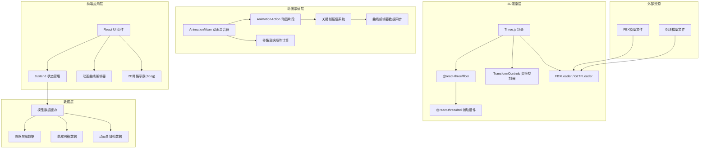

## 1. 架构设计



## 2. 技术描述

### 2.1 核心技术栈
- **前端框架**: React 18 + TypeScript
- **构建工具**: Vite 5
- **样式方案**: Tailwind CSS 3
- **状态管理**: Zustand 4
- **图标库**: Lucide React

### 2.2 3D渲染技术
- **核心引擎**: Three.js 0.160
- **React绑定**: @react-three/fiber 8
- **辅助组件**: @react-three/drei 9
- **后处理**: @react-three/postprocessing 2
- **模型加载**: three/addons (FBXLoader, GLTFLoader, OrbitControls, TransformControls)

### 2.3 动画与可视化
- **2D骨骼示意**: Zdog 1.1
- **曲线编辑器**: 自研Canvas-based动画曲线编辑器
- **动画混合**: Three.js AnimationMixer + 自定义权重过渡系统

## 3. 目录结构

```
src/
├── components/
│   ├── editor/
│   │   ├── Viewport3D.tsx          # 3D视口组件
│   │   ├── SkeletonHierarchy.tsx   # 骨骼层级面板
│   │   ├── TransformPanel.tsx      # 变换属性面板
│   │   ├── Timeline.tsx            # 时间轴组件
│   │   ├── CurveEditor.tsx         # 曲线编辑器
│   │   ├── AnimationBlender.tsx    # 动画混合面板
│   │   └── Skeleton2DPreview.tsx   # 2D骨骼示意
│   ├── ui/
│   │   ├── Button.tsx
│   │   ├── Slider.tsx
│   │   ├── NumberInput.tsx
│   │   └── TreeView.tsx
│   └── layout/
│       ├── DockPanel.tsx           # 可停靠面板
│       └── ResizableHandle.tsx     # 可拖拽分隔条
├── hooks/
│   ├── useAnimationMixer.ts        # 动画混合器Hook
│   ├── useSkeletonData.ts          # 骨骼数据Hook
│   ├── useKeyframeEditor.ts        # 关键帧编辑Hook
│   └── useModelLoader.ts           # 模型加载Hook
├── store/
│   └── editorStore.ts              # Zustand状态管理
├── utils/
│   ├── three/
│   │   ├── SkeletonHelper.ts       # 骨骼辅助工具
│   │   ├── AnimationUtils.ts       # 动画工具函数
│   │   └── ModelLoader.ts          # 模型加载器
│   └── math/
│       ├── CurveMath.ts            # 曲线计算
│       └── Interpolation.ts        # 插值算法
├── types/
│   ├── animation.ts                # 动画类型定义
│   └── skeleton.ts                 # 骨骼类型定义
├── App.tsx
├── main.tsx
└── index.css
```

## 4. 路由定义

| 路由 | 用途 |
|-------|---------|
| / | 主编辑器页面，包含所有编辑功能 |

## 5. 核心数据模型

### 5.1 骨骼数据结构

```mermaid
erDiagram
    SKELETON {
        string uuid
        string name
        Matrix4 bindMatrix
        Bone[] bones
    }
    
    BONE {
        string uuid
        string name
        Vector3 position
        Quaternion rotation
        Vector3 scale
        string parentUuid
        int boneIndex
    }
    
    SKINNED_MESH {
        string uuid
        string name
        BufferGeometry geometry
        Material material
        Skeleton skeleton
        Float32Array boneWeights
        Uint32Array boneIndices
    }
    
    KEYFRAME_TRACK {
        string boneUuid
        string propertyName "position/rotation/scale"
        float[] times
        Vector3[]|Quaternion[] values
        string interpolation
    }
    
    ANIMATION_CLIP {
        string uuid
        string name
        float duration
        KeyframeTrack[] tracks
    }
    
    ANIMATION_STATE {
        string clipUuid
        float weight
        bool isPlaying
        float currentTime
    }
    
    SKELETON ||--o{ BONE : contains
    SKINNED_MESH }o--|| SKELETON : uses
    ANIMATION_CLIP ||--o{ KEYFRAME_TRACK : contains
    ANIMATION_STATE }o--|| ANIMATION_CLIP : references
```

### 5.2 TypeScript 类型定义

```typescript
// 骨骼节点
interface BoneNode {
  uuid: string;
  name: string;
  parentUuid: string | null;
  children: string[];
  position: [number, number, number];
  rotation: [number, number, number, number];
  scale: [number, number, number];
  boneIndex: number;
}

// 关键帧
interface Keyframe {
  time: number;
  value: number[];
  interpolation: 'linear' | 'smooth' | 'step' | 'bezier';
  inTangent?: number[];
  outTangent?: number[];
}

// 动画轨道
interface AnimationTrack {
  boneUuid: string;
  property: 'position' | 'rotation' | 'scale';
  component: 'x' | 'y' | 'z' | 'w';
  keyframes: Keyframe[];
}

// 动画片段
interface AnimationClip {
  uuid: string;
  name: string;
  duration: number;
  tracks: AnimationTrack[];
}

// 动画混合状态
interface BlendState {
  walkWeight: number;
  runWeight: number;
  transitionSpeed: number;
}

// 编辑器状态
interface EditorState {
  selectedBoneUuid: string | null;
  currentTime: number;
  isPlaying: boolean;
  playbackSpeed: number;
  loopMode: 'once' | 'loop' | 'pingpong';
  transformMode: 'translate' | 'rotate' | 'scale';
  showSkeleton: boolean;
  showMesh: boolean;
  meshDisplayMode: 'solid' | 'wireframe' | 'transparent';
}
```

## 6. 状态管理设计

### 6.1 Zustand Store 结构

```typescript
// editorStore.ts
interface EditorStore {
  // 模型数据
  model: THREE.Group | null;
  skeleton: BoneNode[];
  animationClips: AnimationClip[];
  
  // 选择状态
  selectedBoneUuid: string | null;
  setSelectedBone: (uuid: string | null) => void;
  
  // 时间控制
  currentTime: number;
  isPlaying: boolean;
  playbackSpeed: number;
  setCurrentTime: (time: number) => void;
  togglePlay: () => void;
  
  // 变换控制
  transformMode: 'translate' | 'rotate' | 'scale';
  setTransformMode: (mode: 'translate' | 'rotate' | 'scale') => void;
  updateBoneTransform: (uuid: string, property: string, value: number[]) => void;
  
  // 关键帧编辑
  addKeyframe: (boneUuid: string, property: string, time: number) => void;
  updateKeyframe: (trackId: string, keyframeIndex: number, value: Keyframe) => void;
  deleteKeyframe: (trackId: string, keyframeIndex: number) => void;
  
  // 动画混合
  blendState: BlendState;
  setBlendWeight: (type: 'walk' | 'run', weight: number) => void;
  
  // 显示选项
  showSkeleton: boolean;
  showMesh: boolean;
  meshDisplayMode: 'solid' | 'wireframe' | 'transparent';
  toggleSkeleton: () => void;
  toggleMesh: () => void;
  setMeshDisplayMode: (mode: string) => void;
  
  // 模型加载
  loadModel: (file: File) => Promise<void>;
  clearModel: () => void;
}
```

## 7. 性能优化策略

1. **骨骼矩阵更新优化**: 仅在骨骼变换改变时重新计算蒙皮矩阵
2. **关键帧插值缓存**: 对计算出的插值结果进行帧缓存
3. **渲染帧率控制**: 曲线编辑器使用独立的requestAnimationFrame循环
4. **Web Worker**: 模型解析和重骨骼计算在Worker中执行
5. **LOD策略**: 远景模型使用简化骨骼显示

