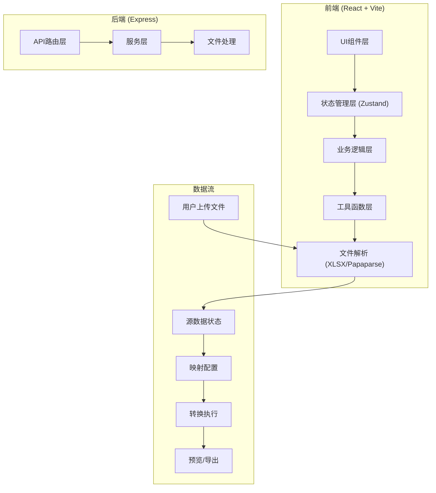

## 1. 架构设计



## 2. 技术说明
- **前端框架**：React@18 + TypeScript + Vite
- **UI样式**：TailwindCSS@3
- **状态管理**：Zustand
- **可视化映射**：React Flow@11
- **文件解析**：XLSX (Excel), Papaparse (CSV), 原生JSON解析
- **后端框架**：Express@4 + TypeScript
- **图标库**：Lucide React

## 3. 路由定义
| 路由 | 用途 |
|------|------|
| / | 主工作台页面 |

## 4. API 定义

```typescript
// 源数据字段
interface SourceField {
  id: string;
  name: string;
  type: 'string' | 'number' | 'date' | 'boolean';
  sampleValues: string[];
}

// 目标模型字段
interface TargetField {
  id: string;
  name: string;
  type: 'string' | 'number' | 'date' | 'boolean';
  required: boolean;
  description?: string;
}

// 转换函数类型
type TransformFunction = 
  | { type: 'concat'; separator: string; fields: string[] }
  | { type: 'split'; separator: string; index: number }
  | { type: 'format'; pattern: string }
  | { type: 'lookup'; mapping: Record<string, string>; defaultValue: string }
  | { type: 'trim' }
  | { type: 'uppercase' }
  | { type: 'lowercase' };

// 映射关系
interface Mapping {
  id: string;
  sourceFieldId: string | null;
  targetFieldId: string;
  transforms: TransformFunction[];
}

// 数据行
type DataRow = Record<string, any>;

// 导出配置
interface ExportConfig {
  format: 'xlsx' | 'csv' | 'json';
  filename: string;
  includeHeaders: boolean;
}
```

## 5. 数据模型

### 5.1 应用状态模型
```typescript
interface AppState {
  // 源数据
  sourceFileName: string | null;
  sourceFields: SourceField[];
  sourceData: DataRow[];
  
  // 目标模型
  targetFields: TargetField[];
  
  // 映射配置
  mappings: Mapping[];
  
  // UI状态
  selectedMapping: string | null;
  previewPage: number;
  previewPageSize: number;
  
  // 操作方法
  setSourceData: (file: File, fields: SourceField[], data: DataRow[]) => void;
  setTargetFields: (fields: TargetField[]) => void;
  addMapping: (mapping: Mapping) => void;
  updateMapping: (id: string, updates: Partial<Mapping>) => void;
  removeMapping: (id: string) => void;
  clearAll: () => void;
}
```
