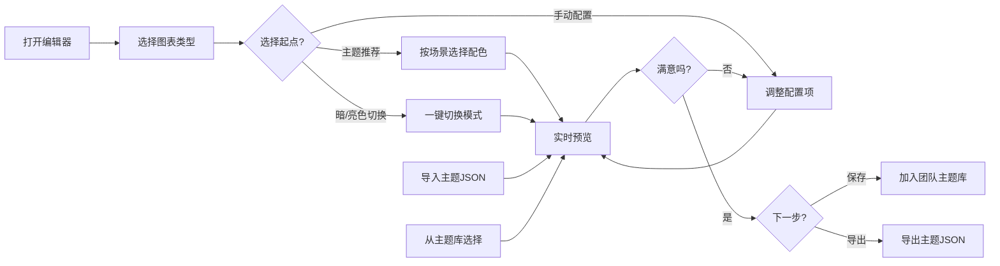

## 1. 产品概述

图表主题编辑器是一款Web端可视化工具，允许用户自定义ECharts图表的样式属性，包括颜色、字体、网格线、标签等，并实时预览效果。支持主题JSON的导入导出，可应用于多种图表类型。

- **核心目的**：为数据可视化开发者提供便捷的主题定制工具
- **目标用户**：前端开发者、数据分析师、UI设计师
- **市场价值**：提升图表定制效率，降低ECharts主题配置门槛

## 2. 核心功能

### 2.1 用户角色
| 角色 | 注册方式 | 核心权限 |
|------|----------|----------|
| 普通用户 | 无需注册 | 使用所有编辑功能，导入导出主题 |

### 2.2 功能模块
1. **主编辑页面**：配置面板、图表预览区、工具栏
2. **配置面板**：颜色配置、字体配置、网格线配置、标签配置
3. **图表预览区**：多种图表类型实时预览
4. **工具栏**：主题导入、主题导出、图表切换、暗/亮色切换
5. **主题推荐**：按业务场景推荐预设配色方案
6. **团队主题库**：主题收藏、分享、复用管理

### 2.3 页面详情
| 页面名称 | 模块名称 | 功能描述 |
|---------|----------|----------|
| 主编辑页面 | 配置面板 | 分组展示所有可配置项，支持颜色选择器、滑块、下拉选择等交互；全局色板变化时自动重新映射系列色 |
| 主编辑页面 | 图表预览区 | 实时渲染配置效果，支持折线图、柱状图、饼图、散点图等多种类型；切换图表类型保留主题配置 |
| 主编辑页面 | 工具栏 | 提供导入JSON、导出JSON（含样式合并压缩）、重置主题、切换图表类型、暗/亮色一键切换等操作 |
| 主编辑页面 | 主题推荐 | 按业务场景（数据大屏、工作报告、财务分析、营销报表等）推荐专业配色方案，一键应用 |
| 主编辑页面 | 团队主题库 | 展示已保存的主题列表，支持收藏、应用、重命名、删除，实现主题共享复用 |

## 3. 核心流程

用户打开编辑器 → 选择图表类型 → 选择业务场景主题推荐 → 或切换暗/亮色模式 → 在配置面板调整样式 → 实时查看预览效果 → 保存到团队主题库 → 导出主题JSON文件（或导入已有主题）

## 4. 用户界面设计

### 4.1 设计风格
- **主色调**：深蓝色系 (#1890ff)，体现专业、科技感
- **辅助色**：绿色成功、橙色警告、红色错误
- **按钮样式**：圆角矩形，悬停有轻微阴影和颜色变化
- **字体**：系统默认无衬线字体，标题加粗
- **布局风格**：左右分栏布局，左侧配置面板，右侧预览区
- **图标风格**：简洁线性图标，Ant Design风格

### 4.2 页面设计概述
| 页面名称 | 模块名称 | UI元素 |
|---------|----------|--------|
| 主编辑页面 | 顶部工具栏 | 标题、导入按钮、导出按钮、图表类型选择器、暗/亮色切换按钮 |
| 主编辑页面 | 左侧配置面板 | 可折叠分组、颜色选择器、数字输入框、滑块、下拉菜单、主题推荐卡片 |
| 主编辑页面 | 左侧配置面板 | 团队主题库列表、主题卡片（预览+操作按钮） |
| 主编辑页面 | 右侧预览区 | ECharts图表容器、类型标签、说明文字、当前色板展示 |

### 4.3 响应式
- **桌面端优先**：左右分栏布局，配置面板固定宽度360px
- **平板适配**：配置面板可折叠收起
- **移动端**：上下布局，配置面板采用抽屉式交互

### 4.4 交互细节
- 配置项修改后图表立即重绘（防抖处理）
- 颜色选择器支持HEX/RGB/HSL格式
- 所有配置支持撤销/重做
- 悬停配置项显示提示信息
- 全局色板变化时，所有系列颜色自动重新映射
- 切换图表类型时，主题配置保持不变，仅改变图表展示形式
- 导出主题时自动合并重复样式、压缩去除冗余属性
- 暗/亮色一键切换：自动调整背景色、文字色、网格线对比度
- 主题推荐：点击卡片一键应用预设配色，按场景分类展示
- 团队主题库：悬停显示预览效果，支持收藏/取消收藏、快速应用、重命名、删除
- 主题保存：输入名称和描述，可选择是否加入团队共享库
