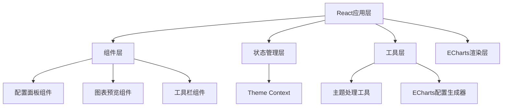

## 1. 架构设计



## 2. 技术描述

- **前端框架**：React@18
- **构建工具**：Vite@5
- **样式方案**：Less
- **图表库**：ECharts@5 + echarts-for-react
- **颜色选择器**：react-colorful
- **状态管理**：Zustand
- **图标库**：lucide-react
- **工具函数**：lodash (用于深拷贝、对象合并、差异比较)

## 3. 目录结构

```
src/
├── components/
│   ├── ConfigPanel/
│   │   ├── index.tsx
│   │   ├── ColorSection.tsx
│   │   ├── ThemeRecommendations.tsx
│   │   └── ── ThemeLibrary.tsx
│   ├── ChartPreview/
│   │   └── index.tsx
│   ├── Toolbar/
│   │   └── index.tsx
│   ├── ColorPicker/
│   │   └── index.tsx
│   ├── ThemeModal/
│   │   └── SaveThemeModal.tsx
│   └── ThemeCard/
│       └── index.tsx
├── store/
│   └── useThemeStore.ts
├── hooks/
│   └── useDebounce.ts
├── utils/
│   ├── themeUtils.ts
│   ├── chartOptions.ts
│   ├── defaultTheme.ts
│   ├── recommendedThemes.ts
│   └── themeConverter.ts
├── types/
│   └── theme.ts
├── styles/
│   ├── variables.less
│   └── global.less
├── App.tsx
└── main.tsx
```

## 4. 主题数据结构

```typescript
interface ChartTheme {
  color: string[];
  backgroundColor: string;
  textStyle: {
    color: string;
    fontFamily: string;
    fontSize: number;
  };
  title: {
    textStyle: {
      color: string;
      fontSize: number;
      fontWeight: string;
    };
    subtextStyle: {
      color: string;
      fontSize: number;
    };
  };
  line: {
    itemStyle: {
      borderWidth: number;
    };
    lineStyle: {
      width: number;
    };
    symbolSize: number;
    symbol: string;
    smooth: boolean;
  };
  grid: {
    show: boolean;
    borderColor: string;
    borderWidth: number;
  };
  categoryAxis: {
    axisLine: {
      show: boolean;
      lineStyle: {
        color: string;
      };
    };
    axisTick: {
      show: boolean;
      lineStyle: {
        color: string;
      };
    };
    axisLabel: {
      show: boolean;
      color: string;
      fontSize: number;
    };
    splitLine: {
      show: boolean;
      lineStyle: {
        color: string;
        type: string;
      };
    };
  };
  valueAxis: {
    axisLine: {
      show: boolean;
      lineStyle: {
        color: string;
      };
    };
    axisTick: {
      show: boolean;
      lineStyle: {
        color: string;
      };
    };
    axisLabel: {
      show: boolean;
      color: string;
      fontSize: number;
    };
    splitLine: {
      show: boolean;
      lineStyle: {
        color: string;
        type: string;
      };
    };
  };
  legend: {
    show: boolean;
    textStyle: {
      color: string;
      fontSize: number;
    };
  };
  tooltip: {
    backgroundColor: string;
    borderColor: string;
    borderWidth: number;
    textStyle: {
      color: string;
      fontSize: number;
    };
  };
}
```

## 5. 组件通信设计

### 5.1 Zustand Store
- **theme**: 存储当前主题配置
- **chartType**: 当前图表类型
- **isDarkMode**: 暗/亮色模式标识
- **savedThemes**: 团队主题库列表
- **history**: 撤销/重做历史栈
- **Actions**:
  - updateTheme: 部分更新主题
  - setColorPalette: 更新全局色板，自动映射系列色
  - setChartType: 切换图表类型（保留主题）
  - toggleDarkMode: 暗/亮色一键切换
  - applyRecommendedTheme: 应用推荐主题
  - saveTheme: 保存主题到团队库
  - deleteTheme: 从团队库删除主题
  - renameTheme: 重命名主题
  - toggleFavorite: 收藏/取消收藏主题
  - exportTheme: 导出主题（含合并压缩）
  - importTheme: 导入主题JSON
  - undo/redo: 撤销重做

### 5.2 组件职责
- **ConfigPanel**: 消费theme store，渲染配置表单、主题推荐、主题库
- **ChartPreview**: 消费theme和chartType，渲染ECharts图表
- **Toolbar**: 消费theme store，提供导入导出、图表切换、暗/亮色切换
- **ThemeRecommendations**: 展示推荐主题卡片，支持一键应用
- **ThemeLibrary**: 展示团队主题库，支持搜索、筛选、管理
- **SaveThemeModal**: 保存主题弹窗，输入名称描述

## 6. 核心功能技术实现

### 6.1 响应式颜色映射
- **设计思路**：全局色板作为单一数据源，所有系列颜色通过索引映射自动生成
- **实现机制**：使用useEffect监听color数组变化，触发所有相关样式的重新计算
- **映射策略**：系列数量超过色板长度时，循环使用色板颜色
- **更新流程**：
  ```
  全局色板更新 → 计算衍生颜色 → 更新各系列itemStyle → 触发图表重绘
  ```

### 6.2 主题导出优化（合并与压缩）
- **样式合并**：深度遍历主题对象，将相同值的属性提升到父级或公共配置
- **冗余去除**：对比默认主题，仅导出与默认值不同的配置项
- **压缩策略**：
  1. 移除undefined和null值
  2. 合并相同样式规则
  3. 简化嵌套结构
  4. 支持格式化/压缩两种导出模式

### 6.3 图表类型切换（保留主题）
- **状态分离**：将图表类型与主题配置分离存储
- **切换逻辑**：切换图表类型时，仅更新chartType和对应option模板，theme保持不变
- **兼容处理**：不同图表类型的option适配相同的主题结构

### 6.4 主题推荐（按业务场景）

#### 6.4.1 推荐主题数据结构
```typescript
interface RecommendedTheme {
  id: string;
  name: string;
  description: string;
  category: 'dashboard' | 'report' | 'finance' | 'marketing' | 'tech';
  categoryName: string;
  theme: Partial<ChartTheme>;
  previewColors: string[];
}
```

#### 6.4.2 预设场景分类
| 场景分类 | 适用场景 | 配色特点 |
|---------|---------|---------|
| 数据大屏 | 驾驶舱、监控大屏 | 深色背景、高对比度、科技感配色 |
| 工作报告 | 周报、月报、年报 | 专业稳重、低饱和度、商务风 |
| 财务分析 | 财务报表、营收分析 | 绿涨红跌、严谨规范、高可读性 |
| 营销报表 | 活动分析、用户增长 | 活泼鲜明、高饱和度、视觉冲击力 |
| 科技风格 | 技术分享、产品数据 | 蓝紫渐变、未来感、极简风 |

#### 6.4.3 实现要点
- 内置5类共15套精选配色方案
- 按分类标签筛选展示
- 卡片展示色板预览和适用场景说明
- 点击一键应用，自动合并默认值

---

### 6.5 暗/亮色主题一键切换

#### 6.5.1 设计思路
- 维护当前模式状态（isDarkMode）
- 切换时自动转换所有颜色属性，保持色板主色调不变
- 使用颜色算法自动计算对比度，确保可读性

#### 6.5.2 颜色转换规则
| 属性 | 亮色 → 暗色 | 暗色 → 亮色 |
|------|-------------|-------------|
| backgroundColor | #ffffff → #141414 | #141414 → #ffffff |
| textStyle.color | #333333 → #e8e8e8 | #e8e8e8 → #333333 |
| 坐标轴文字 | #666666 → #bfbfbf | #bfbfbf → #666666 |
| 网格线 | #e0e0e0 → #434343 | #434343 → #e0e0e0 |
| tooltip背景 | rgba(50,50,50,0.9) → rgba(255,255,255,0.95) | rgba(255,255,255,0.95) → rgba(50,50,50,0.9) |
| tooltip文字 | #ffffff → #333333 | #333333 → #ffffff |
| 色板颜色 | 保持主色调，自动调整明度 | 保持主色调，自动调整明度 |

#### 6.5.3 颜色工具函数
- `hexToHsl`: HEX转HSL，便于调整明度
- `hslToHex`: HSL转HEX
- `adjustColorLightness`: 调整颜色明度
- `getContrastColor`: 根据背景色获取对比色
- `convertThemeMode`: 批量转换主题所有颜色属性

---

### 6.6 团队主题库

#### 6.6.1 数据结构
```typescript
interface SavedTheme {
  id: string;
  name: string;
  description: string;
  theme: ChartTheme;
  isFavorite: boolean;
  createdAt: number;
  updatedAt: number;
  isShared: boolean;
  author: string;
}
```

#### 6.6.2 存储方案
- 使用localStorage持久化存储
- 支持导入/导出整个主题库
- 可按名称搜索、按收藏筛选

#### 6.6.3 核心功能
- **保存主题**：弹窗输入名称、描述，选择是否共享
- **应用主题**：点击卡片替换当前编辑主题
- **重命名**：修改主题名称和描述
- **删除**：删除主题（带二次确认）
- **收藏**：标记常用主题，优先展示
- **搜索**：按名称关键词搜索
- **导入导出**：支持主题库批量备份迁移

---

### 6.7 性能优化

- 使用React.memo优化组件重渲染
- 使用useDebounce防抖处理主题更新
- ECharts图表使用setOption增量更新
- 配置项按需加载
- 使用shallow比较优化Zustand selector
- 主题库列表使用虚拟滚动（超过50项时）
- 颜色转换使用memo缓存结果
