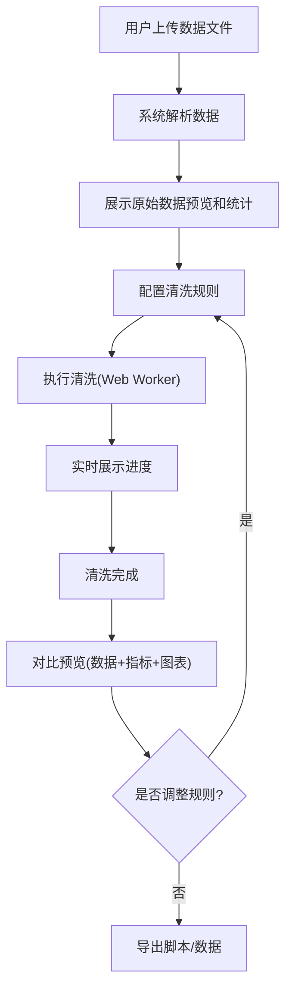

## 1. 产品概述

Web端数据清洗工具，为数据分析师和开发人员提供可视化的数据预处理能力。支持重复值删除、缺失值填充、异常值检测、数据标准化等核心清洗功能，提供清洗前后数据对比预览，并可导出可复用的Python/Pandas清洗脚本。

- 主要解决数据预处理过程繁琐、缺乏可视化对比、清洗逻辑难以复用的问题
- 目标用户为数据分析师、数据科学家、前端/后端开发人员
- 产品价值：提升数据清洗效率，降低数据预处理门槛，实现清洗流程可追溯、可复用

## 2. 核心功能

### 2.1 用户角色
| 角色 | 注册方式 | 核心权限 |
|------|----------|----------|
| 普通用户 | 无需注册，直接使用 | 上传数据、配置清洗规则、预览清洗结果、导出脚本和数据 |

### 2.2 功能模块
1. **数据上传模块**：支持CSV/Excel文件上传、数据预览、数据统计信息展示
2. **清洗规则配置模块**：重复值处理、缺失值填充、异常值检测、数据标准化的规则配置
3. **数据清洗执行模块**：Web Worker后台执行、进度展示、实时状态反馈
4. **对比预览模块**：清洗前后数据对比、统计指标对比、可视化图表对比
5. **脚本导出模块**：Python/Pandas脚本生成、预览、下载
6. **数据导出模块**：清洗后数据导出为CSV/Excel

### 2.3 页面详情
| 页面名称 | 模块名称 | 功能描述 |
|----------|----------|----------|
| 主工作台 | 文件上传区 | 拖拽上传CSV/Excel文件，支持文件大小和格式校验 |
| 主工作台 | 原始数据预览 | 表格展示原始数据前100行，显示数据行列数、数据类型统计 |
| 主工作台 | 清洗规则配置面板 | 分标签页配置各类清洗规则，支持实时规则验证 |
| 主工作台 | 清洗执行控制 | 开始/暂停/重置清洗，显示执行进度和状态 |
| 主工作台 | 对比预览区 | 分栏展示清洗前后数据对比、统计指标对比、ECharts可视化对比 |
| 主工作台 | 导出面板 | 预览生成的Python脚本，选择导出格式（脚本/清洗后数据） |

## 3. 核心流程

用户上传数据文件 → 系统解析并展示原始数据预览和统计信息 → 用户逐项配置清洗规则（重复值处理→缺失值填充→异常值检测→数据标准化）→ 点击执行清洗 → Web Worker后台执行数据处理 → 实时展示清洗进度和状态 → 完成后展示清洗前后对比预览（数据表格+统计指标+可视化图表）→ 用户可调整规则重新清洗 → 导出Python/Pandas脚本和/或清洗后数据

## 4. 用户界面设计

### 4.1 设计风格
- **设计理念**：科技感、专业、高效的数据工具风格
- **主色调**：深空蓝 (#0F172A) 作为背景主色，科技蓝 (#3B82F6) 作为主强调色，翠绿 (#10B981) 表示成功，橙红 (#F59E0B) 表示警告，玫红 (#EF4444) 表示错误
- **辅助色**：蓝紫渐变 (#6366F1 到 #8B5CF6) 用于高亮和装饰
- **按钮风格**：圆角6px，微立体阴影，hover时有轻微上浮和发光效果
- **字体**：标题使用 JetBrains Mono（等宽字体，体现数据专业性），正文使用 Inter（清晰易读）
- **布局风格**：三栏布局（左侧规则配置、中间数据预览、右侧对比分析），卡片式模块，深色主题
- **图标风格**：线性图标，统一2px描边，使用 Lucide React 图标库
- **视觉特效**：数据表格斑马纹、卡片玻璃态效果、进度条渐变、图表入场动画

### 4.2 页面设计概述
| 页面名称 | 模块名称 | UI元素 |
|----------|----------|----------|
| 主工作台 | 文件上传区 | 拖拽区域虚线边框，上传图标动画，文件信息卡片 |
| 主工作台 | 规则配置面板 | 手风琴式折叠面板，开关组件，下拉选择器，参数输入框 |
| 主工作台 | 数据预览区 | 固定列表格，行号列，数据类型标签，分页控件 |
| 主工作台 | 对比预览区 | 左右分栏布局，切换标签（数据对比/统计对比/可视化），ECharts图表容器 |
| 主工作台 | 导出面板 | 代码编辑器样式的脚本预览区，语法高亮，复制/下载按钮 |

### 4.3 响应式
- 桌面端（≥1200px）：三栏完整布局
- 平板端（768px-1199px）：左右两栏，底部合并对比区域
- 移动端（<768px）：单栏流式布局，tab切换各模块
- 触摸优化：按钮最小高度44px，表格支持横向滚动

### 4.4 数据可视化设计
- **缺失值热力图**：展示各列缺失值分布，颜色深浅表示缺失比例
- **箱线图**：异常值检测前后对比，用红点标记异常值
- **直方图/密度图**：数据标准化前后分布对比
- **统计指标卡片**：行数、列数、缺失值数量、重复值数量、异常值数量，清洗前后差值用绿色/红色箭头展示
