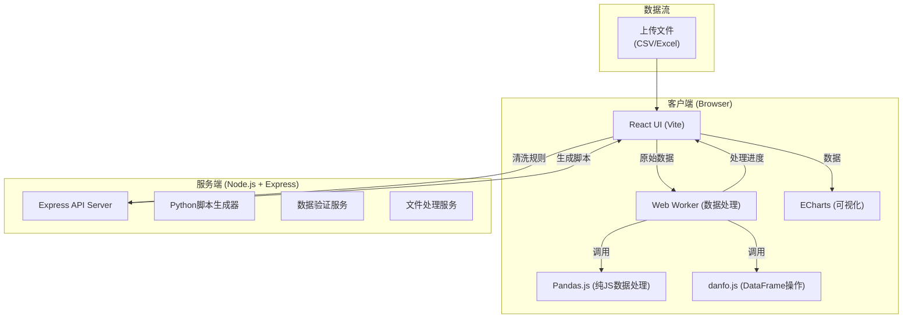

## 1. 架构设计



## 2. 技术描述

### 2.1 前端技术栈
- **框架**: React@18 + TypeScript
- **构建工具**: Vite@5
- **样式方案**: TailwindCSS@3 + CSS Variables
- **UI组件库**: Headless UI (无样式组件) + Lucide React (图标)
- **数据处理库**: 
  - danfo.js (浏览器端DataFrame，类Pandas API)
  - pandas-js (轻量级数据处理)
  - simple-statistics (统计计算)
- **可视化**: ECharts@5 + echarts-for-react
- **Web Worker**: 原生 Web Worker API + comlink (简化通信)
- **文件处理**: Papa Parse (CSV解析) + xlsx (Excel解析)
- **状态管理**: React Context + useReducer (轻量级，避免过度设计)

### 2.2 后端技术栈
- **框架**: Express@4 + TypeScript
- **核心功能**: 
  - Python/Pandas脚本生成器
  - 数据Schema验证
  - 文件格式转换服务
  - 示例数据生成
- **部署**: 后端作为可选服务，前端可独立运行（纯客户端模式）

### 2.3 架构特点
- **混合架构**: 核心数据清洗逻辑在前端Web Worker中执行，避免阻塞UI
- **后端辅助**: 后端仅提供脚本生成、格式转换等辅助功能
- **离线可用**: 前端可独立运行，无需后端支持即可完成核心清洗功能
- **性能优化**: 大数据量使用分片处理，Web Worker多线程并行

## 3. 目录结构

```
├── client/                 # 前端项目
│   ├── src/
│   │   ├── components/     # React组件
│   │   │   ├── FileUpload/
│   │   │   ├── DataPreview/
│   │   │   ├── RuleConfig/
│   │   │   ├── ComparisonView/
│   │   │   ├── ScriptExport/
│   │   │   └── charts/     # ECharts图表组件
│   │   ├── workers/        # Web Worker
│   │   │   └── dataCleaner.worker.ts
│   │   ├── utils/          # 工具函数
│   │   │   ├── dataProcessor.ts
│   │   │   ├── scriptGenerator.ts
│   │   │   └── statistics.ts
│   │   ├── types/          # TypeScript类型定义
│   │   ├── context/        # React Context
│   │   └── App.tsx
│   └── package.json
│
└── server/                 # 后端项目
    ├── src/
    │   ├── controllers/
    │   ├── services/
    │   ├── routes/
    │   └── server.ts
    └── package.json
```

## 4. 核心数据结构与类型定义

### 4.1 清洗规则类型
```typescript
// 缺失值填充方法
type FillMethod = 'mean' | 'median' | 'mode' | 'interpolate' | 'constant' | 'ffill' | 'bfill';

// 异常值检测方法
type OutlierMethod = 'zscore' | 'iqr';

// 标准化方法
type NormalizeMethod = 'minmax' | 'zscore' | 'robust';

// 清洗规则配置
interface CleaningRules {
  removeDuplicates: {
    enabled: boolean;
    columns?: string[];  // 指定列检查重复，空则检查所有列
    keep: 'first' | 'last' | false;
  };
  handleMissing: {
    enabled: boolean;
    columns: {
      [columnName: string]: {
        method: FillMethod;
        value?: number | string;  // constant方法时使用
      };
    };
    defaultMethod: FillMethod;
  };
  detectOutliers: {
    enabled: boolean;
    columns: {
      [columnName: string]: {
        method: OutlierMethod;
        threshold: number;  // zscore默认3，iqr默认1.5
        action: 'remove' | 'cap' | 'mark';  // 删除/盖帽/标记
      };
    };
    defaultMethod: OutlierMethod;
    defaultThreshold: number;
  };
  normalize: {
    enabled: boolean;
    columns: {
      [columnName: string]: {
        method: NormalizeMethod;
      };
    };
    defaultMethod: NormalizeMethod;
  };
}
```

### 4.2 数据统计信息
```typescript
interface ColumnStats {
  name: string;
  type: 'numeric' | 'string' | 'boolean' | 'date' | 'mixed';
  count: number;
  missingCount: number;
  missingPercent: number;
  uniqueCount: number;
  duplicateCount: number;
  // 数值型统计
  min?: number;
  max?: number;
  mean?: number;
  median?: number;
  mode?: number | string;
  std?: number;
  // 异常值
  outlierCount?: number;
  outliers?: number[];
}

interface DatasetStats {
  rowCount: number;
  columnCount: number;
  columns: ColumnStats[];
  totalMissing: number;
  totalDuplicates: number;
  memorySize: string;
}
```

### 4.3 清洗结果
```typescript
interface CleaningResult {
  success: boolean;
  data: any[][];
  columns: string[];
  stats: DatasetStats;
  beforeStats: DatasetStats;
  changes: {
    rowsRemoved: number;
    rowsAdded: number;
    valuesFilled: number;
    outliersHandled: number;
    duplicatesRemoved: number;
  };
  script: string;  // 生成的Python脚本
  logs: string[];
  duration: number;
}
```

## 5. 路由定义

### 5.1 前端路由
| 路由 | 页面 | 说明 |
|------|------|------|
| / | 主工作台 | 数据清洗主界面 |
| /demo | 演示页面 | 内置示例数据演示 |

### 5.2 后端API
| 方法 | 路由 | 说明 |
|------|------|------|
| POST | /api/generate-script | 根据清洗规则生成Python/Pandas脚本 |
| POST | /api/validate-schema | 验证数据集Schema |
| GET | /api/sample-data/:name | 获取示例数据集 |
| POST | /api/convert-format | 转换文件格式 (CSV↔Excel) |

## 6. Web Worker 设计

### 6.1 Worker 消息类型
```typescript
type WorkerMessage = 
  | { type: 'INIT'; payload: { data: any[][]; columns: string[] } }
  | { type: 'CLEAN'; payload: { rules: CleaningRules } }
  | { type: 'CANCEL' }
  | { type: 'GET_STATS' };

type WorkerResponse =
  | { type: 'PROGRESS'; payload: { step: string; progress: number } }
  | { type: 'STATS'; payload: DatasetStats }
  | { type: 'COMPLETE'; payload: CleaningResult }
  | { type: 'ERROR'; payload: string };
```

### 6.2 清洗执行步骤
1. **数据解析** - 解析上传的CSV/Excel文件，转换为二维数组
2. **统计分析** - 计算原始数据统计信息
3. **重复值处理** - 根据规则删除重复行
4. **缺失值填充** - 按列配置的方法填充缺失值
5. **异常值检测与处理** - Z-score/IQR方法检测并处理异常值
6. **数据标准化** - 按列配置进行标准化/归一化
7. **结果统计** - 计算清洗后数据统计信息
8. **脚本生成** - 前端调用脚本生成器生成Python代码

## 7. 脚本生成规则

Python/Pandas脚本生成遵循以下模板结构：
```python
import pandas as pd
import numpy as np
from scipy import stats

# 1. 读取数据
df = pd.read_csv('your_data.csv')

# 2. 删除重复值
df = df.drop_duplicates(subset=[...], keep='first')

# 3. 缺失值处理
df['column1'] = df['column1'].fillna(df['column1'].mean())
df['column2'] = df['column2'].interpolate()

# 4. 异常值处理
# Z-score方法
z_scores = np.abs(stats.zscore(df['column3']))
df = df[z_scores < 3]
# IQR方法
Q1 = df['column4'].quantile(0.25)
Q3 = df['column4'].quantile(0.75)
IQR = Q3 - Q1
df = df[~((df['column4'] < (Q1 - 1.5 * IQR)) | (df['column4'] > (Q3 + 1.5 * IQR)))]

# 5. 数据标准化
from sklearn.preprocessing import StandardScaler, MinMaxScaler
df['column5'] = StandardScaler().fit_transform(df[['column5']])

# 6. 保存结果
df.to_csv('cleaned_data.csv', index=False)
```

## 8. 性能优化策略

1. **Web Worker 隔离**: 所有数据计算在Worker线程执行，不阻塞UI
2. **分片处理**: 超过10万行数据自动分片，逐片处理并报告进度
3. **数据懒加载**: 表格仅渲染可见区域（虚拟滚动）
4. **内存管理**: 处理完成后及时释放大型数据对象，使用transferable objects
5. **增量更新**: 规则变更时仅重新计算受影响的步骤，避免全量重算
6. **WebAssembly**: 核心统计算法使用WASM加速（可选优化）
