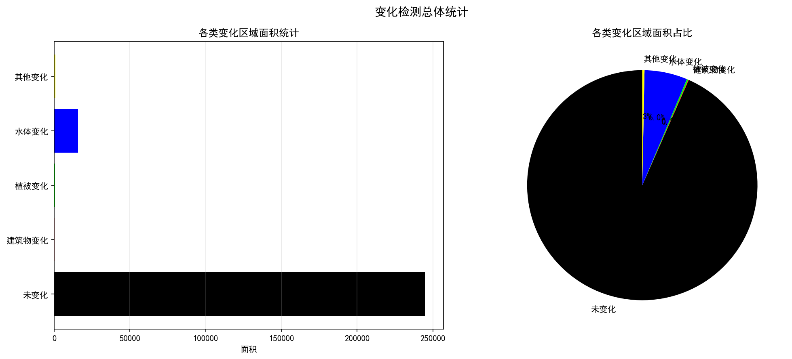
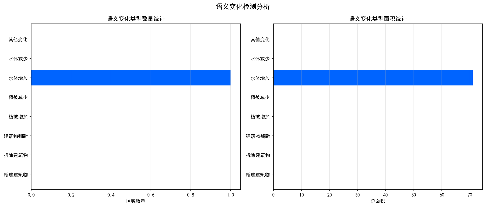
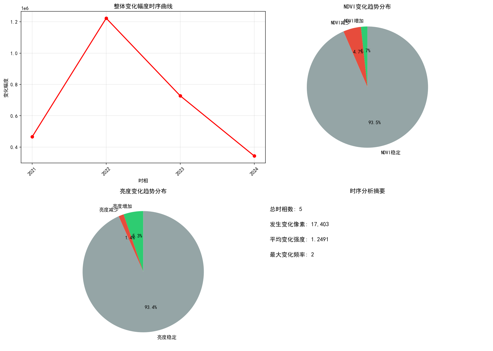
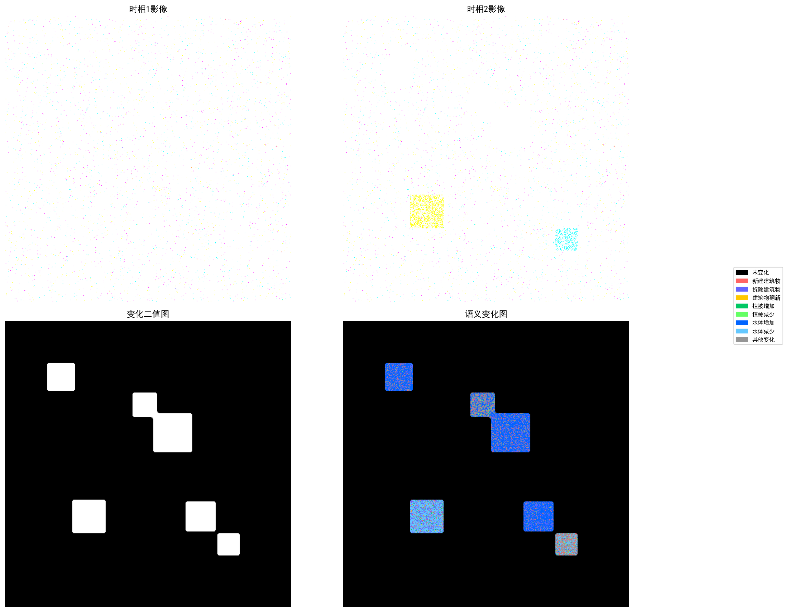
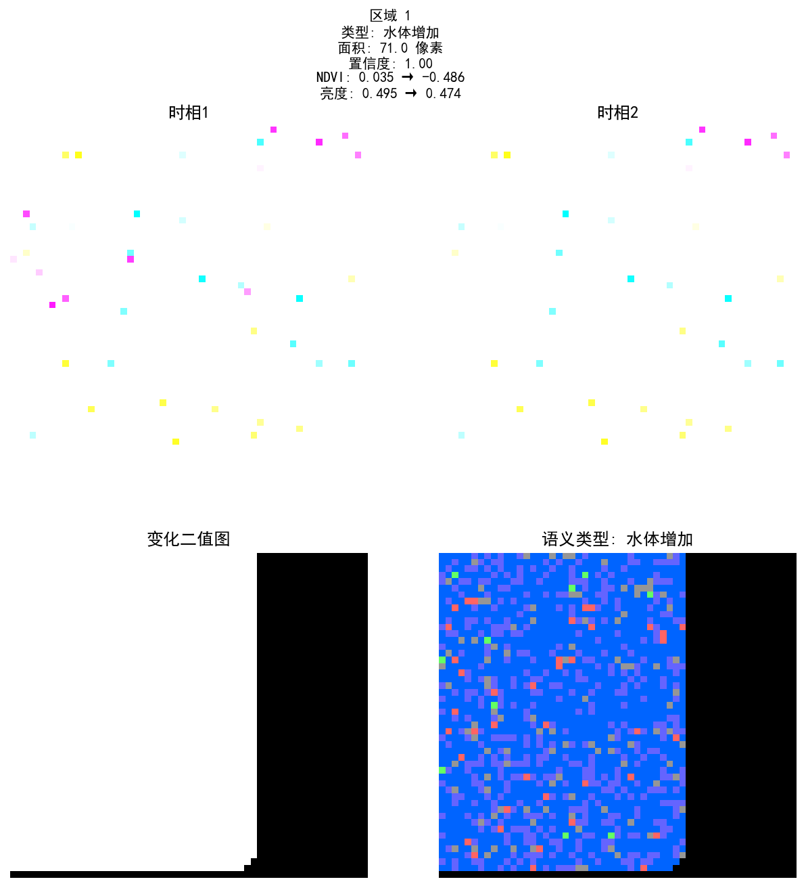

# 遥感图像变化检测

> 📅 报告生成时间: 2026-05-26 00:50:22

---

## 1. 变化检测总体概况

| 指标 | 数值 |
|------|------|
| 总像素数 | 262,144 |
| 变化像素数 | 17,347 |
| 未变化像素数 | 244,797 |
| 变化比例 | 6.62% |
| 变化区域数量 | 5 |
| 总变化面积 | 17347.0000 |
| 平均区域面积 | 3469.4000 |
| 像素实际面积 | 1.000000 平方单位 |

## 2. 语义变化检测分析

| 语义类型 | 区域数量 | 总面积 |
|----------|----------|--------|
| 水体增加 | 1 | 71.0000 |

- 总语义变化区域数: 1
- 平均置信度: 1.0000
- 平均区域面积: 71.0000

## 3. 多时相时序变化分析

| 指标 | 数值 |
|------|------|
| 时相数量 | 5 |
| 发生变化像素数 | 17,403 |
| 平均变化强度 | 1.2491 |
| 最大变化频率 | 2 |
| NDVI增加像素 | 4,535 |
| NDVI减少像素 | 12,401 |
| NDVI稳定像素 | 245,208 |

## 4. 变化影像对比

多时相影像与变化检测结果对比

## 5. 重点变化区域详情

以下为面积最大的10个变化区域的详细影像切片（按面积从大到小排列）。

