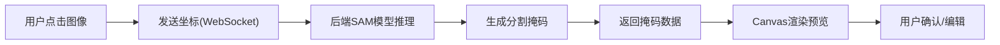

## 1. 产品概述

Web端图像分割标注工具，提供专业的图像像素级标注能力，支持多种标注模式和SAM模型辅助的半自动分割，帮助数据标注人员高效完成计算机视觉训练数据集的制作。

- **主要用途**：图像分割数据标注、训练数据集制作、医学影像标注、自动驾驶场景标注
- **解决问题**：手动标注效率低、精度差，复杂轮廓标注耗时久
- **目标用户**：数据标注工程师、AI算法研究员、医疗影像标注人员

---

## 2. 核心功能

### 2.1 用户角色

| 角色 | 注册方式 | 核心权限 |
|------|----------|----------|
| 标注人员 | 本地启动，无需注册 | 图像上传、标注编辑、SAM辅助分割、标注导出 |

### 2.2 功能模块

1. **主标注页面**：Canvas画布、工具栏、标注列表、属性面板
2. **图像管理**：图像上传、切换浏览、缩放平移
3. **标注工具**：多边形、点、矩形、语义分割画笔
4. **SAM辅助分割**：点击分割、自动生成掩码
5. **标注管理**：标注列表、分类标签、可见性控制
6. **像素计算**：自动计算标注区域像素面积、百分比
7. **数据导出**：JSON格式导出、掩码图像导出

### 2.3 页面详情

| 页面名称 | 模块名称 | 功能描述 |
|----------|----------|----------|
| 主标注页 | 顶部导航栏 | 项目名称、图像上传按钮、导出按钮、帮助入口 |
| 主标注页 | 左侧工具栏 | 标注工具选择（选择、多边形、点、矩形、画笔、SAM点击）、撤销重做 |
| 主标注页 | 中央Canvas区域 | 图像显示、标注绘制、缩放平移、SAM点击交互 |
| 主标注页 | 右侧面板 | 标注列表、标签分类管理、标注属性编辑、像素统计信息 |
| 主标注页 | 底部状态栏 | 当前坐标、缩放比例、图像尺寸、标注数量 |

---

## 3. 核心流程

### 3.1 完整标注流程

用户打开工具 → 上传/选择图像 → 选择标注工具 → 在Canvas上绘制标注 → （可选）使用SAM点击自动分割 → 确认标注并添加标签 → 自动计算像素区域 → 导出标注数据

### 3.2 SAM半自动分割流程

选择SAM点击工具 → 在目标区域点击 → 前端通过WebSocket发送坐标到后端 → 后端调用SAM模型生成掩码 → 掩码返回前端Canvas渲染 → 用户确认或编辑生成的标注

---

## 4. 用户界面设计

### 4.1 设计风格

- **设计基调**：专业简洁的深色科技风格，适合长时间标注作业
- **主色调**：深蓝灰 (#0f172a) 背景，强调专业感和减少眼部疲劳
- **强调色**：青色 #06b6d4 用于激活状态、交互高亮
- **标注颜色**：预设10种高对比度的半透明填充色，用于不同类别区分
- **字体**：JetBrains Mono 作为代码和数字字体，Noto Sans SC 作为中文界面字体
- **按钮风格**：扁平化设计，圆角8px，悬停有轻微亮度变化
- **布局风格**：三栏式布局，左右面板可折叠，Canvas区域自适应

### 4.2 页面设计概述

| 页面名称 | 模块名称 | UI元素 |
|----------|----------|----------|
| 主标注页 | 左侧工具栏 | 图标按钮组，当前工具高亮显示，快捷键提示 |
| 主标注页 | Canvas区域 | 网格背景、十字准星、标注轮廓高亮、半透明填充 |
| 主标注页 | 右侧面板 | 标注列表（带颜色标识、可见性开关）、标签颜色选择器、像素统计卡片 |
| 主标注页 | 顶部导航 | 深色渐变背景、功能按钮、简洁品牌标识 |

### 4.3 交互细节

- 标注绘制时显示实时预览轮廓
- 鼠标悬停显示标注信息tooltip
- 滚轮缩放以鼠标位置为中心
- 按住空格拖动平移图像
- 多边形点击顶点可拖拽调整
- SAM点击后显示可调整的掩码边界

### 4.4 响应式

- 桌面端优先设计（1280px以上）
- 左右面板宽度可拖拽调整
- 小屏幕下支持面板折叠隐藏
- Canvas区域始终保持最大可用空间
