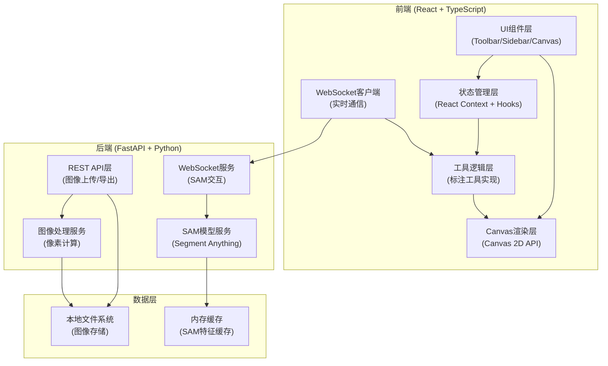
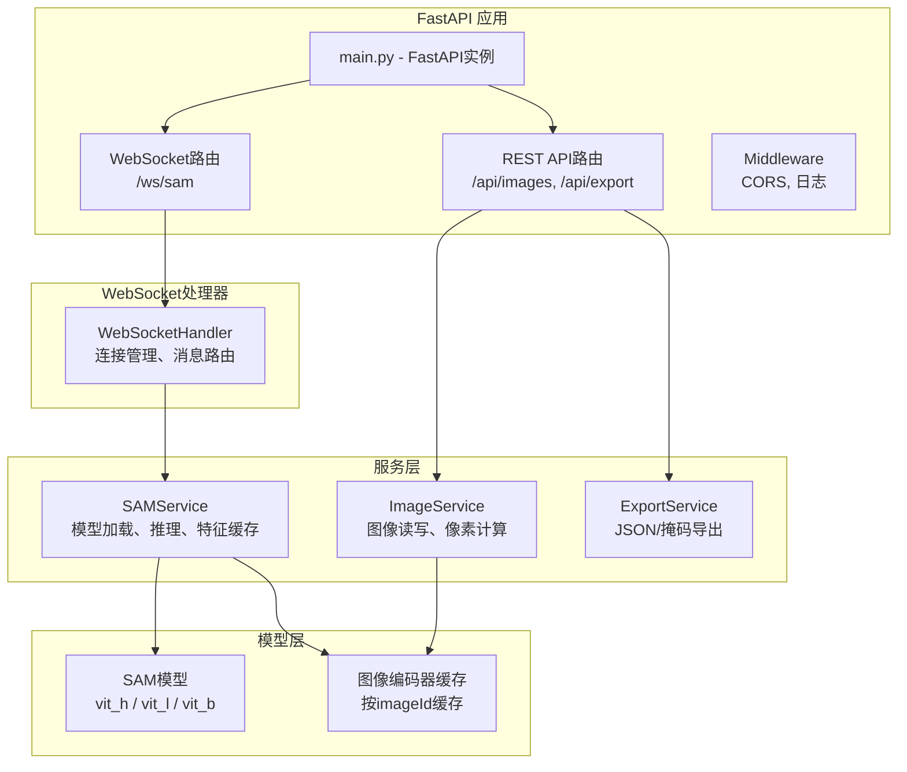

## 1. 架构设计



---

## 2. 技术描述

### 2.1 前端技术栈
- **框架**: React 18 + TypeScript 5
- **构建工具**: Vite 5
- **样式**: Tailwind CSS 3
- **状态管理**: React Context + useReducer
- **Canvas渲染**: 原生 Canvas 2D API
- **WebSocket**: 原生 WebSocket API + 自定义重连机制
- **图标**: Lucide React
- **UI组件**: 自定义组件 (无额外UI库)

### 2.2 后端技术栈
- **Web框架**: FastAPI 0.109
- **WebSocket**: FastAPI WebSocket
- **SAM模型**: segment-anything (facebook) + PyTorch
- **图像处理**: OpenCV, NumPy, Pillow
- **CORS**: fastapi.middleware.cors
- **异步**: asyncio

### 2.3 关键技术选型理由
- **Canvas 2D**: 高性能像素级渲染，支持复杂形状绘制和实时交互
- **WebSocket**: SAM推理需要双向通信，支持流式返回和进度更新
- **SAM模型**: Meta官方Segment Anything，支持一键点击分割
- **TypeScript**: 类型安全，复杂标注数据结构管理更可靠

---

## 3. 目录结构

```
372/
├── client/                          # React前端
│   ├── src/
│   │   ├── components/
│   │   │   ├── Canvas/              # Canvas标注组件
│   │   │   │   ├── AnnotationCanvas.tsx
│   │   │   │   └── useCanvasEvents.ts
│   │   │   ├── Toolbar/             # 工具栏
│   │   │   │   └── Toolbar.tsx
│   │   │   ├── Sidebar/             # 侧边栏
│   │   │   │   ├── AnnotationList.tsx
│   │   │   │   └── LabelManager.tsx
│   │   │   ├── Header/              # 顶部导航
│   │   │   │   └── Header.tsx
│   │   │   └── StatusBar/           # 状态栏
│   │   │       └── StatusBar.tsx
│   │   ├── hooks/
│   │   │   ├── useWebSocket.ts      # WebSocket Hook
│   │   │   ├── useAnnotations.ts    # 标注管理Hook
│   │   │   └── useImageLoader.ts    # 图像加载Hook
│   │   ├── services/
│   │   │   ├── api.ts               # REST API客户端
│   │   │   └── wsClient.ts          # WebSocket客户端
│   │   ├── tools/
│   │   │   ├── BaseTool.ts          # 工具基类
│   │   │   ├── PolygonTool.ts       # 多边形工具
│   │   │   ├── PointTool.ts         # 点工具
│   │   │   ├── RectangleTool.ts     # 矩形工具
│   │   │   ├── BrushTool.ts         # 画笔工具
│   │   │   ├── SAMTool.ts           # SAM点击工具
│   │   │   └── SelectTool.ts        # 选择工具
│   │   ├── types/
│   │   │   └── annotation.ts        # 类型定义
│   │   ├── utils/
│   │   │   ├── canvas.ts            # Canvas工具函数
│   │   │   ├── geometry.ts          # 几何计算
│   │   │   └── pixelCalc.ts         # 像素计算
│   │   ├── context/
│   │   │   └── AppContext.tsx       # 全局状态
│   │   ├── App.tsx
│   │   ├── main.tsx
│   │   └── index.css
│   ├── package.json
│   ├── tsconfig.json
│   └── vite.config.ts
└── server/                          # FastAPI后端
    ├── main.py                      # 应用入口
    ├── sam_model.py                 # SAM模型封装
    ├── websocket_handler.py         # WebSocket处理器
    ├── image_service.py             # 图像处理服务
    ├── schemas.py                   # Pydantic模型
    ├── requirements.txt
    └── models/                      # SAM模型权重目录
```

---

## 4. 类型定义 (TypeScript)

```typescript
// 标注类型
export type AnnotationType = 'polygon' | 'point' | 'rectangle' | 'brush' | 'sam';

// 点坐标
export interface Point {
  x: number;
  y: number;
}

// 标注基类
export interface BaseAnnotation {
  id: string;
  type: AnnotationType;
  label: string;
  color: string;
  visible: boolean;
  createdAt: number;
  pixelArea?: number;
  pixelPercentage?: number;
}

// 多边形标注
export interface PolygonAnnotation extends BaseAnnotation {
  type: 'polygon';
  points: Point[];
  closed: boolean;
}

// 点标注
export interface PointAnnotation extends BaseAnnotation {
  type: 'point';
  position: Point;
  radius: number;
}

// 矩形标注
export interface RectangleAnnotation extends BaseAnnotation {
  type: 'rectangle';
  x: number;
  y: number;
  width: number;
  height: number;
}

// 画笔标注
export interface BrushAnnotation extends BaseAnnotation {
  type: 'brush';
  points: Point[];
  strokeWidth: number;
}

// SAM标注
export interface SAMAnnotation extends BaseAnnotation {
  type: 'sam';
  mask: Uint8Array;  // 二进制掩码
  width: number;
  height: number;
}

export type Annotation = 
  | PolygonAnnotation 
  | PointAnnotation 
  | RectangleAnnotation 
  | BrushAnnotation 
  | SAMAnnotation;

// SAM请求/响应
export interface SAMRequest {
  imageId: string;
  point: Point;
  mode: 'click' | 'box';
}

export interface SAMResponse {
  mask: number[];
  width: number;
  height: number;
  confidence: number;
}
```

---

## 5. API 定义

### 5.1 REST API

| 方法 | 路径 | 用途 |
|------|------|------|
| POST | `/api/images` | 上传图像 |
| GET | `/api/images` | 获取图像列表 |
| GET | `/api/images/{id}` | 获取图像信息 |
| GET | `/api/images/{id}/data` | 获取图像原始数据 |
| DELETE | `/api/images/{id}` | 删除图像 |
| POST | `/api/export/json` | 导出JSON标注 |
| POST | `/api/export/mask` | 导出掩码图像 |
| GET | `/api/sam/status` | SAM模型状态 |

### 5.2 WebSocket 消息

```typescript
// 客户端 -> 服务端
interface WsClientMessage {
  type: 'sam_predict' | 'sam_reset' | 'ping';
  payload: SAMRequest | {};
}

// 服务端 -> 客户端
interface WsServerMessage {
  type: 'sam_result' | 'sam_progress' | 'sam_error' | 'pong';
  payload: SAMResponse | { progress: number } | { error: string };
}
```

---

## 6. 后端架构



---

## 7. 数据模型 (Pydantic)

```python
# schemas.py
from pydantic import BaseModel
from typing import List, Optional, Literal
from enum import Enum

class AnnotationType(str, Enum):
    POLYGON = "polygon"
    POINT = "point"
    RECTANGLE = "rectangle"
    BRUSH = "brush"
    SAM = "sam"

class Point(BaseModel):
    x: float
    y: float

class BaseAnnotation(BaseModel):
    id: str
    type: AnnotationType
    label: str
    color: str
    visible: bool = True
    createdAt: int
    pixelArea: Optional[int] = None
    pixelPercentage: Optional[float] = None

class PolygonAnnotation(BaseAnnotation):
    type: Literal[AnnotationType.POLYGON]
    points: List[Point]
    closed: bool = True

class PointAnnotation(BaseAnnotation):
    type: Literal[AnnotationType.POINT]
    position: Point
    radius: float = 3.0

class RectangleAnnotation(BaseAnnotation):
    type: Literal[AnnotationType.RECTANGLE]
    x: float
    y: float
    width: float
    height: float

class BrushAnnotation(BaseAnnotation):
    type: Literal[AnnotationType.BRUSH]
    points: List[Point]
    strokeWidth: float = 5.0

class SAMAnnotation(BaseAnnotation):
    type: Literal[AnnotationType.SAM]
    mask: List[int]
    width: int
    height: int

class SAMRequest(BaseModel):
    imageId: str
    point: Point
    mode: str = "click"

class SAMResponse(BaseModel):
    mask: List[int]
    width: int
    height: int
    confidence: float

class ImageInfo(BaseModel):
    id: str
    filename: str
    width: int
    height: int
    uploadedAt: int

class ExportRequest(BaseModel):
    imageId: str
    annotations: List[dict]
    format: str = "json"
```

---

## 8. 像素计算算法

### 8.1 多边形区域像素计算
```
算法: 扫描线填充算法
1. 获取多边形所有边界点
2. 对每条水平扫描线, 计算与多边形的交点
3. 交点间的像素属于多边形内部
4. 统计所有内部像素数量
```

### 8.2 SAM掩码像素计算
```
算法: 直接统计二进制掩码
1. 遍历掩码数组
2. 统计值大于阈值(127)的元素数量
3. 像素面积 = 统计数量
4. 百分比 = 像素面积 / 图像总像素 * 100
```

### 8.3 矩形/点区域像素计算
```
矩形: 面积 = width * height
点: 面积 = π * radius² (近似)
```
