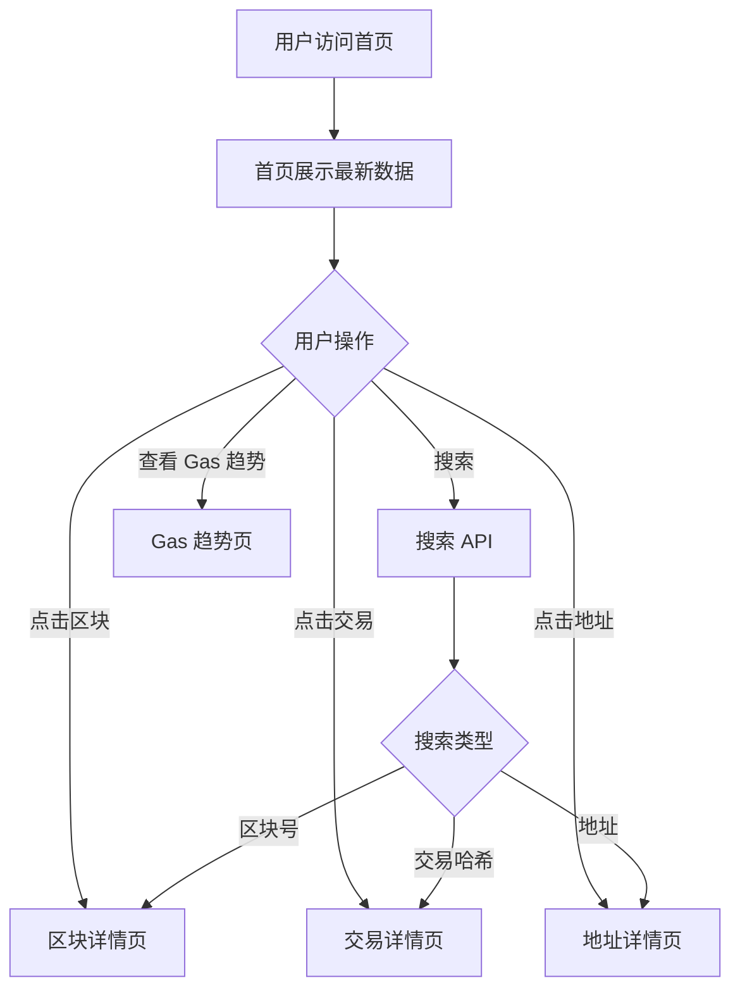

## 1. 产品概述

以太坊区块链浏览器，提供链上数据浏览与交互能力。面向区块链开发者与普通用户。

- 主要目标：让用户可以方便地查询以太坊区块链上的区块、交易、地址余额、合约数据，提供直观展示Gas费趋势，支持智能合约验证和调用
- 市场价值：为 DApp 开发者、区块链研究者、普通用户提供一站式链上数据查询与交互平台

## 2. 核心功能

### 2.1 功能模块

1. **首页**：最新区块列表、最新交易列表、Gas 费趋势图、全局搜索
2. **区块详情页**：区块详细信息、区块内交易列表
3. **交易详情页**：交易完整信息、关联地址、交易状态
4. **地址详情页**：地址余额、交易历史、ERC20 代币余额
5. **智能合约页**：合约源代码验证、合约方法调用、合约事件查询
6. **Gas 趋势页**：Gas 费历史趋势图、Gas 费预测

### 2.2 页面详情

| 页面名称 | 模块名称 | 功能描述 |
|-----------|-----------|----------|
| 首页 | 最新区块 | 展示最近 10 个区块，点击可跳转详情 |
| 首页 | 最新交易 | 展示最近 10 笔交易，点击可跳转详情 |
| 首页 | Gas 趋势图 | ECharts 展示 Gas 费历史趋势 |
| 首页 | 全局搜索 | 支持按区块号/交易哈希/地址搜索 |
| 区块详情页 | 区块信息 | 区块号、时间戳、Gas 用量、矿工地址、Nonce 等 |
| 区块详情页 | 区块内交易 | 列出该区块所有交易 |
| 交易详情页 | 交易信息 | 交易哈希、发送方/接收方、Gas 参数、交易状态 |
| 地址详情页 | 地址余额 | ETH 余额、交易历史、ERC20 代币列表 |
| 智能合约页 | 合约验证 | 提交源码验证合约验证结果展示 |
| 智能合约页 | 合约调用 | 读取/写入合约方法 |

## 3. 核心流程

### 3.1 搜索流程
用户输入关键词 → 前端调用搜索 API → 后端解析输入类型 → 返回对应页面跳转

### 3.2 合约验证流程
用户提交合约地址与源码 → 后端编译源码对比链上字节码 → 返回验证结果

### 3.3 合约调用流程
用户选择合约方法 → 填写参数 → 发送交易/调用 → 返回结果

## 4. 用户界面设计

### 4.1 设计风格
- 主色调：深色科技风，以深蓝 #0a1628 为底，青色 #00d4ff 为强调色
- 按钮风格：圆角矩形，悬停有发光效果
- 字体：JetBrains Mono 等宽字体展示数据，Inter 展示正文
- 布局风格：卡片式布局，顶部导航栏，侧边栏
- 图标：Lucide React 图标库

### 4.2 页面设计概览

| 页面名称 | 模块名称 | UI 元素 |
|-----------|-----------|----------|
| 首页 | 最新区块 | 深色卡片，区块号突出显示，悬停高亮 |
| 首页 | 最新交易 | 列表形式，哈希截断显示，Gas 费高亮 |
| 首页 | Gas 趋势图 | ECharts 折线图，深色背景，渐变色填充 |
| 首页 | 全局搜索 | 顶部搜索框，支持输入联想 |
| 区块详情页 | 区块信息 | 两栏卡片布局，键值对展示 |
| 交易详情页 | 交易信息 | 大号哈希展示，状态标签，地址链接 |
| 地址详情页 | 地址余额 | 大号余额数字，代币列表网格 |
| 智能合约页 | 合约验证 | 表单提交，源码编辑器，验证结果 |
| 智能合约页 | 合约调用 | 方法选择器，参数表单，结果展示 |

### 4.3 响应式
桌面优先设计，在移动设备自适应布局，触摸优化交互

### 4.4 视觉细节
- 背景：深色渐变背景 + 网格纹理
- 卡片：半透明卡片，边框发光效果
- 数据展示：等宽字体，关键词高亮
- 动效：页面加载渐入，卡片悬停微动画
