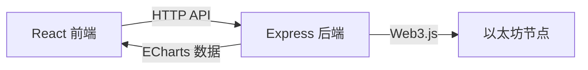
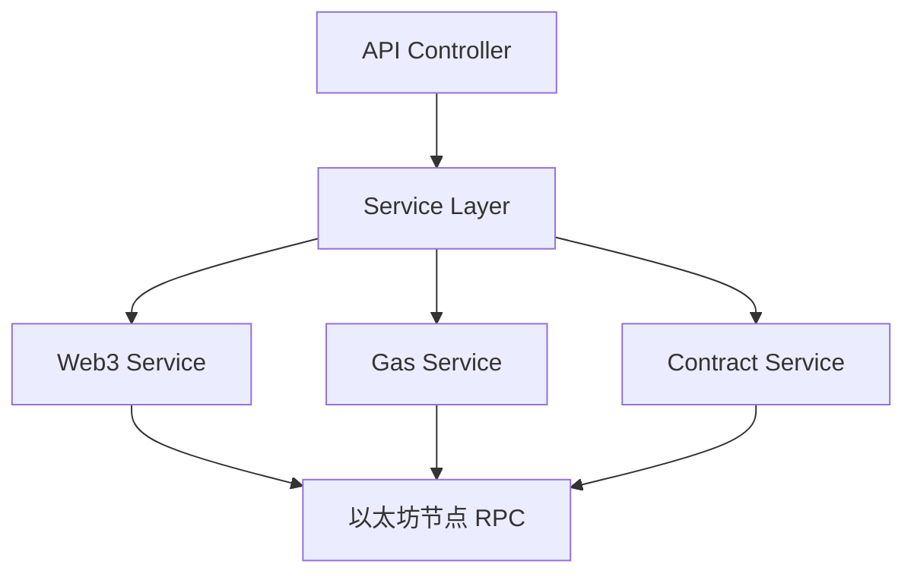

## 1. 架构设计



## 2. 技术描述

- 前端：React@18 + TypeScript + Vite + Tailwind CSS + Zustand
- 初始化工具：vite-init
- 后端：Express@4 + TypeScript + Web3.js
- 图表：ECharts
- 状态管理：Zustand
- 图标：Lucide React
- 以太坊节点：使用 Infura/Alchemy 公共 RPC 节点（主网或 Sepolia 测试网）

## 3. 路由定义

### 前端路由

| 路由 | 用途 |
|-------|------|
| / | 首页 - 最新区块、交易、Gas 趋势、搜索 |
| /block/:number | 区块详情页 |
| /tx/:hash | 交易详情页 |
| /address/:address | 地址详情页 |
| /contract/:address | 智能合约页（验证 + 调用） |
| /gas | Gas 费趋势详情页 |

### 后端 API 路由

| 路由 | 方法 | 用途 |
|-------|------|------|
| /api/blocks/latest | GET | 获取最新 N 个区块 |
| /api/blocks/:number | GET | 获取指定区块详情 |
| /api/transactions/latest | GET | 获取最新交易 |
| /api/transactions/:hash | GET | 获取指定交易详情 |
| /api/address/:address | GET | 获取地址余额和交易历史 |
| /api/address/:address/tokens | GET | 获取地址 ERC20 代币余额 |
| /api/gas/latest | GET | 获取当前 Gas 费 |
| /api/gas/history | GET | 获取 Gas 费历史数据 |
| /api/search | GET | 搜索（区块/交易/地址） |
| /api/contract/verify | POST | 验证合约源代码 |
| /api/contract/:address | GET | 获取合约信息 |
| /api/contract/:address/call | POST | 调用合约方法 |

## 4. API 定义

### 类型定义

```typescript
interface BlockInfo {
  number: number;
  hash: string;
  parentHash: string;
  timestamp: number;
  miner: string;
  gasUsed: string;
  gasLimit: string;
  transactionCount: number;
  difficulty: string;
  baseFeePerGas: string;
}

interface TransactionInfo {
  hash: string;
  blockNumber: number;
  from: string;
  to: string;
  value: string;
  gas: string;
  gasPrice: string;
  gasUsed: string;
  input: string;
  nonce: number;
  status: number;
  timestamp: number;
}

interface AddressInfo {
  address: string;
  balance: string;
  transactionCount: number;
}

interface GasInfo {
  low: string;
  average: string;
  high: string;
  baseFee: string;
  timestamp: number;
}

interface ContractInfo {
  address: string;
  code: string;
  verified: boolean;
  name: string;
  source: string;
  abi: string;
}
```

### 请求/响应示例

#### GET /api/blocks/latest

响应：
```json
{
  "success": true,
  "data": [
    {
      "number": 12345678,
      "hash": "0xabc...",
      "timestamp": 1699999999,
      "miner": "0x...",
      "gasUsed": "15000000",
      "gasLimit": "30000000",
      "transactionCount": 123,
      "baseFeePerGas": "10000000000"
    }
  ]
}
```

#### GET /api/gas/history?days=7

响应：
```json
{
  "success": true,
  "data": [
    { "timestamp": 1699999999, "baseFee": "10000000000", "average": "20000000000" }
  ]
}
```

#### POST /api/contract/verify

请求：
```json
{
  "address": "0x...",
  "source": "// SPDX-License-Identifier: MIT...",
  "compilerVersion": "v0.8.19",
  "name": "MyContract",
  "optimization": true,
  "runs": 200
}
```

响应：
```json
{
  "success": true,
  "data": { "verified": true, "message": "Contract verified successfully" }
}
```

#### POST /api/contract/:address/call

请求：
```json
{
  "method": "transfer",
  "params": ["0x...", "1000000000000000000"],
  "from": "0x...",
  "value": "0"
}
```

响应：
```json
{
  "success": true,
  "data": "0x..."
}
```

## 5. 服务器架构



## 6. 项目结构

```
.
├── api/                    # 后端代码
│   ├── src/
│   │   ├── controllers/    # API 控制器
│   │   │   ├── block.ts
│   │   │   ├── transaction.ts
│   │   │   ├── address.ts
│   │   │   ├── gas.ts
│   │   │   └── contract.ts
│   │   ├── services/       # 业务逻辑层
│   │   │   ├── web3.ts
│   │   │   ├── gas.ts
│   │   │   └── contract.ts
│   │   ├── routes/         # 路由定义
│   │   │   └── index.ts
│   │   ├── utils/          # 工具函数
│   │   │   └── format.ts
│   │   ├── config/         # 配置
│   │   │   └── index.ts
│   │   └── index.ts        # Express 入口
│   └── tsconfig.json
├── src/                    # 前端代码
│   ├── components/         # 组件
│   │   ├── BlockCard.tsx
│   │   ├── TransactionCard.tsx
│   │   ├── GasChart.tsx
│   │   ├── SearchBar.tsx
│   │   ├── ContractForm.tsx
│   │   └── ...
│   ├── pages/              # 页面
│   │   ├── Home.tsx
│   │   ├── BlockDetail.tsx
│   │   ├── TransactionDetail.tsx
│   │   ├── AddressDetail.tsx
│   │   ├── ContractDetail.tsx
│   │   └── GasTrend.tsx
│   ├── hooks/              # 自定义 Hooks
│   │   ├── useWeb3.ts
│   │   └── useSearch.ts
│   ├── store/              # Zustand 状态
│   │   └── index.ts
│   ├── utils/              # 工具函数
│   │   ├── format.ts
│   │   └── api.ts
│   ├── App.tsx
│   └── main.tsx
├── shared/                 # 共享类型
│   └── types.ts
├── vite.config.ts
├── tailwind.config.js
├── postcss.config.js
└── tsconfig.json
```

## 7. 数据模型

由于区块链数据直接从以太坊节点获取，无需本地数据库。Gas 历史数据可在后端内存中缓存。
