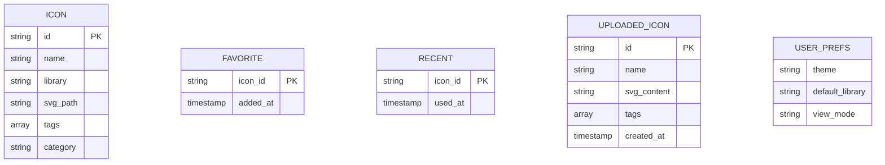

## 1. 架构设计

```mermaid
flowchart TD
    subgraph "前端层"
        "React 18" --> "Vite 构建工具"
        "React 18" --> "Context API 状态管理"
        "React 18" --> "React Router 路由"
    end
    
    subgraph "数据层"
        "LocalStorage" --> "收藏夹存储"
        "LocalStorage" --> "最近使用存储"
        "LocalStorage" --> "用户偏好存储"
        "图标索引(JSON)" --> "FontAwesome 图标数据"
        "图标索引(JSON)" --> "Material 图标数据"
    end
    
    subgraph "功能服务"
        "Clipboard API" --> "代码复制"
        "File System API" --> "批量下载"
        "FileReader API" --> "图标上传"
    end
```

## 2. 技术说明

- 前端框架：React 18 + TypeScript
- 构建工具：Vite
- 样式方案：TailwindCSS 3 + CSS Variables
- 状态管理：React Context + useReducer
- 图标数据源：本地 JSON 索引文件
- 图标渲染：内联 SVG
- 复制功能：Clipboard API
- 本地存储：LocalStorage
- 批量下载：JSZip + FileSaver

## 3. 路由定义

| 路由 | 用途 |
|------|------|
| / | 主页面，包含所有功能模块 |

## 4. 数据模型

### 4.1 数据模型定义



### 4.2 LocalStorage 存储结构

```typescript
// 收藏夹
interface Favorites {
  [iconId: string]: {
    addedAt: number;
  }
}

// 最近使用
interface RecentItems {
  [iconId: string]: {
    usedAt: number;
  }
}

// 自定义上传图标
interface UploadedIcons {
  [iconId: string]: {
    id: string;
    name: string;
    svg: string;
    tags: string[];
    createdAt: number;
  }
}

// 用户偏好
interface UserPreferences {
  theme: 'dark' | 'light';
  defaultLibrary: 'fontawesome' | 'material' | 'custom';
  viewMode: 'grid' | 'list';
}
```

## 5. 项目结构

```
src/
├── components/
│   ├── Sidebar/           # 侧边栏导航
│   ├── IconGrid/          # 图标网格展示
│   ├── IconCard/          # 单个图标卡片
│   ├── SearchBar/         # 搜索组件
│   ├── DetailPanel/       # 详情面板
│   ├── ColorPicker/       # 调色板
│   ├── FavoritesPanel/    # 收藏夹
│   ├── RecentPanel/       # 最近使用
│   ├── UploadModal/       # 上传弹窗
│   └── CodeBlock/         # 代码展示
├── context/
│   ├── IconContext.tsx    # 图标状态管理
│   └── ThemeContext.tsx   # 主题状态
├── data/
│   ├── fontawesome.json   # FA 图标索引
│   ├── material.json      # Material 图标索引
│   └── categories.ts      # 分类配置
├── hooks/
│   ├── useLocalStorage.ts # LocalStorage Hook
│   └── useClipboard.ts    # 剪贴板 Hook
├── types/
│   └── index.ts           # 类型定义
├── utils/
│   ├── svgUtils.ts        # SVG 处理
│   └── download.ts        # 下载工具
├── App.tsx
└── main.tsx
```
