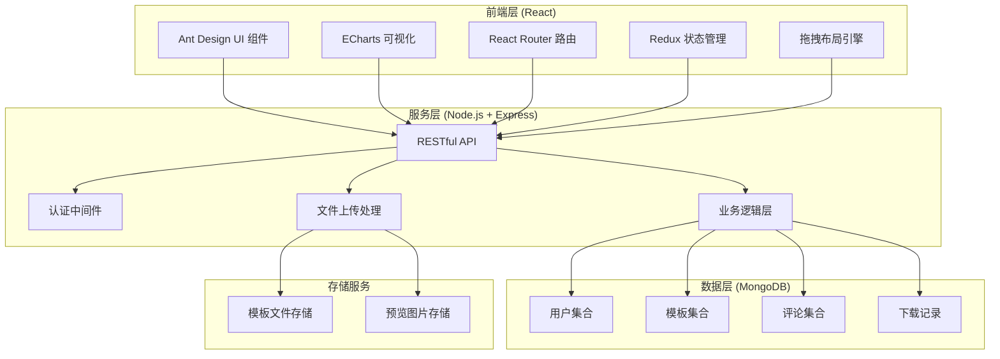
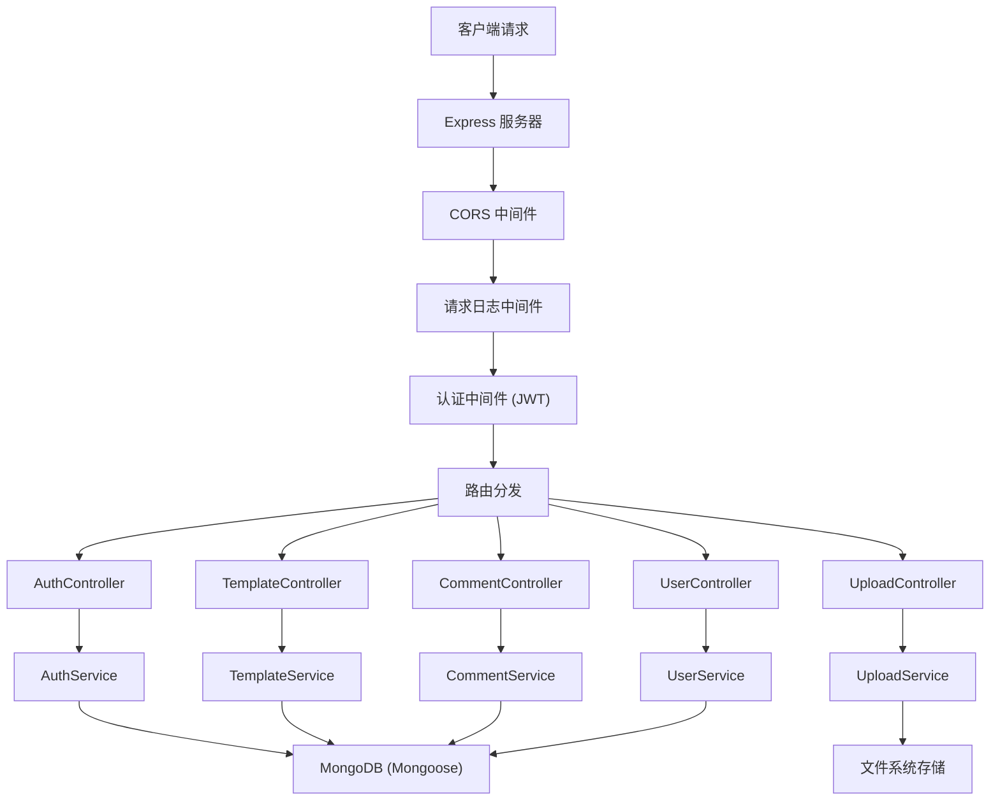
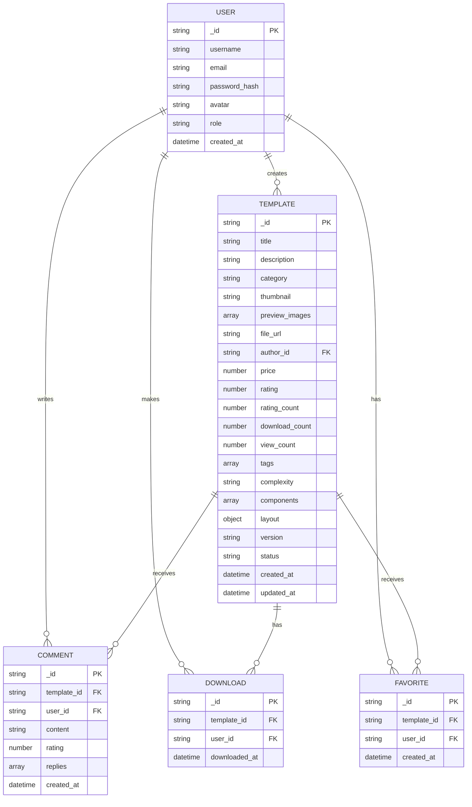

## 1. 架构设计



## 2. 技术描述

### 前端技术栈
- **框架**: React 18.2.0 + TypeScript
- **构建工具**: Vite 5.0
- **UI 组件库**: Ant Design 5.12.0
- **可视化库**: ECharts 5.4.3 + echarts-for-react
- **状态管理**: Redux Toolkit + React Redux
- **路由**: React Router DOM 6.20.0
- **拖拽库**: react-dnd + react-grid-layout
- **HTTP 客户端**: Axios
- **样式**: TailwindCSS 3.3.5 + Less
- **图标**: @ant-design/icons

### 后端技术栈
- **运行环境**: Node.js 18+
- **Web 框架**: Express 4.18.2
- **数据库**: MongoDB 6.0 + Mongoose 7.6.3
- **认证**: JWT (jsonwebtoken) + bcryptjs
- **文件上传**: Multer
- **验证**: Joi
- **日志**: Winston
- **CORS**: cors 中间件

### 开发工具
- **代码规范**: ESLint + Prettier
- **Git Hooks**: Husky + lint-staged
- **API 文档**: Swagger UI

## 3. 路由定义

### 前端路由
| 路由 | 页面 | 权限 |
|------|------|------|
| / | 首页 | 公开 |
| /templates | 模板列表 | 公开 |
| /templates/:id | 模板详情 | 公开 |
| /editor/:id? | 模板编辑器 | 需要登录 |
| /upload | 上传模板 | 需要登录 |
| /profile | 个人中心 | 需要登录 |
| /login | 登录页 | 公开 |
| /register | 注册页 | 公开 |

### 后端 API 路由
| 方法 | 路由 | 描述 | 权限 |
|------|------|------|------|
| POST | /api/auth/register | 用户注册 | 公开 |
| POST | /api/auth/login | 用户登录 | 公开 |
| GET | /api/auth/profile | 获取当前用户 | 需要登录 |
| GET | /api/templates | 获取模板列表 | 公开 |
| GET | /api/templates/:id | 获取模板详情 | 公开 |
| POST | /api/templates | 上传模板 | 需要登录 |
| PUT | /api/templates/:id | 更新模板 | 需要登录 |
| DELETE | /api/templates/:id | 删除模板 | 需要登录 |
| POST | /api/templates/:id/download | 下载模板 | 需要登录 |
| POST | /api/templates/:id/rate | 评分模板 | 需要登录 |
| POST | /api/templates/:id/comments | 发表评论 | 需要登录 |
| GET | /api/templates/:id/comments | 获取评论列表 | 公开 |
| GET | /api/user/templates | 获取我的模板 | 需要登录 |
| GET | /api/user/favorites | 获取我的收藏 | 需要登录 |
| POST | /api/user/favorites/:id | 收藏模板 | 需要登录 |
| DELETE | /api/user/favorites/:id | 取消收藏 | 需要登录 |

## 4. API 类型定义

```typescript
// 用户类型
interface User {
  _id: string;
  username: string;
  email: string;
  avatar?: string;
  role: 'user' | 'creator' | 'admin';
  createdAt: string;
}

// 模板类型
interface Template {
  _id: string;
  title: string;
  description: string;
  category: 'operation' | 'sales' | 'finance' | 'ops';
  thumbnail: string;
  previewImages: string[];
  fileUrl: string;
  author: User;
  price: number;
  rating: number;
  ratingCount: number;
  downloadCount: number;
  viewCount: number;
  tags: string[];
  complexity: 'simple' | 'medium' | 'complex';
  components: TemplateComponent[];
  layout: LayoutConfig;
  version: string;
  status: 'pending' | 'approved' | 'rejected';
  createdAt: string;
  updatedAt: string;
}

// 模板组件
interface TemplateComponent {
  id: string;
  type: 'chart' | 'metric' | 'table' | 'text' | 'image';
  chartType?: 'line' | 'bar' | 'pie' | 'area' | 'gauge';
  title: string;
  position: { x: number; y: number };
  size: { w: number; h: number };
  config: Record<string, any>;
  dataSource: DataSourceConfig;
}

// 布局配置
interface LayoutConfig {
  gridCols: number;
  gridRows: number;
  gutter: number;
  backgroundColor: string;
}

// 数据源配置
interface DataSourceConfig {
  type: 'static' | 'api' | 'database';
  data?: any[];
  apiUrl?: string;
  fields?: FieldMapping[];
}

// 字段映射
interface FieldMapping {
  sourceField: string;
  targetField: string;
  label: string;
}

// 评论类型
interface Comment {
  _id: string;
  templateId: string;
  user: User;
  content: string;
  rating: number;
  createdAt: string;
  replies: CommentReply[];
}

interface CommentReply {
  _id: string;
  user: User;
  content: string;
  createdAt: string;
}

// 下载记录
interface DownloadRecord {
  _id: string;
  templateId: string;
  userId: string;
  downloadedAt: string;
}
```

## 5. 服务端架构



## 6. 数据模型

### 6.1 ER 图



### 6.2 数据库索引

```javascript
// 用户集合索引
db.users.createIndex({ email: 1 }, { unique: true });
db.users.createIndex({ username: 1 }, { unique: true });

// 模板集合索引
db.templates.createIndex({ category: 1 });
db.templates.createIndex({ author: 1 });
db.templates.createIndex({ status: 1 });
db.templates.createIndex({ rating: -1 });
db.templates.createIndex({ downloadCount: -1 });
db.templates.createIndex({ createdAt: -1 });
db.templates.createIndex({ tags: 1 });
db.templates.createIndex({ title: 'text', description: 'text' });

// 评论集合索引
db.comments.createIndex({ templateId: 1 });
db.comments.createIndex({ userId: 1 });
db.comments.createIndex({ createdAt: -1 });

// 下载记录索引
db.downloads.createIndex({ templateId: 1 });
db.downloads.createIndex({ userId: 1 });
db.downloads.createIndex({ downloadedAt: -1 });

// 收藏索引
db.favorites.createIndex({ userId: 1, templateId: 1 }, { unique: true });
```
