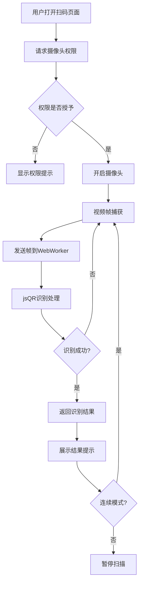

## 1. 产品概述
Web端二维码扫码组件，通过调用浏览器摄像头实现实时扫码识别，支持二维码和条形码。
- 主要用途：快速扫描识别二维码/条形码，支持连续扫描、手动输入、历史记录管理
- 目标用户：需要在浏览器中快速扫码的用户，如物流、仓储、门店等场景
- 市场价值：无需安装APP，浏览器即开即用，轻量化扫码方案

## 2. 核心功能

### 2.1 功能模块
1. **扫码页面**：摄像头画面展示、扫码框、实时识别、连续扫码模式
2. **历史记录**：扫码历史列表、搜索过滤、删除记录、批量操作
3. **手动输入**：手动输入二维码/条形码内容
4. **设置面板**：闪光灯控制、低光照增强、导出格式选择

### 2.2 页面详情
| 页面名称 | 模块名称 | 功能描述 |
|---------|---------|---------|
| 扫码页面 | 摄像头预览 | 全屏展示摄像头画面，中央显示扫码框，识别成功时显示结果 |
| 扫码页面 | 控制工具栏 | 开关摄像头、切换连续/单次模式、切换前后摄像头 |
| 扫码页面 | 识别结果提示 | 识别成功时弹出结果卡片，支持复制和保存到历史 |
| 扫码页面 | 手动输入入口 | 点击打开手动输入弹窗，支持输入条码内容 |
| 历史记录页面 | 历史列表 | 展示所有扫码记录，按时间倒序，支持搜索 |
| 历史记录页面 | 批量操作 | 多选记录、批量删除、批量导出(CSV/JSON) |
| 历史记录页面 | 搜索过滤 | 按内容关键词搜索历史记录 |
| 设置面板 | 闪光灯控制 | 开启/关闭摄像头闪光灯（支持设备） |
| 设置面板 | 低光照增强 | 图像增强算法提升低光环境识别率 |
| 设置面板 | 导出设置 | 选择导出格式（CSV/JSON） |

## 3. 核心流程

### 3.1 扫码识别流程
用户打开页面 → 请求摄像头权限 → 摄像头开启 → 实时帧发送到WebWorker → WebWorker使用jsQR识别 → 识别成功返回结果 → 展示结果提示 → 自动/手动保存到历史

### 3.2 历史导出流程
用户进入历史页面 → 查看扫码记录 → 搜索/筛选 → 选择需要导出的记录 → 选择导出格式 → 生成文件下载

## 4. 用户界面设计

### 4.1 设计风格
- 主色调：深色科技风 (#0d1117) + 强调色 (#58a6ff)
- 按钮风格：圆角半透明背景，发光边框效果
- 字体：系统默认无衬线字体
- 布局：全屏沉浸式扫码视图，底部浮动控制栏
- 图标：简洁线性图标

### 4.2 页面设计概览
| 页面名称 | 模块名称 | UI元素 |
|---------|---------|---------|
| 扫码页面 | 摄像头预览 | 全屏视频背景、居中扫描框动画、四角定位标识 |
| 扫码页面 | 控制工具栏 | 底部浮动栏、图标按钮、模式切换开关 |
| 扫码页面 | 结果提示 | 顶部弹出卡片、内容展示、操作按钮 |
| 历史记录页面 | 历史列表 | 卡片列表、时间标签、内容预览 |
| 历史记录页面 | 搜索栏 | 顶部固定搜索框、过滤按钮 |
| 设置面板 | 功能开关 | 开关组件、滑杆控件、选择器 |

### 4.3 响应式设计
- 桌面端：侧栏布局，扫码区域占主要空间
- 移动端：全屏沉浸式，控制栏底部固定
- 支持触摸操作
