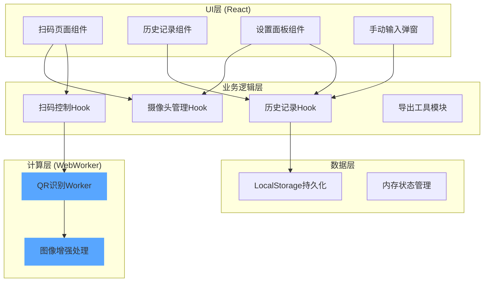

## 1. 架构设计
前端单页应用，使用React组件化架构，WebWorker处理图像识别计算。



## 2. 技术说明
- 前端框架：React 18 + TypeScript + Vite
- 样式方案：TailwindCSS 3 + CSS Modules
- 摄像头API：MediaDevices API (getUserMedia)
- 扫码识别：jsQR库（在WebWorker中运行）
- 条形码识别：zxing-js/library
- 状态管理：React Hooks + Context
- 数据持久化：LocalStorage
- 图标：Lucide React

## 3. 路由定义
| 路由 | 用途 |
|-----|------|
| / | 扫码页面（默认） |
| /history | 历史记录页面 |
| /settings | 设置页面 |

## 4. 数据模型

### 4.1 扫码记录类型定义
```typescript
interface ScanRecord {
  id: string;
  content: string;
  type: 'qrcode' | 'barcode' | 'manual';
  format?: string;
  timestamp: number;
  note?: string;
}

interface ScanSettings {
  continuousMode: boolean;
  torchEnabled: boolean;
  lowLightEnhance: boolean;
  frontCamera: boolean;
  exportFormat: 'csv' | 'json';
  autoSave: boolean;
  vibrateOnSuccess: boolean;
}
```

### 4.2 LocalStorage存储结构
```
scanner_records: ScanRecord[]
scanner_settings: ScanSettings
```

## 5. 组件结构

```
src/
├── components/
│   ├── Scanner/
│   │   ├── Scanner.tsx          # 主扫码组件
│   │   ├── ScannerFrame.tsx     # 扫码框组件
│   │   ├── ResultModal.tsx      # 识别结果弹窗
│   │   └── ControlBar.tsx       # 底部控制栏
│   ├── History/
│   │   ├── HistoryList.tsx      # 历史记录列表
│   │   ├── HistoryItem.tsx      # 历史记录项
│   │   └── SearchBar.tsx        # 搜索栏
│   ├── Settings/
│   │   ├── SettingsPanel.tsx    # 设置面板
│   │   └── ToggleSwitch.tsx     # 开关组件
│   └── ManualInput/
│       └── ManualInput.tsx      # 手动输入弹窗
├── hooks/
│   ├── useCamera.ts             # 摄像头管理Hook
│   ├── useScanner.ts            # 扫码识别Hook
│   ├── useHistory.ts            # 历史记录Hook
│   └── useSettings.ts           # 设置管理Hook
├── workers/
│   └── qrScanner.worker.ts      # QR识别WebWorker
├── utils/
│   ├── imageEnhance.ts          # 图像增强工具
│   ├── export.ts                # 导出工具
│   └── storage.ts               # 本地存储工具
├── types/
│   └── index.ts                 # 类型定义
├── App.tsx
└── main.tsx
```

## 6. 关键技术实现说明

### 6.1 WebWorker扫码识别
- 创建独立的WebWorker运行jsQR识别
- 使用OffscreenCanvas在Worker中处理图像
- 主线程通过postMessage发送视频帧数据
- Worker返回识别结果

### 6.2 低光照增强
- 实时分析图像亮度直方图
- 自动调整对比度和亮度
- 可选：自适应直方图均衡化(CLAHE)简化实现

### 6.3 连续扫码模式
- 识别成功后短暂延迟继续扫描
- 同一内容防抖处理（去重逻辑）
- 支持振动反馈（移动端）
