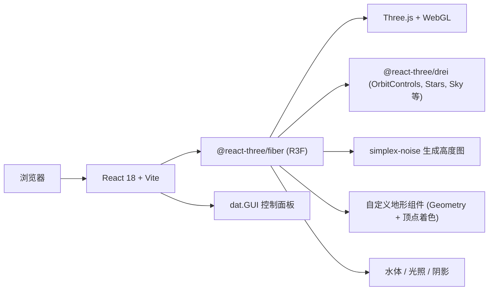

# 3D 地形生成器 技术架构

## 1. 架构设计


## 2. 技术选型
- 前端：React@18 + TypeScript + Vite
- 3D 渲染：three@0.161 + @react-three/fiber@8 + @react-three/drei@9
- 噪声：simplex-noise@4（支持 Perlin / Simplex 2D/3D）
- 控制面板：dat.gui@0.7
- 状态：zustand（参数 store）
- 样式：TailwindCSS + 自定义 CSS

## 3. 目录结构
```
src/
  components/
    terrain/
      Terrain.tsx            # 地形网格 + 顶点颜色
      Water.tsx              # 水面
      Lights.tsx             # 光照
      Scene.tsx              # 场景组合
    ui/
      Header.tsx             # 顶部栏
      ControlPanel.tsx       # dat.GUI 面板
  hooks/
    useTerrain.ts            # 地形高度图生成
    useGUI.ts                # dat.GUI 初始化
  store/
    terrainStore.ts          # zustand 参数状态
  utils/
    noise.ts                 # 噪声工具封装
    colors.ts                # 高度 → 颜色映射
  pages/
    Home.tsx                 # 主页
  App.tsx
  main.tsx
```

## 4. 路由定义
| 路由 | 用途 |
|------|------|
| `/` | 主页，包含 3D 场景与控制面板 |

## 5. 数据模型
zustand 全局状态：
```ts
interface TerrainState {
  noiseType: 'perlin' | 'simplex';
  amplitude: number;       // 地形高度
  frequency: number;       // 频率
  octaves: number;         // 噪声层数
  persistence: number;     // 持续度
  lacunarity: number;      // 间隙度
  seed: number;
  gridSize: number;        // 网格细分
  waterLevel: number;
  material: 'heightColor' | 'wireframe' | 'solid';
  showWater: boolean;
  showShadows: boolean;
  autoRotate: boolean;
  reset(): void;
  randomize(): void;
  set<K extends keyof TerrainState>(k: K, v: TerrainState[K]): void;
}
```
