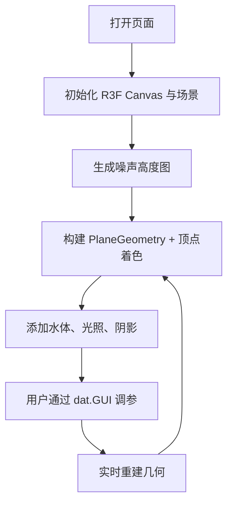

# 3D 地形生成器 PRD

## 1. 产品概述
Web 端 3D 地形生成器，基于 Perlin / Simplex 噪声算法实时生成程序化地形高度图，并使用 Three.js + WebGL 渲染可交互的 3D 场景。面向游戏开发者、可视化爱好者与教育场景，提供直观的参数调节与材质预览能力。

- 目标：低门槛、实时预览、参数化生成，所见即所得
- 价值：为程序化地形提供可视化原型工具，可直接应用于游戏 / 可视化原型

## 2. 核心功能

### 2.1 用户角色
无多角色区分，单页体验。

### 2.2 功能模块
1. **主视图**：3D 地形、水体、阴影、天空
2. **参数面板**：dat.GUI 控制幅度、频率、octaves、seed、网格尺寸、噪声类型（Perlin/Simplex）、水面高度、材质切换
3. **交互**：轨道相机旋转、缩放、平移；重置 / 随机种子

### 2.3 页面详情
| 页面 | 模块 | 功能描述 |
|------|------|----------|
| 主页面 | 3D 场景 | Canvas 全屏渲染地形、水体、光照与阴影 |
| 主页面 | 参数控制 | dat.GUI 面板实时更新地形、水体、材质 |
| 主页面 | 顶部标题栏 | 产品标题、说明、随机/重置按钮 |

## 3. 核心流程
用户打开页面 → 初始化 3D 场景与默认参数 → 生成高度图 → 渲染地形与水体 → 用户通过 dat.GUI 调整参数 → 实时重建几何 → 相机交互浏览

## 4. 用户界面设计

### 4.1 设计风格
- 暗色科技风（深空蓝 + 琥珀点缀）
- 字体：`'Space Grotesk'` 标题 + `'JetBrains Mono'` 数据显示
- 按钮：圆角 + 发光 hover
- 布局：全屏 Canvas + 左上角标题 + 右上操作按钮 + 右侧浮动控制面板

### 4.2 页面概览
| 页面 | 模块 | UI 元素 |
|------|------|---------|
| 主页面 | 顶部标题 | 半透明毛玻璃、渐入动画 |
| 主页面 | 操作按钮 | 图标按钮、悬浮、tooltip |
| 主页面 | dat.GUI | 自动吸顶，支持折叠 |

### 4.3 响应式
桌面为主，Canvas 自适应视口，控制面板在小屏自动隐藏至抽屉。

### 4.4 3D 场景指引
- 天空：淡蓝 → 深蓝渐变 Fog
- 光照：HemisphereLight + DirectionalLight 阴影
- 相机：PerspectiveCamera，OrbitControls
- 地形：PlaneGeometry 按高度着色（沙滩/草地/岩石/雪）
- 水体：半透明蓝色平面 + 轻微动画
- 阴影：ShadowMaterial 接收，DirectionalLight 投射
