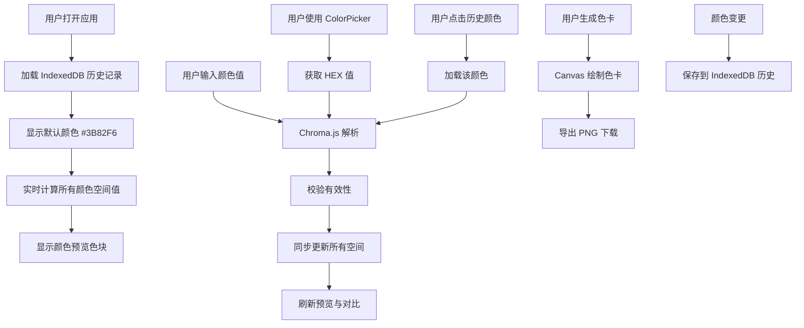

## 1. 产品概述
一款面向设计师和开发者的专业级 Web 颜色转换工具，支持 RGB、HEX、HSL、CMYK、LAB 五大主流颜色空间之间的实时互转，并提供颜色预览、色值对比、调色板选色、历史记录和色卡生成导出等完整工作流能力。

- 目标用户：UI/UX 设计师、前端开发者、品牌设计团队
- 核心价值：一站式颜色空间转换与管理，提升配色效率与精准度

## 2. 核心功能

### 2.1 功能模块
1. **颜色转换器**：RGB/HEX/HSL/CMYK/LAB 五空间互转，实时双向同步，色域外值自动裁剪并警告提示
2. **颜色预览与对比**：实时色块预览、亮色/暗色背景对比、两种颜色并排对比
3. **WCAG 对比度检测**：文字可读性评分（AA/AAA 标准），自动计算前景/背景对比度
4. **颜色名称识别**：基于颜色数据库匹配通俗中文名称（如"珊瑚红"、"天空蓝"）
5. **浏览器取色器**：调用系统 EyeDropper API，支持任意屏幕像素取色并导入
6. **调色板选色**：集成 ColorPicker 拾色器，支持色环、滑块、预设色板
7. **颜色历史记录**：基于 IndexedDB 持久化，记录最近 100 条颜色，支持项目标签与筛选，一键复用
8. **配色方案生成器**：行业通用配色方案（单色、互补、三角、矩形），可预览与导出 PNG 色卡

### 2.2 页面详情
| 页面名称 | 模块名称 | 功能描述 |
|----------|----------|----------|
| 主页面 | 颜色转换器 | 五个颜色空间输入框，实时双向同步转换，色域外值显示警告并自动裁剪 |
| 主页面 | 颜色预览区 | 当前颜色大色块预览，支持亮/暗背景切换对比，显示颜色通俗名称 |
| 主页面 | 对比区 | 当前颜色与对比颜色并排显示，计算差值与 WCAG 对比度评分 |
| 主页面 | 对比度检测器 | 自动计算前景/背景对比度，显示 AA/AAA 合规状态 |
| 主页面 | 屏幕取色器 | 调用系统取色器，任意屏幕像素取色 |
| 主页面 | 调色板 | ColorPicker 拾色器 + 预设色板快速选择 |
| 主页面 | 颜色历史 | 横向滚动展示，支持项目标签筛选，点击复用，右键删除 |
| 主页面 | 配色方案生成器 | 选择方案类型（单色/互补/三角/矩形），预览多色卡，导出 PNG |

## 3. 核心流程

## 4. 用户界面设计

### 4.1 设计风格
- 主色调：深灰 (#1a1a2e) 背景，强调深色专业氛围
- 强调色：动态跟随当前选中颜色，形成沉浸式体验
- 字体：Space Grotesk（标题）+ JetBrains Mono（数值显示）
- 布局：卡片式双栏布局，左侧工具区 + 右侧预览对比区
- 圆角：12px 大圆角，柔和现代
- 阴影：柔和多层阴影 (0 4px 24px rgba(0,0,0,0.3))

### 4.2 页面设计概览
| 页面名称 | 模块名称 | UI 元素 |
|----------|----------|----------|
| 主页面 | 颜色转换器 | 5 行输入框，每行左侧标签+右侧输入框，数值等宽字体，色域警告琥珀色提示条 |
| 主页面 | 颜色预览区 | 300px 大圆角色块，下方显示 HEX 值、通俗颜色名称，切换按钮 |
| 主页面 | 对比区 | 两个 150px 圆角色块并排，中间显示差值与对比度评分 |
| 主页面 | 对比度检测器 | 对比度数值、AA/AAA 合规徽章、文字大小说明 |
| 主页面 | 屏幕取色器 | 取色按钮，悬浮提示支持的浏览器 |
| 主页面 | 调色板 | ColorPicker 组件 + 12 个预设色板网格 |
| 主页面 | 颜色历史 | 横向滚动条，项目标签筛选下拉，24px 圆形色块，hover 显示色值 |
| 主页面 | 配色方案生成器 | 方案类型选择器，多色预览网格，导出按钮 |

### 4.3 响应式
桌面端优先（≥1024px），平板端折叠为单栏布局，移动端堆叠显示。
