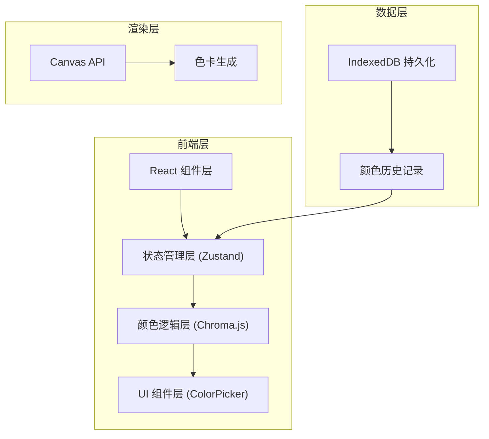

## 1. 架构设计



## 2. 技术说明
- 前端框架：React 18 + TypeScript
- 构建工具：Vite 5
- 样式方案：Tailwind CSS 3
- 状态管理：Zustand
- 颜色处理：Chroma.js
- 拾色器：react-colorful
- 数据存储：IndexedDB（idb 库封装）
- 图标库：Lucide React

## 3. 路由定义
| 路由 | 用途 |
|------|------|
| / | 主页面，所有颜色工具 |

## 4. 数据模型

### 4.1 IndexedDB 数据结构
- 数据库名：`ColorLabDB`
- 存储对象：`colorHistory`
- 索引：`timestamp`（按时间排序）、`project`（按项目筛选）

```typescript
interface ColorHistory {
  id: string;           // UUID
  hex: string;          // HEX 色值
  rgb: { r: number; g: number; b: number };
  timestamp: number;    // 保存时间戳
  name?: string;        // 可选名称
  project?: string;     // 项目标签
}
```

### 4.2 配色方案类型
```typescript
type ColorSchemeType = 'monochromatic' | 'complementary' | 'triadic' | 'tetradic';

interface ColorScheme {
  type: ColorSchemeType;
  name: string;
  colors: string[];  // hex colors array
}
```

### 4.3 色域校验结果
```typescript
interface GamutCheckResult {
  isOutOfGamut: boolean;
  sourceSpace: string;
  targetSpace: string;
  originalValue: string;
  clampedValue: string;
}
```

### 4.4 WCAG 对比度结果
```typescript
interface WCAGResult {
  ratio: number;
  aaNormal: boolean;
  aaLarge: boolean;
  aaaNormal: boolean;
  aaaLarge: boolean;
  level: 'fail' | 'aa' | 'aaa';
}
```

### 4.5 颜色名称匹配结果
```typescript
interface ColorNameResult {
  name: string;
  hex: string;
  distance: number;
}
```

## 5. 组件结构

```
src/
├── components/
│   ├── ColorConverter/       # 颜色空间转换输入区域（含色域警告）
│   ├── ColorPreview/         # 颜色预览（含颜色名称显示）
│   ├── ColorCompare/         # 颜色对比（含WCAG对比度）
│   ├── ColorPicker/          # 拾色器组件
│   ├── ColorHistory/         # 历史记录列表（含项目筛选）
│   ├── ColorSchemeGenerator/ # 配色方案生成器
│   ├── ColorContrast/        # WCAG 对比度检测器
│   ├── EyeDropper/           # 屏幕取色器
│   └── PresetPalette/        # 预设色板
├── hooks/
│   ├── useColorStore.ts      # Zustand 颜色状态
│   └── useColorHistory.ts    # IndexedDB 历史记录
├── utils/
│   ├── colorConverter.ts     # 颜色空间转换函数
│   ├── gamutChecker.ts       # 色域校验与裁剪
│   ├── colorScheme.ts        # 配色方案算法
│   ├── contrastChecker.ts    # WCAG 对比度计算
│   └── colorNames.ts         # 颜色名称数据库与匹配
├── types/
│   └── index.ts              # TypeScript 类型定义
├── App.tsx
└── main.tsx
```

## 6. 核心依赖
```json
{
  "chroma-js": "^2.4.2",
  "react-colorful": "^5.6.1",
  "idb": "^8.0.0",
  "zustand": "^4.5.0",
  "lucide-react": "^0.344.0"
}
```
