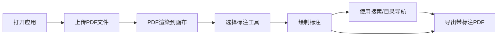

## 1. 产品概述

一款基于Web的PDF标注工具，支持PDF上传预览、多种标注方式（高亮、下划线、删除线、批注、形状）、文字搜索、目录导航及标注导出功能。面向需要在线审阅和标注PDF文档的专业人士和普通用户。

## 2. 核心功能

### 2.1 用户角色
| 角色 | 注册方式 | 核心权限 |
|------|---------|---------|
| 审阅者 | 无需注册/临时会话 | 上传PDF、添加标注、使用标注模板、导出带标注的PDF |
| 文档所有者 | 会话创建者 | 发起多人审阅、合并标注、处理冲突、导出最终版本 |

### 2.2 功能模块
1. **主界面**：PDF上传区、工具栏、PDF预览画布、侧边栏
2. **标注功能**：高亮、下划线、删除线、文本批注、形状标注（矩形、圆形、箭头）
3. **辅助功能**：文字搜索、目录导航、页面跳转、缩放控制
4. **导出功能**：导出带有标注的PDF文件
5. **OCR识别功能**：扫描版PDF文字识别、识别结果高亮标注
6. **标注模板功能**：常用审阅意见快速复用、模板管理
7. **多人审阅功能**：多用户标注、标注合并、冲突处理

### 2.3 页面详情
| 页面名称 | 模块名称 | 功能描述 |
|---------|---------|----------|
| 主界面 | 文件上传区 | 拖拽或点击上传PDF文件，显示上传进度 |
| 主界面 | 顶部工具栏 | 标注工具选择、撤销/重做、搜索、目录、导出按钮、OCR识别、标注模板 |
| 主界面 | PDF画布区 | PDF渲染显示、标注绘制交互、缩放/拖拽操作 |
| 主界面 | 侧边栏 | 搜索结果面板、目录导航面板、批注列表、审阅者列表 |
| 主界面 | 底部状态栏 | 当前页码、总页数、缩放比例、标注统计、审阅状态 |
| 弹窗 | OCR识别面板 | 选择识别页面、显示识别进度、确认识别结果 |
| 弹窗 | 标注模板面板 | 查看常用模板、添加/编辑/删除模板 |
| 弹窗 | 标注合并面板 | 查看所有审阅者标注、选择合并、处理冲突 |

## 3. 核心流程

用户打开应用 → 上传PDF文件 → PDF渲染到画布 → 选择标注工具 → 在PDF上绘制标注 → 可使用搜索/目录导航功能 → 完成标注后导出带标注的PDF

## 4. 用户界面设计

### 4.1 设计风格
- **主色调**：深蓝色 (#165DFF) - 专业、可靠的感觉
- **辅助色**：橙色 (#FF7D00) - 用于强调和高亮工具
- **中性色**：深灰 (#1D2129)、中灰 (#4E5969)、浅灰 (#F2F3F5)
- **按钮风格**：圆角 6px，扁平化设计，hover时有轻微阴影效果
- **字体**：Inter 字体族，清晰易读
- **布局风格**：三栏式布局，左侧工具栏 + 中间画布 + 右侧可折叠侧边栏
- **图标风格**：简洁的线性图标，统一 24x24 尺寸

### 4.2 页面设计概述
| 页面名称 | 模块名称 | UI元素 |
|---------|---------|--------|
| 主界面 | 文件上传区 | 拖拽区域、虚线边框、上传图标、提示文字、渐变色背景 |
| 主界面 | 顶部工具栏 | 图标按钮组、工具激活状态、下拉颜色选择器 |
| 主界面 | PDF画布区 | 白色画布背景、阴影效果、标注绘制层、缩放控制按钮 |
| 主界面 | 侧边栏 | 标签页切换、搜索输入框、目录树、批注列表项 |
| 主界面 | 底部状态栏 | 页码显示、缩放滑块、页面导航按钮 |

### 4.3 响应式
- 桌面端优先设计，针对 1280px 及以上宽度优化
- 平板端：侧边栏可折叠为图标模式
- 移动端：工具栏移至底部，采用单列布局
- 触摸设备优化：增大可点击区域，支持手势缩放

### 4.4 交互细节
- 标注工具选择时的视觉反馈（颜色变化、边框高亮）
- 画布悬停时显示当前工具的光标样式
- 标注选中状态显示调整控制点
- 平滑的页面切换和缩放动画
- 搜索结果高亮和跳转动画
