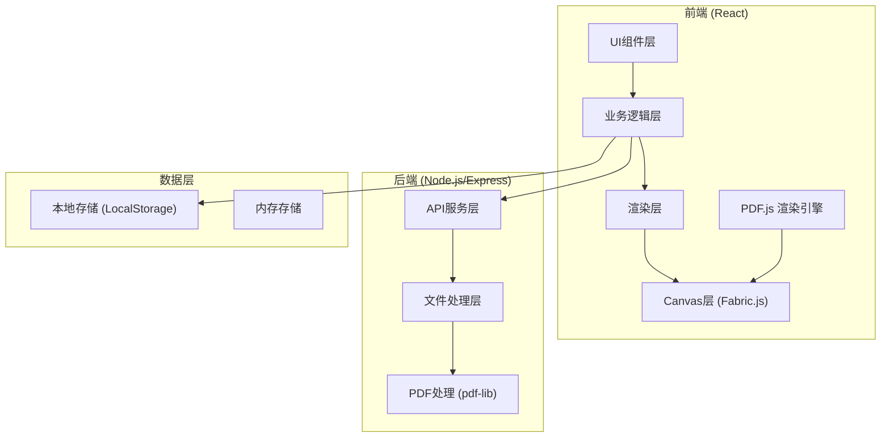

## 1. 架构设计



## 2. 技术描述

- **前端框架**: React@18 + TypeScript
- **构建工具**: Vite@5
- **样式方案**: TailwindCSS@3
- **PDF渲染**: pdfjs-dist@3
- **画布标注**: fabric@6
- **状态管理**: React Context + useReducer
- **后端框架**: Express@4
- **PDF处理**: @pdf-lib/core
- **图标库**: lucide-react

## 3. 目录结构

```
project/
├── client/                    # 前端项目
│   ├── src/
│   │   ├── components/        # 组件
│   │   │   ├── Toolbar/       # 工具栏
│   │   │   ├── Canvas/        # PDF画布
│   │   │   ├── Sidebar/       # 侧边栏
│   │   │   └── Upload/        # 上传组件
│   │   ├── hooks/             # 自定义Hooks
│   │   ├── contexts/          # Context
│   │   ├── utils/             # 工具函数
│   │   ├── types/             # 类型定义
│   │   └── App.tsx
│   └── package.json
├── server/                    # 后端项目
│   ├── src/
│   │   ├── controllers/       # 控制器
│   │   ├── services/          # 服务层
│   │   └── routes/            # 路由
│   └── package.json
└── package.json
```

## 4. 前端路由定义
| 路由 | 页面组件 | 功能描述 |
|------|---------|----------|
| / | PdfAnnotator | 主页面，PDF标注工具 |

## 5. API 定义

### 5.1 类型定义
```typescript
// 标注类型
type AnnotationType = 'highlight' | 'underline' | 'strikeout' | 'comment' | 'rectangle' | 'circle' | 'arrow';

// 相对坐标 (0-1 比例值)
interface RelativePosition {
  x: number;
  y: number;
  width?: number;
  height?: number;
}

interface Annotation {
  id: string;
  type: AnnotationType;
  pageIndex: number;
  position: RelativePosition;
  color: string;
  content?: string;
  createdAt: number;
}

// 目录节点（多级树结构）
interface OutlineNode {
  id: string;
  title: string;
  pageIndex: number;
  children: OutlineNode[];
}

interface PdfDocument {
  id: string;
  name: string;
  file: File;
  numPages: number;
  annotations: Annotation[];
  outlines: OutlineNode[];
}

// 导出任务状态
type ExportStatus = 'pending' | 'processing' | 'completed' | 'failed';

interface ExportTask {
  taskId: string;
  fileId: string;
  status: ExportStatus;
  downloadUrl?: string;
  progress: number;
  createdAt: number;
  completedAt?: number;
}

// OCR识别结果
interface OcrResult {
  pageIndex: number;
  text: string;
  position: RelativePosition;
  confidence: number;
}

interface OcrTask {
  taskId: string;
  fileId: string;
  status: 'pending' | 'processing' | 'completed' | 'failed';
  progress: number;
  results: OcrResult[];
}

// 标注模板
interface AnnotationTemplate {
  id: string;
  name: string;
  type: AnnotationType;
  color: string;
  content?: string;
  shortcut?: string;
  isGlobal: boolean;
  createdAt: number;
  updatedAt: number;
}

// 审阅者
interface Reviewer {
  id: string;
  name: string;
  color: string;
  role: 'owner' | 'reviewer';
}

// 审阅会话
interface ReviewSession {
  sessionId: string;
  fileId: string;
  ownerId: string;
  reviewers: Reviewer[];
  annotations: (Annotation & { reviewerId: string })[];
  status: 'active' | 'merged' | 'completed';
  createdAt: number;
}

// 合并冲突
interface MergeConflict {
  annotationA: Annotation;
  annotationB: Annotation;
  type: 'overlap' | 'position' | 'content';
}
```

### 5.2 后端接口

| 方法 | 路径 | 描述 | 请求 | 响应 |
|------|------|------|------|------|
| POST | /api/pdf/upload | 上传PDF文件 | FormData (file) | { fileId, filename, numPages, outlines } |
| GET | /api/pdf/:fileId/outline | 获取PDF目录树 | - | { outlines: OutlineNode[] } |
| POST | /api/pdf/export/start | 开始导出任务 | { fileId, annotations } | { taskId, status } |
| GET | /api/pdf/export/:taskId/status | 查询导出进度 | - | { taskId, status, progress, downloadUrl } |
| GET | /api/pdf/export/:taskId/download | 下载导出文件 | - | Blob (PDF文件) |
| GET | /api/pdf/:fileId | 获取PDF文件 | - | Blob (PDF文件) |
| POST | /api/ocr/recognize | 开始OCR识别 | { fileId, pages?: number[] } | { taskId, status } |
| GET | /api/ocr/:taskId/status | 查询OCR进度 | - | { taskId, status, progress, results } |
| GET | /api/templates | 获取标注模板列表 | - | { templates: AnnotationTemplate[] } |
| POST | /api/templates | 创建标注模板 | { name, type, color, content, shortcut } | { template } |
| PUT | /api/templates/:id | 更新标注模板 | { name?, type?, color?, content?, shortcut? } | { template } |
| DELETE | /api/templates/:id | 删除标注模板 | - | { success: true } |
| POST | /api/review/session | 创建审阅会话 | { fileId, reviewerName } | { sessionId, reviewerId } |
| POST | /api/review/session/:sessionId/join | 加入审阅会话 | { reviewerName } | { reviewerId } |
| GET | /api/review/session/:sessionId | 获取审阅会话状态 | - | { session, annotations } |
| POST | /api/review/session/:sessionId/annotations | 添加标注 | { annotation } | { success: true } |
| POST | /api/review/session/:sessionId/merge | 合并标注 | { selectedIds[] } | { mergedAnnotations, conflicts } |

## 6. 核心模块设计

### 6.1 PDF渲染模块
- 使用 PDF.js 渲染 PDF 页面到 Canvas
- 支持分页渲染和虚拟滚动
- 缩放和旋转控制
- 提供页面尺寸信息用于坐标转换

### 6.2 标注系统（相对坐标）
- 使用 Fabric.js 管理标注图层
- 支持多种标注类型的绘制和编辑
- **相对坐标存储**：所有标注位置以 (0-1) 比例值存储
- **缩放重定位**：缩放时根据当前页面尺寸按比例重新计算绝对坐标
- 坐标转换工具函数：相对坐标 ↔ 绝对坐标

### 6.3 目录解析（递归遍历）
- 使用 PDF.js 的 getOutline() API 获取目录数据
- **递归遍历算法**：深度优先遍历生成多级树结构
- 支持无限层级目录嵌套
- 目录节点包含：标题、页码、子节点数组

### 6.4 文字搜索
- 使用 PDF.js 的文本提取功能
- 支持正则表达式搜索
- 搜索结果高亮和跳转

### 6.5 导出功能（服务端异步）
- **服务端渲染**：后端使用 pdf-lib 在服务器端将标注写入PDF
- **异步任务队列**：导出请求入队，后台工作线程处理
- **进度轮询**：前端轮询任务状态，显示处理进度
- **下载链接**：任务完成后返回下载URL，支持断点续传
- 任务状态管理：pending → processing → completed/failed

### 6.6 OCR识别模块
- **tesseract.js 集成**：前端调用 OCR 引擎识别扫描版PDF文字
- **页面级识别**：支持单页或批量识别，进度可视化
- **文字定位**：识别结果包含坐标信息，用于高亮标注
- **异步处理**：识别任务异步执行，不阻塞UI
- **结果缓存**：识别结果缓存，避免重复识别

### 6.7 标注模板模块
- **模板存储**：本地存储常用审阅意见模板
- **快速复用**：点击模板快速添加标注，支持快捷键
- **模板管理**：支持添加、编辑、删除自定义模板
- **全局模板**：预置常用审阅意见模板
- **快捷键支持**：可为模板设置键盘快捷键

### 6.8 多人审阅模块
- **会话管理**：创建审阅会话，生成邀请链接
- **多用户标注**：不同审阅者用不同颜色标注
- **实时同步**：轮询获取其他审阅者的标注
- **标注合并**：文档所有者可合并所有审阅者的标注
- **冲突处理**：检测重叠/冲突标注，提供选择界面
