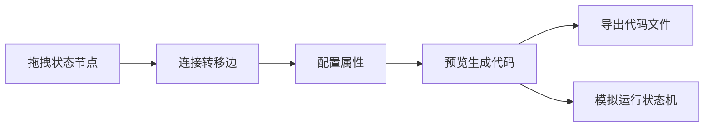

## 1. 产品概述

Web端流程图转状态机代码工具，通过拖拽式可视化编辑创建状态机流程图，自动生成XState和Spring StateMachine代码，支持代码预览、导出及状态机模拟运行。

- **主要用途**：帮助开发者快速设计状态机并生成生产级代码
- **解决问题**：简化状态机设计流程，减少手动编码错误
- **目标用户**：前端/后端开发者、系统架构师
- **市场价值**：提升状态机开发效率，统一团队状态机设计规范

## 2. 核心功能

### 2.1 用户角色
| 角色 | 注册方式 | 核心权限 |
|------|----------|----------|
| 开发者 | 无需注册 | 使用所有功能、导出代码、模拟运行 |

### 2.2 功能模块
1. **画布编辑区**：拖拽状态节点、连接转移边、属性配置
2. **代码生成区**：实时生成XState/Spring StateMachine代码、语法高亮
3. **模拟运行区**：状态机执行模拟、状态高亮、事件触发
4. **工具栏**：导出代码、清空画布、加载示例、切换主题

### 2.3 页面详情
| 页面名称 | 模块名称 | 功能描述 |
|----------|----------|----------|
| 主页面 | 左侧边栏 | 状态节点拖拽面板、节点类型选择 |
| 主页面 | 中心画布 | React Flow流程图编辑、缩放、平移 |
| 主页面 | 右侧面板 | 属性配置、代码预览、模拟运行 |
| 主页面 | 顶部工具栏 | 文件操作、视图切换、帮助 |

## 3. 核心流程

### 3.1 主工作流程
1. 用户从左侧拖拽状态节点到画布
2. 连接节点创建状态转移
3. 配置状态和转移属性（条件、动作、守卫）
4. 切换代码标签预览生成的代码
5. 选择导出格式下载代码
6. 使用模拟面板测试状态机逻辑

## 4. 用户界面设计

### 4.1 设计风格
- **主色调**：深紫蓝色 (#1e1b4b) 作为主背景，青绿色 (#10b981) 作为强调色
- **按钮风格**：圆角、渐变背景、悬停动效
- **字体**：Fira Code (代码) + JetBrains Mono (界面)
- **布局风格**：三栏布局（左侧工具、中间画布、右侧代码）
- **图标风格**：简洁线性图标 + emoji点缀

### 4.2 页面设计概述
| 页面名称 | 模块名称 | UI元素 |
|----------|----------|--------|
| 主页面 | 左侧边栏 | 可折叠面板、节点分类、拖拽交互 |
| 主页面 | 中心画布 | 网格背景、节点圆角卡片、贝塞尔曲线连接线 |
| 主页面 | 右侧面板 | Tab切换（属性/代码/模拟）、代码编辑器、运行控制 |
| 主页面 | 顶部栏 | Logo、操作按钮、语言切换、主题切换 |

### 4.3 响应式
- Desktop端：三栏布局，固定侧边栏宽度
- 移动端：侧边栏可折叠弹出，代码区域移至画布下方
- 触控优化：节点拖拽支持触摸操作，按钮增大触摸区域

### 4.4 动画效果
- 节点拖拽时的平滑跟随动画
- 连接线创建时的弹性动画
- 状态切换时的高亮闪烁效果
- 代码生成时的打字机效果
