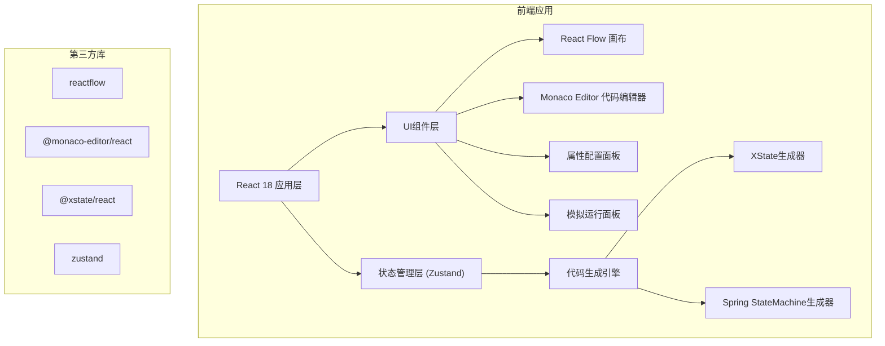

## 1. 架构设计



## 2. 技术栈说明

- **前端框架**: React@18 + TypeScript@5
- **构建工具**: Vite@5
- **样式方案**: TailwindCSS@3
- **流程图库**: reactflow@11
- **代码编辑器**: @monaco-editor/react@4
- **状态管理**: zustand@4
- **状态机运行**: @xstate/react@3
- **图标**: lucide-react@0.344

## 3. 目录结构

```
src/
├── components/
│   ├── Canvas/              # 流程图画布组件
│   ├── Sidebar/             # 左侧节点面板
│   ├── RightPanel/          # 右侧面板
│   │   ├── Properties.tsx   # 属性配置
│   │   ├── CodeEditor.tsx   # 代码预览
│   │   └── Simulator.tsx    # 模拟运行
│   ├── Toolbar/             # 顶部工具栏
│   └── nodes/               # 自定义节点类型
├── store/
│   └── useFlowStore.ts      # 全局状态管理
├── generators/
│   ├── xstate.ts            # XState代码生成
│   └── spring.ts            # Spring StateMachine代码生成
├── types/
│   └── index.ts             # 类型定义
├── utils/
│   └── export.ts            # 导出工具函数
├── App.tsx
└── main.tsx
```

## 4. 数据模型

### 4.1 节点数据结构

```typescript
interface StateNodeData {
  label: string;
  type: 'initial' | 'normal' | 'final' | 'parallel' | 'history';
  entry?: string[];
  exit?: string[];
  invoke?: string;
  description?: string;
}

interface EdgeData {
  label: string;
  guard?: string;
  actions?: string[];
  event: string;
}
```

### 4.2 全局状态

```typescript
interface FlowState {
  nodes: Node[];
  edges: Edge[];
  selectedNode: Node | null;
  selectedEdge: Edge | null;
  codeFormat: 'xstate' | 'spring';
  simulatorState: {
    currentState: string | null;
    history: string[];
    isRunning: boolean;
  };
}
```

## 5. 核心功能实现

### 5.1 拖拽绘制
- 使用 React Flow 的 `useDragDrop` 实现节点拖拽
- 自定义节点类型支持不同状态样式
- 连接线使用贝塞尔曲线，支持标签显示

### 5.2 代码生成
- 遍历节点和边生成 AST 结构
- 支持 XState (JavaScript/TypeScript)
- 支持 Spring StateMachine (Java)
- 实时生成，防抖优化性能

### 5.3 模拟运行
- 使用 XState 解释器执行状态机
- 高亮当前活动状态
- 显示事件触发历史
- 支持重置和步进执行

### 5.4 代码导出
- 支持复制到剪贴板
- 支持下载为文件 (.ts / .java)
