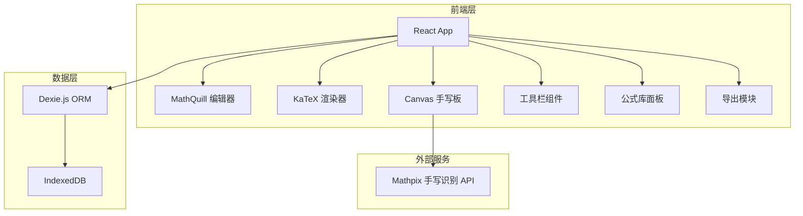
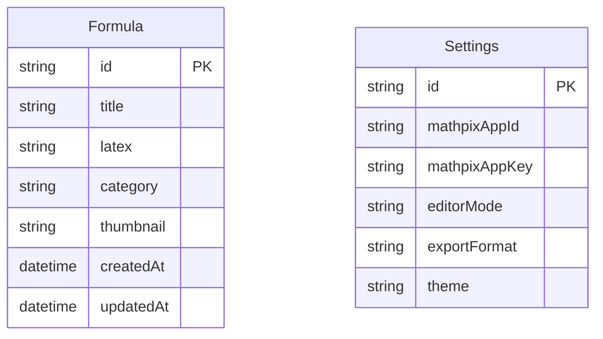
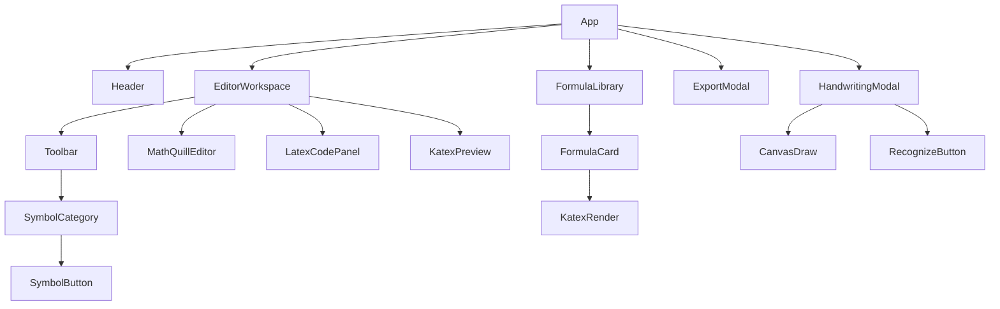

## 1. 架构设计



## 2. 技术说明
- **前端**：React@18 + TypeScript + Tailwind CSS@3 + Vite
- **初始化工具**：Vite (create-vite)
- **后端**：无（纯前端应用）
- **数据库**：IndexedDB（通过Dexie.js ORM）
- **核心库**：
  - mathquill@0.10.1 — 可视化公式编辑
  - katex@0.16.x — LaTeX公式渲染
  - dexie@3.x — IndexedDB操作
  - html-to-image — 导出为图片
  - latex2image — 辅助渲染

## 3. 路由定义
| 路由 | 用途 |
|------|------|
| / | 编辑器主页面（单页应用，所有功能集成） |

## 4. API定义（无后端）
本项目为纯前端应用，无后端API。手写识别通过前端直接调用Mathpix API：
- **请求**：POST `https://api.mathpix.com/v3/text`，Body含image_data（Base64）
- **响应**：`{ text: "LaTeX字符串", confidence: 0.95 }`
- 用户需在设置中配置自己的API Key

## 5. 服务器架构图
- 不适用（纯前端应用）

## 6. 数据模型

### 6.1 数据模型定义


### 6.2 数据定义语言
```sql
-- Dexie.js schema definition
-- Formula表：存储用户保存的公式
Formula: ++id, title, latex, category, thumbnail, createdAt, updatedAt

-- Settings表：存储用户配置
Settings: ++id, mathpixAppId, mathpixAppKey, editorMode, exportFormat, theme
```

## 7. 核心组件架构



## 8. 关键技术决策

| 决策项 | 选择 | 原因 |
|--------|------|------|
| 公式编辑 | MathQuill | 最成熟的可视化数学公式编辑器，支持分数/根号等自然输入 |
| 公式渲染 | KaTeX | 比MathJax快100倍，适合实时预览场景 |
| 本地存储 | Dexie.js + IndexedDB | 纯前端持久化，无需后端，Dexie提供友好API |
| 手写识别 | Mathpix API | 业界最精准的数学手写识别服务 |
| 导出图片 | html-to-image | 纯前端截图，无需服务器渲染 |
| 样式方案 | Tailwind CSS | 快速开发，原子化CSS，配合自定义主题变量 |
