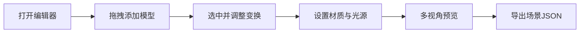

## 1. 产品概述

3D场景编辑器是一款基于Web的可视化3D创作工具，允许用户通过拖拽方式快速构建3D场景，支持基础几何体和自定义glTF模型的导入与编辑。目标用户包括3D设计师、游戏开发者和教育工作者，旨在降低3D场景创作的技术门槛。

## 2. 核心功能

### 2.1 用户角色
| 角色 | 注册方式 | 核心权限 |
|------|----------|----------|
| 普通用户 | 无需注册 | 编辑场景、导出JSON、预览渲染 |

### 2.2 功能模块
1. **主编辑页面**: 3D视口、模型库面板、属性控制面板、工具栏
2. **导出功能**: 场景JSON导出、GLTF模型导出

### 2.3 页面详情
| 页面名称 | 模块名称 | 功能描述 |
|---------|----------|----------|
| 主编辑页面 | 3D视口 | Three.js渲染场景，支持轨道控制、选择物体、变换操作 |
| 主编辑页面 | 模型库面板 | 拖拽添加立方体、球体、自定义glTF模型 |
| 主编辑页面 | 属性控制面板 | 调整选中物体的位置、旋转、缩放、材质属性 |
| 主编辑页面 | 光源设置 | 添加和编辑环境光、平行光、点光源 |
| 主编辑页面 | 工具栏 | 视角切换、导出按钮、预览渲染 |

## 3. 核心流程

用户打开编辑器 → 从模型库拖拽几何体到场景 → 选中模型调整变换属性 → 设置材质颜色和光照 → 切换多视角预览 → 导出场景JSON文件

## 4. 用户界面设计

### 4.1 设计风格
- **主色调**: 深灰色背景 (#1a1a2e) 搭配科技蓝 (#00d4ff) 作为强调色
- **按钮风格**: 圆角矩形，hover时有发光效果
- **字体**: JetBrains Mono 用于编辑器界面，现代等宽字体体现科技感
- **布局风格**: 三栏布局（左：模型库，中：3D视口，右：属性面板）
- **图标风格**: Lucide 线性图标，简洁现代

### 4.2 页面设计概述
| 页面名称 | 模块名称 | UI元素 |
|---------|----------|--------|
| 主编辑页面 | 3D视口 | 全屏Canvas、网格辅助线、坐标轴指示、变换Gizmo |
| 主编辑页面 | 模型库面板 | 可折叠侧边栏、模型卡片、拖拽指示器 |
| 主编辑页面 | 属性面板 | Leva控制组件、滑块、颜色选择器、数值输入框 |
| 主编辑页面 | 顶部工具栏 | 视角切换按钮组、导出下拉菜单、预览按钮 |

### 4.3 响应式
- Desktop-first 设计，优先保证桌面端操作体验
- 平板端自适应调整面板宽度
- 移动端简化为单栏视口 + 底部工具栏

### 4.4 3D场景指导
- **环境**: 深色背景配合雾效，营造科技感
- **光照设置**: 默认环境光 + 两盏平行光，保证模型可见性
- **相机设置**: 透视相机，支持轨道控制，预设正视图/侧视图/透视图
- **交互**: 点击选择物体，Gizmo进行平移/旋转/缩放
- **后处理**: 可选抗锯齿和色调映射
