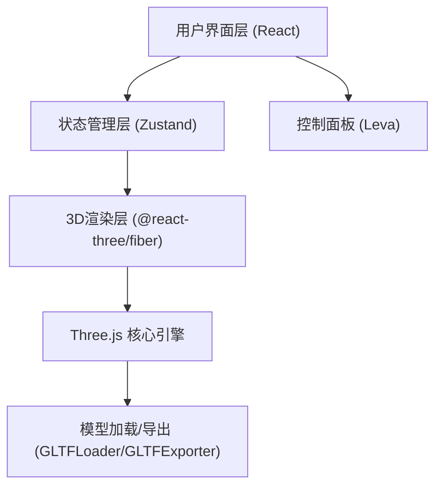

## 1. 架构设计



## 2. 技术描述

- **前端框架**: React@18 + TypeScript
- **构建工具**: Vite@5
- **样式方案**: TailwindCSS@3
- **3D引擎**: Three.js + @react-three/fiber + @react-three/drei
- **状态管理**: Zustand
- **控制面板**: Leva
- **图标库**: lucide-react

## 3. 路由定义

| 路由 | 用途 |
|------|------|
| / | 主编辑器页面 |

## 4. 数据模型

### 4.1 场景数据结构

```typescript
interface SceneObject {
  id: string;
  name: string;
  type: 'box' | 'sphere' | 'gltf';
  position: [number, number, number];
  rotation: [number, number, number];
  scale: [number, number, number];
  material: {
    color: string;
    metalness: number;
    roughness: number;
    emissive: string;
    emissiveIntensity: number;
  };
  gltfUrl?: string;
}

interface LightConfig {
  id: string;
  type: 'ambient' | 'directional' | 'point';
  color: string;
  intensity: number;
  position?: [number, number, number];
}

interface SceneData {
  objects: SceneObject[];
  lights: LightConfig[];
  backgroundColor: string;
  fog: {
    enabled: boolean;
    color: string;
    near: number;
    far: number;
  };
}
```

## 5. 目录结构

```
src/
├── components/
│   ├── Editor/
│   │   ├── Viewport.tsx        # 3D视口组件
│   │   ├── ModelLibrary.tsx    # 模型库面板
│   │   ├── PropertyPanel.tsx   # 属性面板
│   │   └── Toolbar.tsx         # 顶部工具栏
│   └── Three/
│       ├── Scene.tsx           # 3D场景
│       ├── RenderableObject.tsx # 可渲染物体
│       ├── Lights.tsx          # 光源组件
│       └── Gizmo.tsx           # 变换控制器
├── store/
│   └── useSceneStore.ts        # 场景状态管理
├── hooks/
│   └── useGLTFModel.ts         # GLTF模型加载hook
├── utils/
│   ├── sceneExporter.ts        # 场景导出工具
│   └── sceneImporter.ts        # 场景导入工具
├── types/
│   └── scene.ts                # 类型定义
├── App.tsx
└── main.tsx
```
