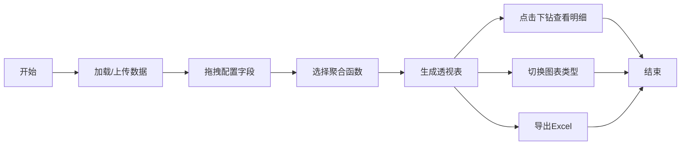

## 1. 产品概述

Web端数据透视表组件，用于多维数据分析和可视化，支持用户通过拖拽方式灵活配置数据维度和指标。
- 主要用途：快速生成交互式数据报表，支持多种聚合计算和数据下钻分析
- 目标用户：数据分析师、业务人员、运营团队
- 产品价值：降低数据分析门槛，提升数据洞察效率

## 2. 核心功能

### 2.1 用户角色
| 角色 | 注册方式 | 核心权限 |
|------|----------|----------|
| 普通用户 | 无需注册 | 使用所有数据分析功能 |

### 2.2 功能模块
1. **数据透视表页面**：字段配置区、透视表展示区、图表展示区
2. **字段配置**：拖拽行/列/值字段配置
3. **聚合计算**：求和、平均、计数、去重计数
4. **数据下钻**：点击单元格查看明细数据
5. **数据导出**：导出Excel文件
6. **图表联动**：透视表与图表双向交互

### 2.3 页面详情
| 页面名称 | 模块名称 | 功能描述 |
|---------|----------|---------|
| 数据透视表页面 | 字段配置区 | 拖拽行、列、值字段，选择聚合函数 |
| 数据透视表页面 | 透视表展示区 | 展示交叉表格，支持点击下钻 |
| 数据透视表页面 | 图表展示区 | 柱状图/折线图/饼图展示，与表格联动 |
| 数据透视表页面 | 工具栏 | 数据上传、导出Excel、图表类型切换 |

## 3. 核心流程

用户上传数据或使用示例数据 → 拖拽字段到行/列/值区域 → 选择聚合函数 → 查看透视表结果 → 点击单元格查看明细 → 切换图表类型查看可视化 → 导出Excel报表

## 4. 用户界面设计

### 4.1 设计风格
- 主色调：深蓝 #165DFF，专业商务风格
- 辅助色：浅蓝 #E8F3FF，用于选中状态和高亮
- 按钮风格：圆角矩形，轻微阴影，hover状态有微妙动效
- 字体：思源黑体，清晰易读的层级结构
- 布局风格：三栏布局，左侧字段配置，中间表格，右侧/下方图表
- 图标风格：简洁线性图标，统一24px尺寸

### 4.2 页面设计概述
| 页面名称 | 模块名称 | UI元素 |
|---------|----------|--------|
| 数据透视表页面 | 字段配置区 | 可拖拽字段卡片，三个放置区域（行、列、值），聚合函数下拉选择 |
| 数据透视表页面 | 透视表展示区 | 固定表头，斑马纹行，hover高亮，点击单元格有动效反馈 |
| 数据透视表页面 | 图表展示区 | 图表容器，类型切换按钮，图例交互 |
| 数据透视表页面 | 工具栏 | 顶部导航栏，操作按钮组 |

### 4.3 响应式
- 桌面端：三栏布局（字段区20% + 表格50% + 图表30%）
- 平板端：上下布局，字段区移至顶部，表格和图表垂直排列
- 移动端：单栏滚动布局，折叠式字段配置面板

### 4.4 动效设计
- 字段拖拽：拖拽时半透明效果，放置区域有蓝色边框提示
- 表格交互：行hover时背景色渐变过渡
- 数据加载：骨架屏动画，数字递增动效
- 弹窗过渡：下钻明细弹窗使用缩放+淡入效果
