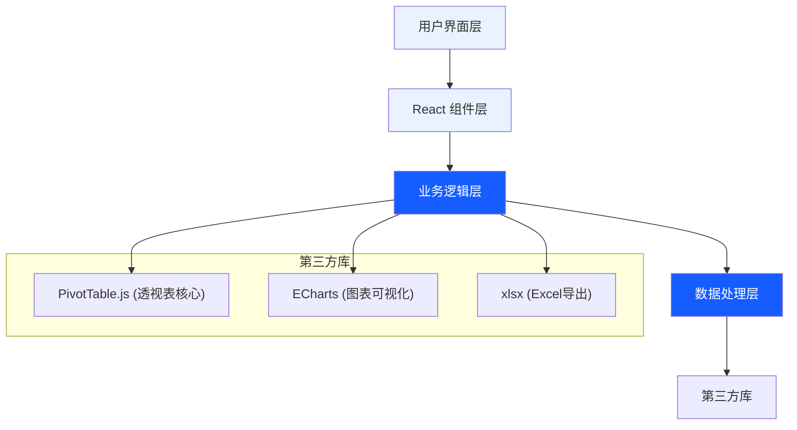
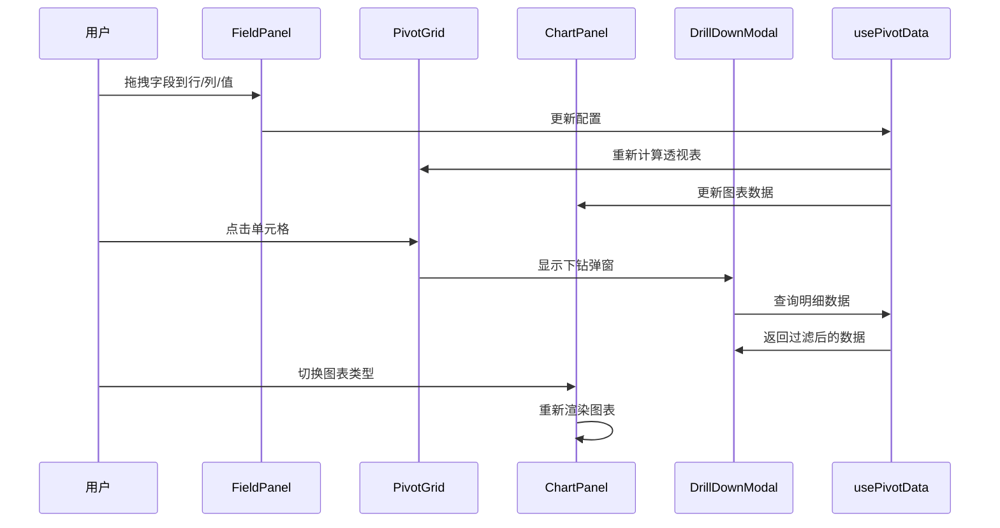

## 1. 架构设计



## 2. 技术描述

- **前端框架**: React@18 + TypeScript
- **构建工具**: Vite@5
- **样式方案**: TailwindCSS@3
- **透视表核心**: react-pivottable (PivotTable.js的React封装)
- **图表库**: echarts@5 + echarts-for-react
- **Excel导出**: xlsx@0.18
- **拖拽交互**: react-dnd (原生HTML5拖拽)
- **状态管理**: React Hooks (useState/useReducer)

## 3. 目录结构

```
src/
├── components/
│   ├── PivotTable/
│   │   ├── FieldPanel.tsx      # 字段配置面板
│   │   ├── PivotGrid.tsx       # 透视表展示
│   │   ├── DrillDownModal.tsx  # 下钻明细弹窗
│   │   └── index.tsx
│   ├── Charts/
│   │   ├── ChartPanel.tsx      # 图表面板
│   │   └── ChartSwitcher.tsx   # 图表切换器
│   └── Toolbar/
│       └── Toolbar.tsx         # 工具栏
├── hooks/
│   ├── usePivotData.ts         # 透视表数据处理Hook
│   └── useChartData.ts         # 图表数据转换Hook
├── utils/
│   ├── pivotUtils.ts           # 透视表计算工具
│   ├── excelExport.ts          # Excel导出工具
│   └── dataTransform.ts        # 数据转换工具
├── types/
│   └── index.ts                # 类型定义
├── data/
│   └── sampleData.ts           # 示例数据
├── App.tsx
└── main.tsx
```

## 4. 核心类型定义

```typescript
// 数据行类型
interface DataRow {
  [key: string]: string | number;
}

// 字段配置
interface FieldConfig {
  name: string;
  type: 'dimension' | 'measure';
  dataType: 'string' | 'number' | 'date';
}

// 聚合函数类型
type AggregationType = 'sum' | 'avg' | 'count' | 'countDistinct';

// 值字段配置
interface ValueField {
  field: string;
  aggregation: AggregationType;
}

// 透视表状态
interface PivotState {
  data: DataRow[];
  rows: string[];
  cols: string[];
  values: ValueField[];
}

// 下钻上下文
interface DrillDownContext {
  rowFilters: { [field: string]: string };
  colFilters: { [field: string]: string };
  valueField: string;
}
```

## 5. 核心组件交互



## 6. 数据模型

### 6.1 示例数据结构
```typescript
// 销售数据示例
const sampleSalesData: DataRow[] = [
  {
    日期: '2024-01-15',
    区域: '华东',
    城市: '上海',
    产品: '产品A',
    类别: '电子产品',
    销售额: 15000,
    销量: 120,
    利润: 3000
  },
  // ... 更多数据
];
```
