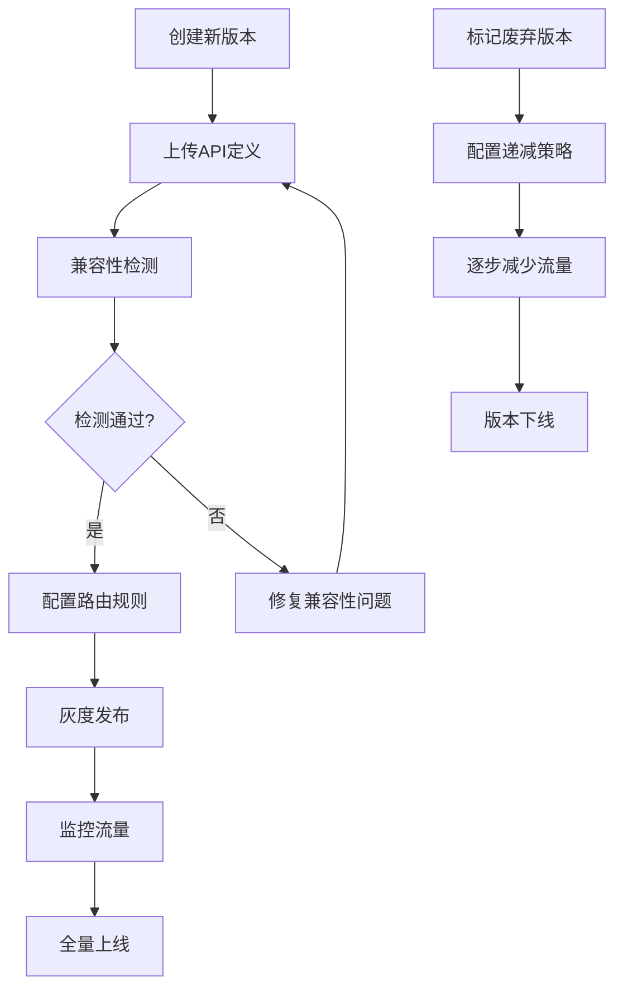

## 1. 产品概述

API版本管理平台是一个面向微服务架构的全生命周期版本管理系统，解决API接口多版本共存、平滑升级、灰度下线等核心问题。目标用户包括后端开发人员、API架构师和运维团队。

- 主要用途：管理API接口的版本演进，支持多版本共存、版本路由、废弃版本灰度下线
- 核心价值：降低API升级风险，提升客户端兼容性，提供版本差异可视化对比

## 2. 核心特性

### 2.1 用户角色

| 角色 | 注册方式 | 核心权限 |
|------|----------|----------|
| 开发者 | 单点登录/账号密码 | 查看API文档、版本对比、客户端升级引导 |
| 管理员 | 账号密码 | 版本发布、路由配置、灰度策略管理、兼容性检测 |
| 运维人员 | 账号密码 | 监控版本流量、执行灰度下线、查看版本状态 |

### 2.2 功能模块

1. **仪表盘**：版本概览、流量分布、废弃版本监控
2. **API版本管理**：版本列表、版本详情、版本发布/废弃
3. **版本路由配置**：路由规则、灰度策略、流量分配
4. **版本差异对比**：接口定义对比、兼容性分析、变更报告
5. **Swagger文档中心**：多版本API文档、在线调试
6. **客户端升级引导**：版本兼容矩阵、升级指南、SDK下载

### 2.3 页面详情

| 页面名称 | 模块名称 | 功能描述 |
|---------|----------|----------|
| 仪表盘 | 版本概览卡片 | 展示活跃版本数、废弃版本数、版本流量占比 |
| 仪表盘 | 流量趋势图 | 展示各版本近7天流量变化曲线 |
| API版本管理 | 版本列表 | 分页展示所有API版本，支持按状态、名称筛选 |
| API版本管理 | 版本详情 | 展示版本元信息、接口列表、依赖关系 |
| 版本路由 | 路由规则列表 | 展示路由规则配置、权重分配、灰度策略 |
| 版本路由 | 路由编辑器 | 可视化配置路由规则、流量分配比例 |
| 版本对比 | 差异对比面板 | 双栏对比两个版本的接口定义差异 |
| 版本对比 | 兼容性检测 | 自动检测破坏性变更、生成兼容性报告 |
| Swagger文档 | 版本选择器 | 切换不同版本的API文档 |
| Swagger文档 | 在线调试 | 支持按版本调用API接口 |
| 客户端引导 | 兼容矩阵 | 展示客户端版本与API版本兼容关系 |
| 客户端引导 | 升级指南 | 提供版本升级步骤和注意事项 |

## 3. 核心流程

### 3.1 版本发布流程
管理员创建新版本 → 配置版本元信息 → 上传OpenAPI定义 → 兼容性检测 → 配置路由规则 → 灰度发布 → 全量上线

### 3.2 版本灰度下线流程
标记版本为废弃 → 配置流量递减策略 → 监控客户端升级情况 → 逐步减少流量 → 最终下线

### 3.3 流程图

## 4. 用户界面设计

### 4.1 设计风格
- 主色调：深蓝色系（#165DFF），代表专业、可靠
- 辅助色：绿色（#00B42A）表示正常运行，橙色（#FF7D00）表示警告，红色（#F53F3F）表示危险
- 按钮风格：圆角矩形，悬停有微动画效果
- 字体：主标题使用思源黑体（Source Han Sans），正文使用系统字体
- 布局风格：顶部导航 + 左侧菜单 + 内容区的三段式布局
- 图标风格：线性图标，保持简洁一致

### 4.2 页面设计概述

| 页面名称 | 模块名称 | UI元素 |
|---------|----------|--------|
| 仪表盘 | 版本概览 | 卡片式布局、数据统计、渐变背景、悬停动效 |
| 仪表盘 | 流量趋势图 | 折线图、多色线条、数据点高亮 |
| API版本管理 | 版本列表 | 表格布局、状态标签、操作按钮组 |
| 版本路由 | 路由编辑器 | 拖拽式配置、滑块调节权重、实时预览 |
| 版本对比 | 差异面板 | 双栏布局、差异高亮、展开/折叠 |
| Swagger文档 | 文档中心 | 侧边导航、代码高亮、Try it out |

### 4.3 响应性
- 采用桌面优先设计，适配1920px、1440px、1024px三种主流分辨率
- 平板端：左侧菜单可折叠，内容区自适应
- 移动端：顶部导航简化为汉堡菜单，主要功能保留

### 4.4 动效设计
- 页面加载：元素淡入，采用staggered动画延迟
- 数据更新：数值变化有平滑过渡动画
- 卡片悬停：轻微上浮 + 阴影加深
- 开关切换：平滑过渡动画
- 版本对比：差异处高亮闪烁提示
