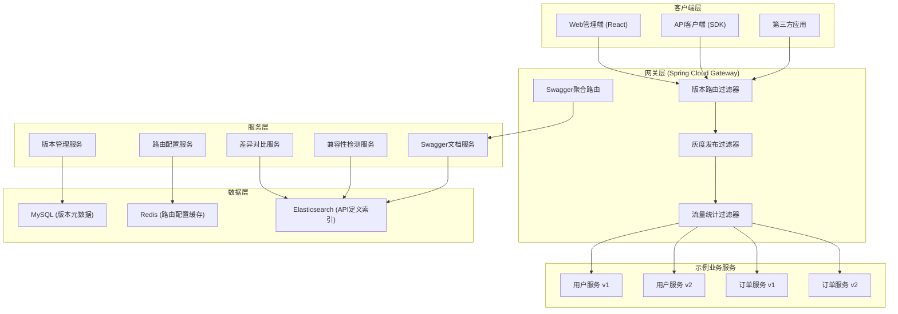
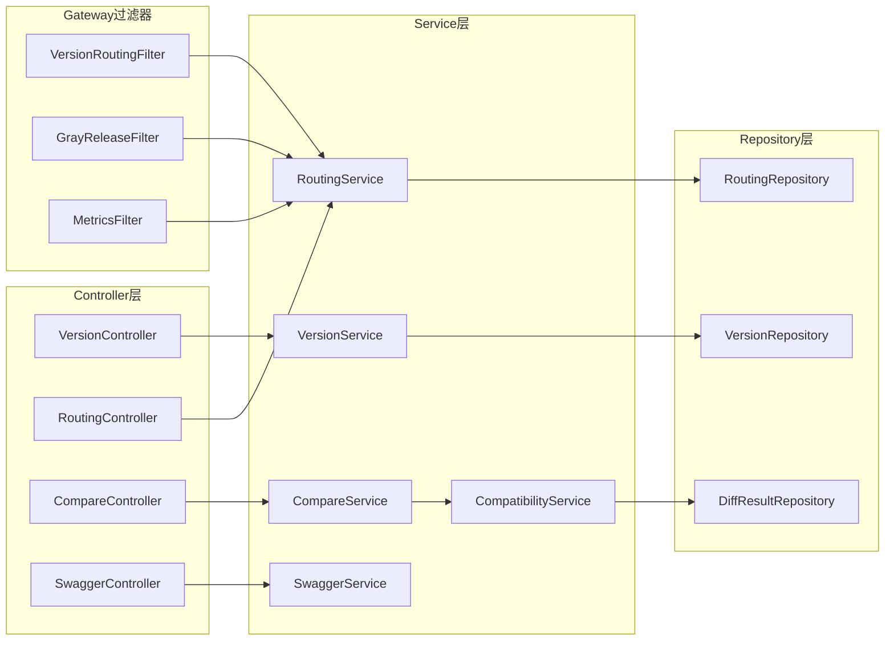
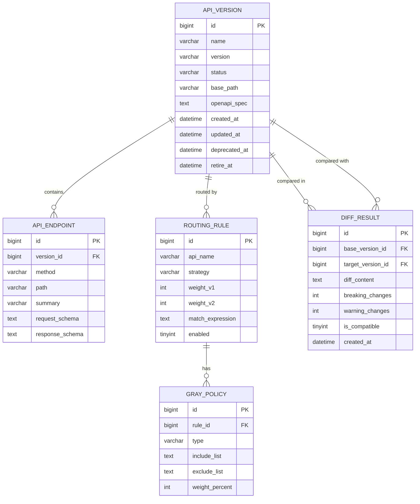

## 1. 架构设计



## 2. 技术描述

### 2.1 整体技术栈
- **前端**：React@18 + TypeScript + Ant Design + Vite
- **状态管理**：Zustand
- **图表**：ECharts
- **代码高亮**：Prism.js
- **后端网关**：Spring Cloud Gateway 3.1.x + Spring Boot 2.7.x
- **后端服务**：Spring Boot 2.7.x + MyBatis Plus
- **服务注册**：Nacos 2.x
- **数据库**：MySQL 8.0
- **缓存**：Redis 7.x
- **API文档**：Swagger / OpenAPI 3.0 + SpringDoc
- **构建工具**：Maven 3.8.x + Node.js 18.x

### 2.2 版本路由策略
- **Path版本路由**：`/api/v1/users`, `/api/v2/users`
- **Header版本路由**：`X-API-Version: v1`
- **Query参数路由**：`?apiVersion=v1`
- **灰度路由**：基于用户ID、IP、权重的流量分配

## 3. 路由定义

### 3.1 前端路由
| 路由路径 | 页面名称 | 功能说明 |
|---------|----------|----------|
| `/dashboard` | 仪表盘 | 版本概览、流量监控 |
| `/versions` | API版本列表 | 所有API版本管理 |
| `/versions/:id` | 版本详情 | 版本元信息、接口列表 |
| `/versions/new` | 创建版本 | 新建API版本 |
| `/routing` | 路由配置 | 路由规则管理 |
| `/routing/edit` | 路由编辑器 | 可视化编辑路由 |
| `/compare` | 版本对比 | 双栏版本差异对比 |
| `/swagger` | Swagger文档 | 多版本API文档 |
| `/client-guide` | 客户端引导 | 兼容矩阵、升级指南 |
| `/settings` | 系统设置 | 系统参数配置 |

### 3.2 后端API路由
| 路由路径 | 服务 | 说明 |
|---------|------|------|
| `/api/version-manager/**` | 版本管理服务 | 版本CRUD |
| `/api/routing-manager/**` | 路由配置服务 | 路由规则管理 |
| `/api/compare/**` | 差异对比服务 | 版本对比、兼容性检测 |
| `/api/v3/api-docs/**` | Swagger文档服务 | 多版本OpenAPI定义 |
| `/api/v1/**` | 业务服务v1 | 版本1业务接口 |
| `/api/v2/**` | 业务服务v2 | 版本2业务接口 |

## 4. API定义

### 4.1 核心数据类型
```typescript
// API版本信息
interface ApiVersion {
  id: string;
  name: string;
  version: string;
  status: 'DRAFT' | 'ACTIVE' | 'DEPRECATED' | 'RETIRED';
  description: string;
  basePath: string;
  openApiSpec: string;
  createdAt: string;
  updatedAt: string;
  deprecatedAt?: string;
  retireAt?: string;
}

// 路由规则
interface RoutingRule {
  id: string;
  apiName: string;
  versionWeights: Map<string, number>;
  strategy: 'PATH' | 'HEADER' | 'QUERY' | 'WEIGHTED';
  matchExpression?: string;
  grayStrategy?: GrayStrategy;
  createdAt: string;
}

// 灰度策略
interface GrayStrategy {
  type: 'USER_ID' | 'IP' | 'WEIGHT' | 'CUSTOM';
  includeList?: string[];
  excludeList?: string[];
  weight?: number;
  customRule?: string;
}

// 版本差异
interface VersionDiff {
  baseVersion: string;
  targetVersion: string;
  breakingChanges: Change[];
  nonBreakingChanges: Change[];
  deprecatedChanges: Change[];
}

interface Change {
  type: 'ADD' | 'REMOVE' | 'MODIFY';
  path: string;
  field: string;
  oldValue?: string;
  newValue?: string;
  description: string;
  level: 'ERROR' | 'WARNING' | 'INFO';
}

// 兼容性报告
interface CompatibilityReport {
  isCompatible: boolean;
  breakingChangeCount: number;
  warningCount: number;
  details: string[];
  recommendations: string[];
}
```

### 4.2 主要API接口
```typescript
// 版本管理
GET    /api/version-manager/versions          // 获取版本列表
GET    /api/version-manager/versions/{id}     // 获取版本详情
POST   /api/version-manager/versions          // 创建新版本
PUT    /api/version-manager/versions/{id}     // 更新版本
DELETE /api/version-manager/versions/{id}     // 删除版本
POST   /api/version-manager/versions/{id}/publish    // 发布版本
POST   /api/version-manager/versions/{id}/deprecate  // 废弃版本
POST   /api/version-manager/versions/{id}/retire     // 下线版本

// 路由管理
GET    /api/routing-manager/rules             // 获取路由规则列表
GET    /api/routing-manager/rules/{id}        // 获取路由规则详情
POST   /api/routing-manager/rules             // 创建路由规则
PUT    /api/routing-manager/rules/{id}        // 更新路由规则
DELETE /api/routing-manager/rules/{id}        // 删除路由规则
GET    /api/routing-manager/metrics           // 获取路由流量指标

// 版本对比
POST   /api/compare/diff                      // 对比两个版本
POST   /api/compare/compatibility             // 兼容性检测
GET    /api/compare/reports/{id}              // 获取对比报告
```

## 5. 服务架构图



## 6. 数据模型

### 6.1 ER图


### 6.2 DDL语句
```sql
-- API版本表
CREATE TABLE api_version (
    id BIGINT PRIMARY KEY AUTO_INCREMENT,
    name VARCHAR(128) NOT NULL COMMENT 'API名称',
    version VARCHAR(32) NOT NULL COMMENT '版本号如v1,v2',
    status VARCHAR(16) NOT NULL DEFAULT 'DRAFT' COMMENT '状态:DRAFT/ACTIVE/DEPRECATED/RETIRED',
    description VARCHAR(512) COMMENT '描述',
    base_path VARCHAR(128) NOT NULL COMMENT '基础路径如/api/v1',
    openapi_spec LONGTEXT COMMENT 'OpenAPI规范JSON',
    created_at DATETIME NOT NULL DEFAULT CURRENT_TIMESTAMP,
    updated_at DATETIME NOT NULL DEFAULT CURRENT_TIMESTAMP ON UPDATE CURRENT_TIMESTAMP,
    deprecated_at DATETIME COMMENT '废弃时间',
    retire_at DATETIME COMMENT '计划下线时间',
    UNIQUE KEY uk_name_version (name, version)
) ENGINE=InnoDB DEFAULT CHARSET=utf8mb4;

-- API端点表
CREATE TABLE api_endpoint (
    id BIGINT PRIMARY KEY AUTO_INCREMENT,
    version_id BIGINT NOT NULL COMMENT '版本ID',
    method VARCHAR(8) NOT NULL COMMENT 'HTTP方法',
    path VARCHAR(256) NOT NULL COMMENT '接口路径',
    summary VARCHAR(256) COMMENT '接口说明',
    request_schema LONGTEXT COMMENT '请求Schema',
    response_schema LONGTEXT COMMENT '响应Schema',
    created_at DATETIME NOT NULL DEFAULT CURRENT_TIMESTAMP,
    INDEX idx_version_id (version_id)
) ENGINE=InnoDB DEFAULT CHARSET=utf8mb4;

-- 路由规则表
CREATE TABLE routing_rule (
    id BIGINT PRIMARY KEY AUTO_INCREMENT,
    api_name VARCHAR(128) NOT NULL COMMENT 'API名称',
    strategy VARCHAR(16) NOT NULL DEFAULT 'PATH' COMMENT '路由策略:PATH/HEADER/QUERY/WEIGHTED',
    match_expression VARCHAR(256) COMMENT '匹配表达式',
    weight_v1 INT DEFAULT 0 COMMENT 'v1权重',
    weight_v2 INT DEFAULT 100 COMMENT 'v2权重',
    enabled TINYINT NOT NULL DEFAULT 1 COMMENT '是否启用',
    created_at DATETIME NOT NULL DEFAULT CURRENT_TIMESTAMP,
    updated_at DATETIME NOT NULL DEFAULT CURRENT_TIMESTAMP ON UPDATE CURRENT_TIMESTAMP,
    UNIQUE KEY uk_api_name (api_name)
) ENGINE=InnoDB DEFAULT CHARSET=utf8mb4;

-- 灰度策略表
CREATE TABLE gray_policy (
    id BIGINT PRIMARY KEY AUTO_INCREMENT,
    rule_id BIGINT NOT NULL COMMENT '路由规则ID',
    type VARCHAR(16) NOT NULL COMMENT '灰度类型:USER_ID/IP/WEIGHT/CUSTOM',
    include_list TEXT COMMENT '包含列表JSON',
    exclude_list TEXT COMMENT '排除列表JSON',
    weight_percent INT DEFAULT 0 COMMENT '流量百分比',
    custom_rule TEXT COMMENT '自定义规则',
    created_at DATETIME NOT NULL DEFAULT CURRENT_TIMESTAMP,
    INDEX idx_rule_id (rule_id)
) ENGINE=InnoDB DEFAULT CHARSET=utf8mb4;

-- 差异对比结果表
CREATE TABLE diff_result (
    id BIGINT PRIMARY KEY AUTO_INCREMENT,
    base_version_id BIGINT NOT NULL COMMENT '基准版本ID',
    target_version_id BIGINT NOT NULL COMMENT '目标版本ID',
    diff_content LONGTEXT COMMENT '差异内容JSON',
    breaking_changes INT DEFAULT 0 COMMENT '破坏性变更数',
    warning_changes INT DEFAULT 0 COMMENT '警告变更数',
    is_compatible TINYINT NOT NULL DEFAULT 1 COMMENT '是否兼容',
    created_at DATETIME NOT NULL DEFAULT CURRENT_TIMESTAMP,
    INDEX idx_versions (base_version_id, target_version_id)
) ENGINE=InnoDB DEFAULT CHARSET=utf8mb4;
```

### 6.3 初始化数据
```sql
-- 插入示例版本数据
INSERT INTO api_version (name, version, status, description, base_path) VALUES
('用户服务', 'v1', 'ACTIVE', '用户服务v1版本', '/api/v1'),
('用户服务', 'v2', 'ACTIVE', '用户服务v2版本，新增字段', '/api/v2'),
('订单服务', 'v1', 'ACTIVE', '订单服务v1版本', '/api/v1'),
('订单服务', 'v2', 'DEPRECATED', '订单服务v2版本，待废弃', '/api/v2');

-- 插入示例路由规则
INSERT INTO routing_rule (api_name, strategy, weight_v1, weight_v2) VALUES
('用户服务', 'WEIGHTED', 30, 70),
('订单服务', 'PATH', 0, 100);
```
