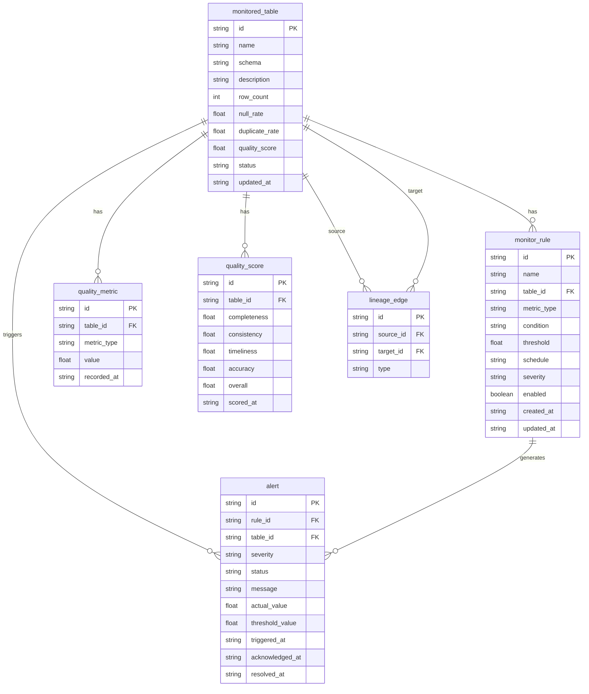

## 1. 架构设计

```mermaid
graph TB
    subgraph "前端层"
        "React仪表盘"
    end
    subgraph "API层"
        "Express API Server"
    end
    subgraph "数据质量引擎"
        "Spark计算引擎"
        "Delta Lake存储"
        "Airflow调度器"
    end
    subgraph "数据存储层"
        "SQLite(指标/规则/告警)"
    end

    "React仪表盘" --> "Express API Server"
    "Express API Server" --> "SQLite(指标/规则/告警)"
    "Express API Server" --> "Spark计算引擎"
    "Airflow调度器" --> "Spark计算引擎"
    "Spark计算引擎" --> "Delta Lake存储"
    "Spark计算引擎" --> "SQLite(指标/规则/告警)"
```

## 2. 技术说明

- **前端**：React@18 + TailwindCSS@3 + Vite + Zustand + Recharts（图表）+ ReactFlow（依赖图谱）
- **初始化工具**：vite-init (react-express-ts 模板)
- **后端API**：Express@4 + TypeScript (ESM)
- **数据质量引擎**：Java + Spark + Delta Lake（通过模拟数据层在本项目中体现）
- **调度器**：Airflow（通过模拟调度状态在本项目中体现）
- **数据库**：SQLite（存储监控规则、质量指标、告警记录、评分数据）

## 3. 路由定义

| 路由 | 用途 |
|------|------|
| `/` | 监控仪表盘 - 全局质量概览 |
| `/rules` | 监控规则管理 - 规则列表与编辑 |
| `/rules/new` | 创建新监控规则 |
| `/rules/:id` | 编辑监控规则 |
| `/scores` | 数据质量评分 - 评分总览 |
| `/scores/:tableId` | 单表评分详情 |
| `/alerts` | 告警中心 - 告警列表 |
| `/alerts/:id` | 告警详情 |
| `/impact` | 影响分析 - 依赖图谱与影响评估 |

## 4. API定义

### 4.1 监控仪表盘

```
GET /api/dashboard/overview
Response: {
  overallScore: number
  activeAlerts: number
  monitoredTables: number
  totalRules: number
  scoreTrend: { date: string, score: number }[]
}

GET /api/dashboard/metrics-trend
Query: { tableId?: string, metricType: string, days: number }
Response: { date: string, value: number, tableName: string }[]

GET /api/dashboard/anomaly-heatmap
Response: { tableName: string, metric: string, severity: number }[]

GET /api/dashboard/recent-alerts
Query: { limit: number }
Response: Alert[]
```

### 4.2 监控规则

```
GET /api/rules
Response: Rule[]

GET /api/rules/:id
Response: Rule

POST /api/rules
Body: { name, tableId, metricType, condition, threshold, schedule, severity }

PUT /api/rules/:id
Body: Partial<Rule>

DELETE /api/rules/:id

PATCH /api/rules/:id/toggle
Body: { enabled: boolean }

GET /api/rules/templates
Response: RuleTemplate[]
```

### 4.3 质量评分

```
GET /api/scores
Response: { tableId: string, tableName: string, overallScore: number, dimensions: DimensionScore[] }[]

GET /api/scores/:tableId
Response: { tableId: string, overallScore: number, dimensions: DimensionScore[], history: { date: string, score: number }[] }
```

### 4.4 告警

```
GET /api/alerts
Query: { severity?, status?, page?, pageSize? }
Response: { items: Alert[], total: number }

GET /api/alerts/:id
Response: AlertDetail

PATCH /api/alerts/:id/acknowledge
Body: { acknowledgedBy: string }

PATCH /api/alerts/:id/resolve
Body: { resolvedBy: string, resolution: string }
```

### 4.5 影响分析

```
GET /api/impact/lineage
Response: { nodes: LineageNode[], edges: LineageEdge[] }

GET /api/impact/analyze/:tableId
Response: { affectedDownstream: AffectedTable[], rootCauseCandidates: RootCause[] }
```

### 4.6 数据类型定义

```typescript
type MetricType = 'row_count' | 'null_rate' | 'duplicate_rate' | 'distribution_drift'
type Severity = 'critical' | 'warning' | 'info'
type AlertStatus = 'active' | 'acknowledged' | 'resolved'

interface Rule {
  id: string
  name: string
  tableId: string
  tableName: string
  metricType: MetricType
  condition: string
  threshold: number
  schedule: string
  severity: Severity
  enabled: boolean
  createdAt: string
  updatedAt: string
}

interface Alert {
  id: string
  ruleId: string
  ruleName: string
  tableId: string
  tableName: string
  metricType: MetricType
  severity: Severity
  status: AlertStatus
  message: string
  actualValue: number
  thresholdValue: number
  triggeredAt: string
  acknowledgedAt?: string
  resolvedAt?: string
}

interface DimensionScore {
  dimension: string
  score: number
  weight: number
}

interface LineageNode {
  id: string
  name: string
  type: 'table' | 'job'
  status: 'healthy' | 'warning' | 'critical'
}

interface LineageEdge {
  source: string
  target: string
  type: 'data_flow' | 'dependency'
}
```

## 5. 服务端架构图

```mermaid
graph LR
    "Controller层" --> "Service层"
    "Service层" --> "Repository层"
    "Repository层" --> "SQLite数据库"
    "Service层" --> "模拟数据生成器"
```

## 6. 数据模型

### 6.1 数据模型定义



### 6.2 数据定义语言

```sql
CREATE TABLE monitored_table (
  id TEXT PRIMARY KEY,
  name TEXT NOT NULL,
  schema_name TEXT NOT NULL,
  description TEXT,
  row_count INTEGER DEFAULT 0,
  null_rate REAL DEFAULT 0,
  duplicate_rate REAL DEFAULT 0,
  distribution_drift REAL DEFAULT 0,
  quality_score REAL DEFAULT 0,
  status TEXT DEFAULT 'healthy',
  updated_at TEXT DEFAULT (datetime('now'))
);

CREATE TABLE monitor_rule (
  id TEXT PRIMARY KEY,
  name TEXT NOT NULL,
  table_id TEXT NOT NULL REFERENCES monitored_table(id),
  metric_type TEXT NOT NULL,
  condition TEXT NOT NULL,
  threshold REAL NOT NULL,
  schedule TEXT NOT NULL,
  severity TEXT DEFAULT 'warning',
  enabled INTEGER DEFAULT 1,
  created_at TEXT DEFAULT (datetime('now')),
  updated_at TEXT DEFAULT (datetime('now'))
);

CREATE TABLE quality_metric (
  id TEXT PRIMARY KEY,
  table_id TEXT NOT NULL REFERENCES monitored_table(id),
  metric_type TEXT NOT NULL,
  value REAL NOT NULL,
  recorded_at TEXT DEFAULT (datetime('now'))
);

CREATE TABLE alert (
  id TEXT PRIMARY KEY,
  rule_id TEXT REFERENCES monitor_rule(id),
  table_id TEXT NOT NULL REFERENCES monitored_table(id),
  severity TEXT NOT NULL DEFAULT 'warning',
  status TEXT NOT NULL DEFAULT 'active',
  message TEXT NOT NULL,
  actual_value REAL,
  threshold_value REAL,
  triggered_at TEXT DEFAULT (datetime('now')),
  acknowledged_at TEXT,
  resolved_at TEXT,
  resolution TEXT
);

CREATE TABLE quality_score (
  id TEXT PRIMARY KEY,
  table_id TEXT NOT NULL REFERENCES monitored_table(id),
  completeness REAL DEFAULT 0,
  consistency REAL DEFAULT 0,
  timeliness REAL DEFAULT 0,
  accuracy REAL DEFAULT 0,
  overall REAL DEFAULT 0,
  scored_at TEXT DEFAULT (datetime('now'))
);

CREATE TABLE lineage_edge (
  id TEXT PRIMARY KEY,
  source_id TEXT NOT NULL REFERENCES monitored_table(id),
  target_id TEXT NOT NULL REFERENCES monitored_table(id),
  type TEXT DEFAULT 'data_flow'
);

CREATE INDEX idx_metric_table ON quality_metric(table_id);
CREATE INDEX idx_metric_type ON quality_metric(metric_type);
CREATE INDEX idx_alert_table ON alert(table_id);
CREATE INDEX idx_alert_status ON alert(status);
CREATE INDEX idx_score_table ON quality_score(table_id);
CREATE INDEX idx_rule_table ON monitor_rule(table_id);
```
