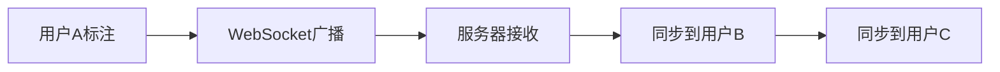

## 1. 产品概述

Web端图表数据标注工具，支持对时序图表、散点图、柱状图的数据点标注（分类、异常标记、趋势标注），提供标注导出、多人实时协作、标注统计等功能。

- 主要目的：提供高效的图表数据标注解决方案，解决数据分析团队在数据标注和协作问题
- 目标用户：数据分析师、机器学习工程师、数据标注团队

## 2. 核心功能

### 2.1 用户角色

| 角色 | 注册方式 | 核心权限 |
|--------|----------|----------|
| 标注员 | 账号注册 | 创建标注、查看标注、导出标注 |
| 管理员 | 账号注册 | 用户管理、项目管理、标注审核 |
| 协作者 | 邀请加入 | 实时协作、查看统计 |

### 2.2 功能模块

1. **工作区页面**：项目列表、创建项目、数据上传
2. **标注工作台**：图表可视化、标注工具、实时协作
3. **标注统计页**：标注进度、质量统计、用户贡献

### 2.3 页面详情

| 页面名称 | 模块名称 | 功能描述 |
|-----------|-------------|---------------------|
| 工作区页面 | 项目列表 | 展示所有标注项目，支持搜索、筛选、排序 |
| 工作区页面 | 项目创建 | 上传数据文件、选择图表类型、配置项目信息 |
| 标注工作台 | 图表渲染 | 支持时序图、散点图、柱状图三种图表类型 |
| 标注工作台 | 标注工具 | 分类标注、异常标记、趋势标注、标注编辑删除 |
| 标注工作台 | 实时协作 | 多用户同步、光标同步、操作通知 |
| 标注工作台 | 标注导出 | 支持JSON、CSV、Excel格式导出 |
| 标注统计页 | 统计面板 | 标注数量统计、标注质量统计、用户贡献排名 |

## 3. 核心流程

### 3.1 标注工作流程

```mermaid
flowchart LR
    A["用户登录" --> B["选择/创建项目"]
    B --> C["上传数据文件"]
    C --> D["选择图表类型"]
    D --> E["进入标注工作台"]
    E --> F["查看图表数据点"]
    F --> G["选择标注工具"]
    G --> H["添加标注"]
    H --> I["保存标注"]
    I --> J["实时同步到协作者"]
    J --> K["导出标注结果"]
```

### 3.2 多人协作流程



## 4. 用户界面设计

### 4.1 设计风格
- 主色调：深蓝色 (#1e3a8a)，科技感专业风格
- 辅助色：青色 (#06b6d4)，用于交互元素
- 按钮风格：圆角矩形，悬浮效果
- 字体：Inter 字体族，清晰易读
- 布局风格：左侧导航 + 主工作区，卡片式设计
- 图标风格：线性图标，简洁现代

### 4.2 页面设计概述

| 页面名称 | 模块名称 | UI元素 |
|-----------|-------------|-------------|
| 工作区页面 | 项目列表 | 卡片网格、搜索框、筛选器、创建按钮 |
| 标注工作台 | 图表区域 | 大尺寸图表、工具栏、标注面板 |
| 标注工作台 | 侧边栏 | 标注列表、用户列表、操作按钮 |
| 标注统计页 | 统计面板 | 统计卡片、图表、排行榜 |

### 4.3 响应性
- 桌面端优先设计
- 支持平板设备适配
- 图表区域自适应布局
- 触控设备优化

### 4.4 动画效果
- 页面加载时的淡入动画
- 标注添加时的高亮动画
- 实时协作时的光标闪烁提示
- 悬停交互反馈
