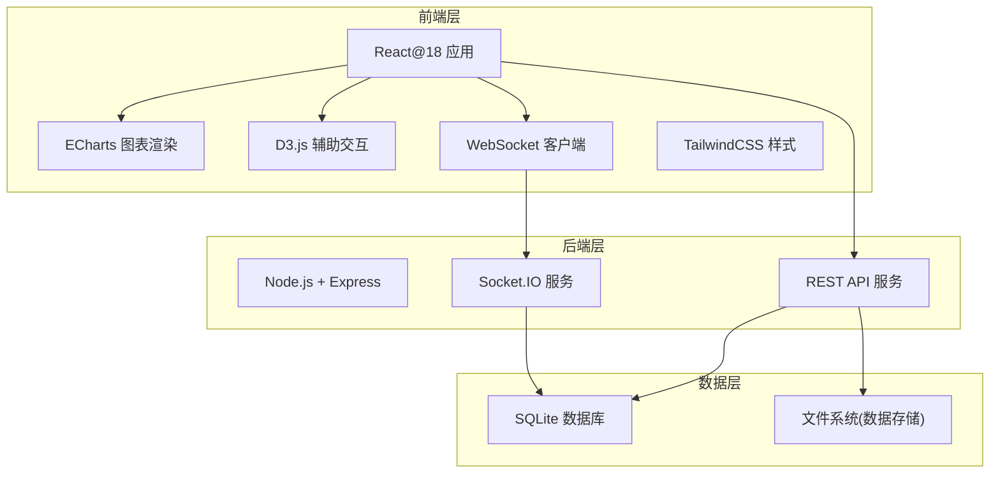
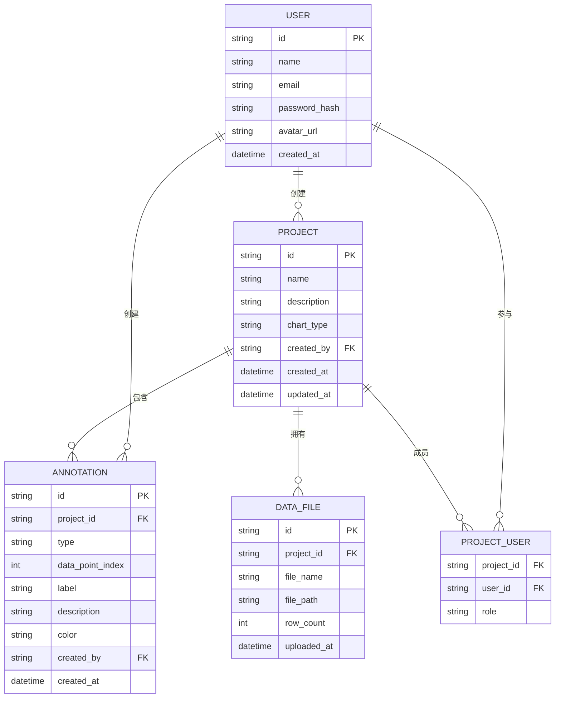

## 1. 架构设计



## 2. 技术栈说明

### 2.1 前端技术
- **框架**: React@18 + TypeScript
- **构建工具**: Vite@5
- **样式**: TailwindCSS@3
- **图表库**: ECharts@5 (主图表渲染)
- **可视化辅助**: D3.js@7 (标注交互)
- **状态管理**: Zustand
- **WebSocket**: Socket.IO-client
- **UI组件**: Headless UI + Heroicons

### 2.2 后端技术
- **运行时**: Node.js@18
- **框架**: Express@4
- **WebSocket**: Socket.IO@4
- **数据库**: SQLite (开发阶段)
- **ORM**: Prisma
- **文件处理**: multer
- **数据导出**: xlsx + csv-writer

## 3. 路由定义

| 路由路径 | 页面/组件 | 功能说明 |
|----------|----------|----------|
| `/` | WorkspacePage | 工作区 - 项目列表 |
| `/project/:id` | AnnotationPage | 标注工作台 |
| `/project/:id/statistics` | StatisticsPage | 标注统计页 |

## 4. API 定义

### 4.1 REST API

```typescript
// 项目相关
interface Project {
  id: string;
  name: string;
  description: string;
  chartType: 'timeSeries' | 'scatter' | 'bar';
  createdAt: Date;
  updatedAt: Date;
}

// 标注相关
interface Annotation {
  id: string;
  projectId: string;
  type: 'classification' | 'anomaly' | 'trend';
  dataPointIndex: number;
  label: string;
  description?: string;
  color?: string;
  createdBy: string;
  createdAt: Date;
}

// 数据点
interface DataPoint {
  x: number | string | Date;
  y: number;
  [key: string]: any;
}
```

### 4.2 WebSocket 事件

| 事件名称 | 方向 | 数据结构 | 说明 |
|----------|------|----------|------|
| `joinProject` | Client → Server | `{ projectId, userId, userName }` | 加入项目 |
| `annotationAdded` | Client → Server | `Annotation` | 添加标注 |
| `annotationUpdated` | Client → Server | `Annotation` | 更新标注 |
| `annotationDeleted` | Client → Server | `{ annotationId }` | 删除标注 |
| `userCursor` | Client → Server | `{ userId, x, y }` | 光标位置同步 |
| `onlineUsers` | Server → Client | `User[]` | 在线用户列表 |
| `annotationSync` | Server → Client | `Annotation[]` | 标注同步 |
```

## 5. 服务器架构

```mermaid
graph TD
    A["WebSocket 连接层" --> B["连接管理"]
    A --> C["房间管理"]
    
    D["API 控制层"] --> E["项目控制器"]
    D --> F["标注控制器"]
    D --> G["数据文件控制器"]
    D --> H["用户控制器"]
    
    I["业务服务层"] --> J["项目服务"]
    I --> K["标注服务"]
    I --> L["数据处理服务"]
    I --> M["协作服务"]
    
    N["数据访问层"] --> O["Prisma ORM"]
    O --> P["SQLite 数据库"]
    
    B --> M
    C --> M
    E --> J
    F --> K
    G --> L
    J --> N
    K --> N
    L --> N
    M --> N
```

## 6. 数据模型

### 6.1 ER 图



### 6.2 Prisma Schema

```prisma
model User {
  id            String    @id @default(cuid())
  name          String
  email         String    @unique
  passwordHash  String
  avatarUrl     String?
  createdAt     DateTime  @default(now())
  projects      Project[]
  annotations   Annotation[]
  projectUsers  ProjectUser[]
}

model Project {
  id           String        @id @default(cuid())
  name         String
  description  String?
  chartType    String
  createdBy    User          @relation(fields: [createdById], references: [id])
  createdById  String
  annotations  Annotation[]
  dataFiles    DataFile[]
  projectUsers ProjectUser[]
  createdAt    DateTime      @default(now())
  updatedAt   DateTime      @updatedAt
}

model Annotation {
  id              String   @id @default(cuid())
  project         Project  @relation(fields: [projectId], references: [id])
  projectId       String
  type            String
  dataPointIndex  Int
  label           String
  description     String?
  color           String?
  createdBy       User     @relation(fields: [createdById], references: [id])
  createdById     String
  createdAt       DateTime @default(now())
}

model DataFile {
  id          String   @id @default(cuid())
  project     Project  @relation(fields: [projectId], references: [id])
  projectId   String
  fileName    String
  filePath    String
  rowCount    Int
  uploadedAt  DateTime @default(now())
}

model ProjectUser {
  id          String   @id @default(cuid())
  project     Project  @relation(fields: [projectId], references: [id])
  projectId   String
  user        User     @relation(fields: [userId], references: [id])
  userId      String
  role        String
  @@unique([projectId, userId])
}
```

## 7. 目录结构

```
project/
├── client/                    # 前端应用
│   ├── src/
│   │   ├── components/        # 通用组件
│   │   ├── pages/             # 页面组件
│   │   ├── hooks/             # 自定义Hooks
│   │   ├── stores/            # Zustand状态管理
│   │   ├── services/          # API和WebSocket服务
│   │   ├── types/             # TypeScript类型定义
│   │   ├── utils/             # 工具函数
│   │   ├── App.tsx
│   │   └── main.tsx
│   ├── public/
│   ├── package.json
│   ├── tsconfig.json
│   ├── vite.config.ts
│   └── tailwind.config.js
│
├── server/                    # 后端应用
│   ├── src/
│   │   ├── controllers/       # 控制器
│   │   ├── services/          # 业务逻辑
│   │   ├── models/            # 数据模型
│   │   ├── routes/            # 路由定义
│   │   ├── middleware/        # 中间件
│   │   ├── utils/             # 工具函数
│   │   ├── prisma/            # Prisma配置
│   │   ├── socket/            # WebSocket处理
│   │   └── index.ts
│   ├── uploads/               # 上传文件目录
│   ├── package.json
│   └── tsconfig.json
│
└── README.md
```

## 8. 核心功能实现方案

### 8.1 图表渲染方案
- 使用 ECharts 渲染时序图、散点图、柱状图
- 使用 ECharts 的 graphic 组件实现标注点显示
- 使用 D3.js 处理复杂的交互逻辑

### 8.2 标注交互方案
- 点击数据点触发标注弹窗
- 支持拖拽调整标注位置
- 支持框选区域进行批量标注

### 8.3 实时协作方案
- Socket.IO 实现 WebSocket 连接
- 房间机制隔离不同项目
- 操作冲突检测与合并
- 光标位置实时同步

### 8.4 数据导出方案
- JSON: 直接序列化标注数据
- CSV: 使用 csv-writer 生成
- Excel: 使用 xlsx 库生成
