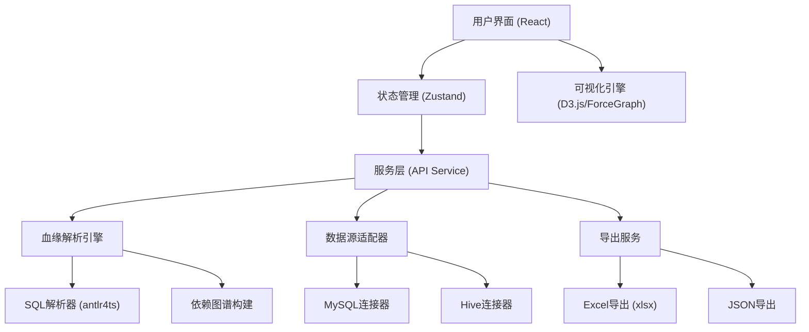

## 1. 架构设计



## 2. 技术描述

- **前端框架**: React@18 + TypeScript@5
- **构建工具**: Vite@5
- **样式方案**: TailwindCSS@3
- **状态管理**: Zustand@4
- **可视化库**: D3.js@7 + react-force-graph@1
- **SQL解析**: antlr4ts@0.5 + sql-parser-cst
- **导出功能**: xlsx@0.18
- **图标库**: lucide-react@0.344
- **后端**: 纯前端Mock数据（演示用），后续可扩展Express后端
- **数据存储**: localStorage存储数据源配置，Mock数据模拟血缘关系

## 3. 路由定义

| 路由 | 页面/组件 | 用途 |
|------|-----------|------|
| / | MainLayout | 主布局容器 |
| / | LineageAnalyzer | 血缘分析主页面 |
| /datasources | DataSourceManager | 数据源管理页面（弹窗形式） |

## 4. 数据模型

### 4.1 核心类型定义

```typescript
// 数据源类型
interface DataSource {
  id: string;
  name: string;
  type: 'mysql' | 'hive';
  host: string;
  port: number;
  database: string;
  username?: string;
  password?: string;
  status: 'connected' | 'disconnected' | 'connecting';
}

// 字段节点
interface FieldNode {
  id: string;
  name: string;
  table: string;
  database: string;
  datasource: string;
  type: 'field' | 'table' | 'etl' | 'report';
  description?: string;
  createdAt?: string;
}

// 血缘关系边
interface LineageEdge {
  id: string;
  source: string;
  target: string;
  type: 'direct' | 'transform' | 'aggregate';
  transformation?: string;
  etlTask?: string;
}

// 血缘图谱
interface LineageGraph {
  nodes: FieldNode[];
  edges: LineageEdge[];
}

// 分析结果
interface AnalysisResult {
  fieldId: string;
  fieldName: string;
  graph: LineageGraph;
  statistics: {
    totalDownstreamNodes: number;
    etlTasks: number;
    reports: number;
    tables: number;
  };
  downstreamList: {
    etlTasks: ETLTask[];
    reports: Report[];
    tables: TableInfo[];
  };
}

// ETL任务
interface ETLTask {
  id: string;
  name: string;
  script: string;
  schedule: string;
  owner: string;
  lastRun: string;
}

// 报表
interface Report {
  id: string;
  name: string;
  type: 'dashboard' | 'report' | 'chart';
  url?: string;
  owner: string;
  updatedAt: string;
}

// 表信息
interface TableInfo {
  id: string;
  name: string;
  database: string;
  datasource: string;
  fieldCount: number;
}
```

### 4.2 Mock数据设计

系统内置丰富的Mock数据用于演示：
- 3个数据源：MySQL业务库、Hive数据仓库、MySQL报表库
- 20+张数据表，涵盖用户、订单、商品等核心业务表
- 10+个ETL任务，模拟数据抽取、清洗、聚合流程
- 5+个报表/看板，模拟下游数据消费场景

## 5. 核心功能模块

### 5.1 SQL血缘解析模块

```typescript
interface SQLParser {
  parse(sql: string): Promise<ParsedSQL>;
  extractSourceFields(ast: ParsedSQL): FieldNode[];
  extractTargetFields(ast: ParsedSQL): FieldNode[];
  buildLineage(ast: ParsedSQL): LineageEdge[];
}
```

### 5.2 图谱可视化模块

- 力导向布局算法
- 节点拖拽、缩放、平移
- 节点悬停高亮关联边
- 点击节点展开详情
- 路径高亮显示

### 5.3 导出模块

支持两种导出格式：
1. **JSON格式**：完整的图谱数据结构
2. **Excel格式**：影响范围统计、ETL任务列表、报表列表、字段清单

## 6. 目录结构

```
src/
├── components/
│   ├── layout/          # 布局组件
│   ├── search/          # 搜索模块
│   ├── graph/           # 血缘图谱
│   ├── details/         # 详情面板
│   ├── datasource/      # 数据源管理
│   └── export/          # 导出功能
├── stores/              # Zustand状态管理
├── services/            # 服务层
│   ├── lineage.ts       # 血缘分析服务
│   ├── datasource.ts    # 数据源服务
│   └── parser.ts        # SQL解析服务
├── types/               # TypeScript类型定义
├── mock/                # Mock数据
├── utils/               # 工具函数
└── App.tsx              # 主应用入口
```
