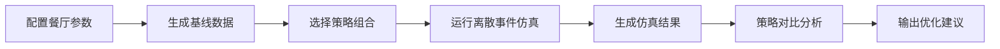

## 1. 产品概述
餐厅翻台率优化系统是一款基于排队论和离散事件仿真的智能决策工具，帮助餐厅经营者分析客流模式、优化桌位分配策略、提升翻台率。通过数据驱动的仿真模拟，为餐厅提供可量化的运营改进方案。

## 2. 核心功能

### 2.1 用户角色
| 角色 | 注册方式 | 核心权限 |
|------|----------|----------|
| 餐厅管理者 | 无需注册，本地访问 | 配置餐厅参数、运行仿真、查看分析报告、导出数据 |

### 2.2 功能模块
1. **餐厅配置面板**：桌位配置、客流参数、用餐时长分布
2. **数据分析仪表盘**：翻台率统计、桌位热力图、客流趋势图
3. **策略模拟器**：多种排号策略对比、桌位分配算法测试
4. **预测报告**：翻台率提升预测、收益分析、优化建议

### 2.3 页面详情
| 页面名称 | 模块名称 | 功能描述 |
|----------|----------|----------|
| 主仪表盘 | KPI卡片 | 实时展示当前翻台率、平均用餐时长、桌位利用率 |
| 主仪表盘 | 桌位热力图 | 可视化展示各桌位全天占用情况 |
| 策略模拟 | 策略对比 | 并排对比不同策略的关键指标差异 |
| 策略模拟 | 仿真控制 | 调整参数后重新运行仿真，实时更新结果 |
| 预测报告 | 翻台率预测 | 展示优化前后的翻台率曲线对比 |
| 预测报告 | 收益分析 | 量化翻台率提升带来的收益增长 |

## 3. 核心流程
用户进入系统后，首先配置餐厅的基本参数（桌位数、客流强度、用餐时长分布），系统基于排队论模型生成基线数据。用户可选择不同的排号策略和桌位分配算法运行仿真，系统通过离散事件仿真引擎模拟餐厅一天的运营情况。最后系统生成可视化报告，对比不同策略的效果，并给出优化建议。

## 4. 用户界面设计

### 4.1 设计风格
- **主色调**：深蓝 (#1e3a5f) - 专业、可信赖
- **辅助色**：橙色 (#ff6b35) - 强调重要数据、行动按钮
- **中性色**：浅灰背景，白色卡片，深色文字
- **按钮风格**：圆角矩形，悬停有微动画效果
- **字体**：系统无衬线字体，标题使用中等字重
- **布局风格**：卡片式布局，清晰的信息层级，充足的留白
- **图标风格**：简洁线性图标，配合emoji增加亲和力

### 4.2 页面设计概述
| 页面名称 | 模块名称 | UI元素 |
|----------|----------|--------|
| 主仪表盘 | KPI卡片 | 渐变背景、大数字展示、趋势箭头、图标装饰 |
| 主仪表盘 | 热力图 | Plotly交互式图表、时间轴滑块、颜色渐变图例 |
| 策略模拟 | 对比卡片 | 并排布局、策略名称标签、关键指标对比条 |
| 预测报告 | 趋势图 | 双折线对比、置信区间阴影、交互悬停提示 |

### 4.3 响应性
- 桌面端优先设计（1280px以上）
- Streamlit自动适配不同屏幕尺寸
- 图表区域支持缩放和全屏查看

### 4.4 交互设计
- 所有参数滑块实时更新仿真结果
- 图表支持悬停查看详细数据
- 策略切换有平滑过渡动画
- 仿真运行时显示进度指示器
