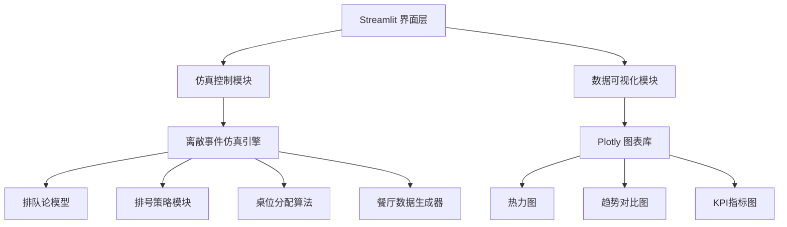
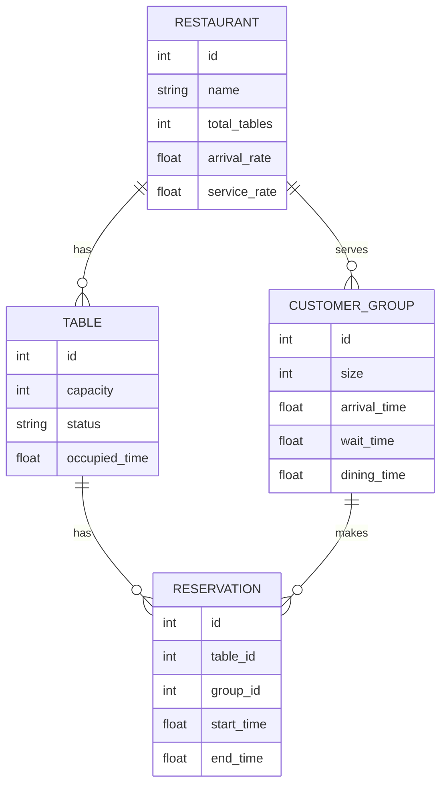

## 1. 架构设计



## 2. 技术描述
- **前端框架**: Streamlit@1.32.0 - 快速构建数据科学应用
- **可视化库**: Plotly@5.19.0 - 交互式图表
- **数值计算**: NumPy@1.26.0, Pandas@2.2.0 - 数据处理
- **仿真引擎**: SimPy@4.1.1 - 离散事件仿真
- **统计分析**: SciPy@1.12.0 - 排队论模型计算
- **依赖管理**: pip + requirements.txt

## 3. 模块设计

### 3.1 核心模块结构
| 模块 | 文件路径 | 功能描述 |
|------|----------|----------|
| 主应用 | app.py | Streamlit主入口，页面布局控制 |
| 仿真引擎 | src/simulation_engine.py | 离散事件仿真核心逻辑 |
| 排队论模型 | src/queueing_model.py | M/M/c排队论数学模型 |
| 排号策略 | src/strategies.py | 多种排号策略实现 |
| 桌位分配 | src/table_assignment.py | 智能桌位分配算法 |
| 数据生成器 | src/data_generator.py | 合成餐厅运营数据 |
| 可视化模块 | src/visualization.py | Plotly图表生成器 |
| 工具函数 | src/utils.py | 通用工具函数 |

## 4. 数据模型

### 4.1 数据模型定义


### 4.2 仿真结果数据结构
```python
@dataclass
class SimulationResult:
    total_arrivals: int
    total_served: int
    average_wait_time: float
    average_dining_time: float
    table_turnover_rate: float
    table_utilization: Dict[int, List[float]]
    hourly_arrivals: List[int]
    queue_length_history: List[Tuple[float, int]]
    revenue: float
```

## 5. 核心算法

### 5.1 排号策略
1. **FIFO策略** (First In First Out) - 先来先服务
2. **大小匹配策略** - 优先安排桌位匹配的顾客
3. **动态策略** - 根据等待时间和桌位大小动态调整

### 5.2 桌位分配算法
1. **首次匹配** - 分配第一个可用的合适桌位
2. **最佳匹配** - 分配最适合人数的最小桌位
3. **共享优化** - 考虑并桌可能性最大化利用率

## 6. 配置文件

### 6.1 requirements.txt
```
streamlit>=1.32.0
plotly>=5.19.0
numpy>=1.26.0
pandas>=2.2.0
simpy>=4.1.1
scipy>=1.12.0
```

## 7. 性能考虑
- 仿真运行时间控制在2-5秒内
- 使用缓存机制避免重复计算
- 图表渲染使用Plotly异步加载
- 参数调整使用节流优化
